# 02-container-diagram — ANTON Container View

**Status of diagram:** Generated 2026-04-26 by Claude Code from commit `0fabf7f` (`openexpert@0.7.5`)
**Subsystem status legend:** ✅ Built · 🟢 Partial · 📋 Spec-only · ❌ Future
**Maintainer note:** Regenerate when a major service group is added/removed (e.g. a new pillar's service folder), when persistence layout changes (e.g. real pgvector adoption), or when a new adapter type appears.

C4 "Container" view: what lives inside the ANTON box from the System Context diagram. Shows the deployable/logical units and the direction of every dependency.

## Diagram

```mermaid
flowchart TB
  classDef frontend fill:#1E3A8A,stroke:#93C5FD,color:#EFF6FF
  classDef route fill:#7C2D12,stroke:#FDBA74,color:#FFF7ED
  classDef core fill:#0F766E,stroke:#5EEAD4,color:#F0FDFA
  classDef pillar fill:#365314,stroke:#A3E635,color:#F7FEE7
  classDef store fill:#581C87,stroke:#D8B4FE,color:#FAF5FF
  classDef ext fill:#1F2937,stroke:#9CA3AF,color:#F9FAFB
  classDef partial stroke-dasharray: 5 3

  %% ─── Frontend tier ────────────────────────────────────────────────────
  subgraph FE["Frontend (Vite — two builds)"]
    direction TB
    SPA["React SPA<br/>src/App.tsx · React 18 + TS 5.7<br/>251 pages · Zustand stores ✅"]:::frontend
    AppPWA["Companion App PWA<br/>src/app/ — separate Vite build<br/>(dist/app/) · Capacitor wrap ✅"]:::frontend
    SPA -. shares /lib + /theme .-> AppPWA
  end

  %% ─── API tier ────────────────────────────────────────────────────────
  subgraph API["API tier — Express on :3001"]
    Index["server/index.ts<br/>middleware (auth · csrf · rate-limit)<br/>SSE streaming · 151 routes ✅"]:::route
  end

  %% ─── Core service layer ──────────────────────────────────────────────
  subgraph Core["Core services (server/services/) — 221 files"]
    direction TB
    Prompt["prompt-builder.ts<br/>7-layer assembly ✅"]:::core
    KS["knowledge-resolver.ts<br/>4 modes + url-fetcher ✅"]:::core
    LLM["unified-llm-client.ts<br/>+ model-adapter.ts ✅"]:::core
    WF["workflow-executor.ts<br/>+ event-workflow-processor 🟢"]:::core
    ORCH["orchestrator-engine.ts<br/>+ pattern + heartbeat 🟢"]:::core
    IRE["iterative-reasoning.ts<br/>revelation chains ✅"]:::core
    PF["pathfinder-engine.ts<br/>+ smart-actions-analyzer ✅"]:::core
    KG["knowledge-graph + atom-extractor<br/>+ pattern-detection<br/>+ apprentice + quality-ratchet 🟢"]:::core
    Bundle["anton-bundler / importer / validator<br/>~48 bundle types ✅"]:::core
    Export["Export pipeline<br/>docx · xlsx · pdf · pptx ✅"]:::core
    Identity["app-enrollment-service<br/>(Ed25519 pairing) ✅"]:::core
    Gateway["app-gateway + app-websocket<br/>+ app-push + app-checkpoint ✅"]:::core
    Crypto["community-crypto<br/>community-e2e<br/>community-signing-service ✅"]:::core
  end

  %% ─── Pillar service domains ──────────────────────────────────────────
  subgraph Pillars["Pillar service domains"]
    direction TB
    PMarkets["Markets — 30 services<br/>indexes · theses · why-chains<br/>· predictions · RCI ✅"]:::pillar
    PPortals["Portals — 18 services<br/>+ registry-protocol<br/>+ capability-descriptor ✅"]:::pillar
    PMissions["Missions — 15 services<br/>+ service-pack-manager<br/>+ credential-vault ✅"]:::pillar
    PAtlas["Risk Atlas — 9 services<br/>residual-calculator (deterministic)<br/>+ pack-loader + fcp-scope ✅"]:::pillar
    PAgents["Specialized Agents — 5 services<br/>profile · processor · builder<br/>· connector-exec · remote-client ✅"]:::pillar
    PCPGS["Procure / Civic / Grow<br/>3 services + 3 migrations ✅"]:::pillar
    PSchool["School<br/>school-prompt-builder ✅"]:::pillar
    PCommunity["Community<br/>signing · projects · messaging ✅"]:::pillar
    PCoding["Coding (4-tier)<br/>+ Hardware Build (Tier 5) ✅"]:::pillar
    PFinance["Payments / FutureChain<br/>fc-* services 🟢"]:::pillar
  end

  %% ─── Persistence ─────────────────────────────────────────────────────
  subgraph Store["Persistence"]
    direction TB
    PG["PostgreSQL 16+<br/>16 base tables (schema.sql)<br/>+ 121 migrations (039–167) ✅"]:::store
    Chroma["Chroma vector store<br/>(separate process) 🟢"]:::store
    OllamaEmb["Ollama embeddings<br/>(nomic-embed-text) 🟢"]:::store
    Files["Workspace files<br/>uploads/ · workspaces/ ✅"]:::store
  end

  %% ─── External-facing adapters (still inside ANTON) ───────────────────
  subgraph Adapters["Outbound adapters"]
    direction TB
    Anthr["claude-client.ts<br/>(Anthropic + caching + adaptive thinking)"]:::ext
    OpenAIA["adapters/openaiAdapter.ts"]:::ext
    AzureA["adapters/azureOpenaiAdapter.ts"]:::ext
    GeminiA["adapters/geminiAdapter.ts"]:::ext
    MistralA["adapters/mistralAdapter.ts"]:::ext
    OllamaA["adapters/ollamaAdapter.ts"]:::ext
    MCP["MCP client / server<br/>server/mcp/ 🟢"]:::ext
    AAP["aap-rollout-bridge.ts<br/>P2P transport 🟢"]:::ext
  end

  %% ─── Frontend → API ─────────────────────────────────────────────────
  SPA -->|HTTPS · fetch / SSE| Index
  AppPWA -->|WebSocket + REST + envelope| Gateway

  %% ─── API → Core services ────────────────────────────────────────────
  Index --> Prompt
  Index --> KS
  Index --> WF
  Index --> ORCH
  Index --> PF
  Index --> Bundle
  Index --> Export
  Index --> Identity
  Index --> IRE
  Index --> KG

  %% ─── API → Pillar services ──────────────────────────────────────────
  Index --> PMarkets
  Index --> PPortals
  Index --> PMissions
  Index --> PAtlas
  Index --> PAgents
  Index --> PCPGS
  Index --> PSchool
  Index --> PCommunity
  Index --> PCoding
  Index --> PFinance

  %% ─── Core service interactions ──────────────────────────────────────
  Prompt --> KS
  Prompt --> LLM
  IRE --> LLM
  ORCH --> WF
  WF --> LLM
  PF --> LLM
  PMarkets --> LLM
  PMarkets --> KG
  PAtlas --> LLM
  PMissions --> LLM
  PMissions --> PAgents
  PMissions --> Identity
  PPortals --> Bundle
  PAgents --> LLM
  PAgents --> Crypto
  PCommunity --> Crypto
  Identity --> Crypto
  Gateway --> Crypto
  Gateway --> Identity

  %% ─── Outbound adapters ──────────────────────────────────────────────
  LLM --> Anthr
  LLM --> OpenAIA
  LLM --> AzureA
  LLM --> GeminiA
  LLM --> MistralA
  LLM --> OllamaA
  KS --> MCP
  Crypto --> AAP

  %% ─── Persistence edges ──────────────────────────────────────────────
  Index --> PG
  Prompt --> PG
  KS --> PG
  WF --> PG
  ORCH --> PG
  IRE --> PG
  KG --> PG
  Bundle --> PG
  Identity --> PG
  Gateway --> PG
  PMarkets --> PG
  PPortals --> PG
  PMissions --> PG
  PAtlas --> PG
  PAgents --> PG
  PCPGS --> PG
  PSchool --> PG
  PCommunity --> PG
  PFinance --> PG
  PCoding --> PG
  KS --> Chroma
  KG --> Chroma
  KS --> OllamaEmb
  KS --> Files
  Index --> Files

  class Chroma,OllamaEmb,WF,ORCH,KG,PFinance,MCP,AAP partial
```

## Legend

- **Frontend tier (blue)** — two distinct Vite builds, sharing only `src/lib/` and `src/theme/`. The Companion App talks to a different transport (the `app-gateway`) than the React SPA.
- **API tier (orange)** — single Express entry mounts 151 route files. All cross-cutting middleware (auth, CSRF, rate-limit, SSE streaming) lives at this seam.
- **Core services (teal)** — services used by every pillar.
- **Pillar service domains (green)** — pillar-specific service families. Counts come from the audit notes.
- **Persistence (purple)** — PostgreSQL is the single source of truth; Chroma + Ollama embeddings are a separate optional vector path.
- **Outbound adapters (grey)** — the only services that speak to off-machine endpoints.
- **Dashed border** — partial implementation per audit (workflow engine's full step-type set, orchestrator phases 2–4, knowledge-graph funnel orchestration, Payments rail, MCP both directions, AAP contact-hash format).

## Source-of-truth references

- `package.json` — confirms `openexpert@0.7.5`; declares Vite 6, React 18, Express 4, TypeScript 5.7.
- `vite.config.ts` + `vite.config.app.ts` — confirms two-build setup (`dist/` and `dist/app/`).
- `server/index.ts` — Express entry; mounts the 151 route files; installs middleware.
- `server/services/prompt-builder.ts` — 7-layer prompt assembly (Layers 2a/2b/2c/2d/4a/6 explicitly labeled).
- `server/services/knowledge-resolver.ts` — 4-mode resolver.
- `server/services/url-fetcher.ts` — Mode 2 helper.
- `server/services/unified-llm-client.ts:141, 304, 356, 480` — streaming + dispatch.
- `server/services/model-adapter.ts:552–582` — six-case provider switch.
- `server/services/claude-client.ts` — Anthropic + caching.
- `server/services/adapters/{azureOpenai,gemini,mistral,ollama,openai}Adapter.ts` — non-Anthropic adapters.
- `server/services/iterative-reasoning.ts` — IRE.
- `server/services/orchestrator-engine.ts`, `orchestrator-pattern-engine.ts`, `orchestrator-heartbeat.ts` — Orchestrator triad.
- `server/services/workflow-executor.ts`, `event-workflow-processor.ts` — Workflow engine.
- `server/services/pathfinder-engine.ts`, `smart-actions-analyzer.ts` — Pathfinder.
- `server/services/knowledge-graph.ts`, `pattern-detection.ts`, `apprentice.ts`, `quality-ratchet.ts`, `atom-extractor.ts`, `atom-boost.ts` — cross-workflow intelligence services.
- `server/services/anton-bundler.ts`, `anton-importer.ts`, `anton-validator.ts`, `bundle-sharing-service.ts` — bundle pipeline.
- `server/services/export-{docx,pdf,pptx}.ts` — export tier.
- `server/services/app-enrollment-service.ts`, `app-gateway.ts`, `app-websocket.ts`, `app-push-service.ts`, `app-checkpoint-service.ts` — Companion App backend.
- `server/services/community-crypto.ts`, `community-e2e.ts`, `community-signing-service.ts` — shared crypto.
- `server/services/aap-rollout-bridge.ts` — AAP transport.
- `server/services/portals/`, `registry-protocol/`, `registry-client/`, `capability-descriptor/` — Portals service tree.
- `server/services/risk-atlas/` — 9 atlas services including `atlas-residual-calculator.ts` (the deterministic engine).
- `server/services/mission-*.ts` + `server/services/missions/seed-templates.ts`, `service-pack-manager.ts` — Missions.
- `server/services/agent-{service,processor,builder,connector-executor}.ts`, `remote-agent-client.ts` — Specialized Agents.
- `server/services/{procure,civic,grow}-service.ts` — pillar services.
- `server/services/school-prompt-builder.ts` — School pillar.
- `server/services/fc-*.ts` — FutureChain stubs (5 files, all 🟢).
- `server/services/chroma-client.ts`, `embedding-pipeline.ts` — Chroma + Ollama embedding path.
- `server/db/schema.sql` — 16 base tables.
- `server/db/migrations-pg/` — 121 migrations (039–167).
- `server/db/init.ts` — migration runner.
- `src/App.tsx`, `src/lib/constants.ts`, `src/stores/*` — frontend shape.
- `src/app/` — Companion App tree.
- `_audit-notes.md` §3, §4, §5 — provider list, migration grouping, status reasoning.

## Open questions

- **MCP server vs MCP client** — both directions are referenced in CLAUDE.md but the audit treats `server/mcp/` as a single bidirectional adapter. The diagram should be split if a clear server/client boundary surfaces in code.
- **Ollama embeddings vs Ollama LLM adapter** — Ollama appears in *two* places (vector store path and LLM adapter path); both are real but conceptually distinct. The diagram intentionally shows them separately.
- **Chroma deployment topology** — runs as a separate process; the diagram treats it as part of "ANTON's persistence layer" rather than as an external system because it's local-first by default.

## Related diagrams

- `01-system-context` — what's outside this box.
- `03-pillar-topology` — how the pillar service domains map to user-facing surfaces.
- `10-module-execution-sequence` (Group 2) — request lifecycle through this container set.
- `13-multi-llm-routing` (Group 2) — detail of the LLM → adapter edges.
- `20-database-schema` (Group 3) — detail of the PostgreSQL tables.
