# 03-pillar-topology — ANTON Pillar Topology

**Status of diagram:** Generated 2026-04-26 by Claude Code from commit `0fabf7f` (`openexpert@0.7.5`); refreshed 2026-04-26 PM after C.3 (AppMode promotion).
**Subsystem status legend:** ✅ Built · 🟢 Partial · 📋 Spec-only · ❌ Future
**Maintainer note:** Regenerate when a pillar is added to `AppMode` in `src/stores/useSettingsStore.ts`, when a pillar's major surfaces change, or when an area/module count shifts materially.

The user-facing slicing of ANTON. Post-C.3, all **12 pillars are now in the `AppMode` union** (`src/stores/useSettingsStore.ts:74–87`). The sidebar continues to use path-based detection for its per-pillar visual variants (`Sidebar.tsx:346–380`) — that's intentional: each pillar has unique nav needs that don't fit a single shared variant.

## Diagram

```mermaid
flowchart TD
  classDef toggle fill:#0F766E,stroke:#5EEAD4,color:#F0FDFA
  classDef pathmode fill:#1E3A8A,stroke:#93C5FD,color:#EFF6FF
  classDef partial stroke-dasharray: 5 3
  classDef spec stroke-dasharray: 2 2,opacity:0.7

  Root["<b>ANTON Instance</b><br/>v0.7.5 — 12 pillars · 251 pages<br/>(all in AppMode union post-C.3)"]

  %% ─── All 12 pillars in AppMode union ────────────────────────────────
  subgraph AppModePillars["AppMode union (useSettingsStore.ts:74–87) — 12 pillars"]
    direction TB
    Work["Work ✅<br/>59 areas · 263 modules<br/>651 system-prompt.md files"]:::toggle
    School["School ✅<br/>Guardian · Teacher · Student<br/>school-prompt-builder"]:::toggle
    Life["Life ✅<br/>Personal-finance-bop ·<br/>Microfinance · Consumer-protection"]:::toggle
    Pathfinder["Pathfinder ✅<br/>Mode-aware research<br/>+ smart-actions analyzer"]:::toggle
    Markets["Markets ✅<br/>23 pages · 30 services<br/>18 migrations"]:::toggle
    Community["Community ✅<br/>E2E messaging<br/>+ contact hashes + trust"]:::toggle
    Payments["Payments 🟢<br/>FutureChain wallet stubs<br/>(5 fc-* services)"]:::toggle
    Portals["Portals ✅<br/>8 admin pages<br/>+ visitor surface (v0.8)"]:::toggle
    Missions["Missions ✅<br/>6 pages · 15 services<br/>+ template engine<br/>(2 seeded · 7 📋 marketing-named)"]:::toggle
    Procure["Procure ✅<br/>Phased procurement pipeline<br/>+ vendor evaluation"]:::toggle
    Civic["Civic ✅<br/>Eligibility checks<br/>+ document submissions"]:::toggle
    Grow["Grow ✅<br/>CRM · Pipeline · Opportunities<br/>+ Signals + Briefings"]:::toggle
  end

  Root --> AppModePillars

  %% ─── Work area groupings (representative — full list in constants.ts) ──
  Work --> WorkAreas["59 area folders under server/areas/<br/>fcp · risk · audit · banking · legal ·<br/>healthcare · hr · investment · pe-vc ·<br/>esg · marketing · coding · hardware ·<br/>education · personal-finance-bop · …"]

  %% ─── School surfaces ───────────────────────────────────────────────
  School --> SchoolGuardian["Guardian dashboard ✅"]
  School --> SchoolTeacher["Teacher feed ✅"]
  School --> SchoolStudent["Student feed ✅"]
  School --> SchoolEvidence["Learning Evidence Log 📋"]
  School --> SchoolCurriculum["Curriculum Registry<br/>(25+ countries) 📋"]

  %% ─── Life categories ──────────────────────────────────────────────
  Life --> LifeNews["News 🟢"]
  Life --> LifeFinance["Finance / Horizon Radar 🟢"]
  Life --> LifeTravel["Travel 🟢"]
  Life --> LifeCommunity["Community link 🟢"]

  %% ─── Markets surfaces ─────────────────────────────────────────────
  Markets --> MIndexes["ANTON Indexes ✅"]
  Markets --> MTheses["Theses + Why-Chains ✅"]
  Markets --> MPredictions["Predictions + RCI ✅"]
  Markets --> MPatterns["Patterns + Investigations ✅"]
  Markets --> MWorkflows["Workflows + Backtests ✅"]
  Markets --> MConsul["Consul Council 📋"]

  %% ─── Portals surfaces ────────────────────────────────────────────
  Portals --> PVisitor["Visitor Layer v0.8 ✅<br/>Landing · Discovery · /portals/p/*"]
  Portals --> PAdmin["Admin: /portals/mine /build<br/>/inbox /walkthroughs ✅<br/>(open: 500 on /portals/mine)"]
  Portals --> PRegistry["Registry protocol + capability descriptor ✅"]
  Portals --> PPath["Pathfinder anton-portal mode 🟢"]

  %% ─── Missions surfaces ──────────────────────────────────────────
  Missions --> MissCreator["Mission Creator ✅"]
  Missions --> MissDash["Dashboard + Inbox ✅"]
  Missions --> MissService["Service Packs ✅"]
  Missions --> MissVault["Credential Vault ✅"]

  %% ─── Other top-level surfaces (not pillars but hang off Root) ─────
  Root --> CoworkerSurfaces["Cross-pillar surfaces"]
  CoworkerSurfaces --> AgentHub["Specialized Agents Hub ✅<br/>(Layer 4)"]
  CoworkerSurfaces --> Atlas["Risk Atlas Workspace ✅<br/>(7 stages + FCP)"]
  CoworkerSurfaces --> Coding["Coding Area (4-tier) ✅<br/>+ Hardware Build (Tier 5) ✅"]
  CoworkerSurfaces --> Evidence["Evidence Pack Builder ✅"]
  CoworkerSurfaces --> Knowledge["Knowledge Base + Graph ✅"]
  CoworkerSurfaces --> Beehive["Beehive ✅<br/>Multi-instance deliberation<br/>(Addendum 1 §E.6 — see /docs/beehive/)"]
  CoworkerSurfaces --> Marketplace["Marketplace 🟢<br/>(visitor surface only)"]
  CoworkerSurfaces --> Settings["Settings · Sessions · Auth ✅"]

  %% ─── Future pillars ─────────────────────────────────────────────
  Root -.-> FutureLayer["❌ Future / not yet pillars:<br/>full Marketplace economy<br/>+ FutureChain payment rail"]:::spec

  class Payments,Marketplace,LifeNews,LifeFinance,LifeTravel,LifeCommunity,SchoolEvidence,SchoolCurriculum,MConsul,PPath partial
```

## Legend

- **Teal nodes** — pillars present in the `AppMode` union (`src/stores/useSettingsStore.ts:74`). These have a sidebar toggle.
- **Blue nodes** — pillars routed by path matching in `Sidebar.tsx` (no `AppMode` value but fully wired with their own sidebar variants). See `_audit-notes.md` §6 D1 for why this distinction exists.
- **Dashed border** — partial / spec-only surfaces.
- **Cross-pillar surfaces** — surfaces that aren't pillars themselves but are reached from multiple pillars (Specialized Agents Hub, Risk Atlas, Coding, Evidence Pack, etc.).

## AppMode + sidebar-variant split (post-C.3)

All 12 pillars are now toggleable via `setAppMode()` from `useSettingsStore`. The sidebar continues to detect *visual variants* by pathname — `isLifeMode`, `isMarketsMode`, `isPortalsMode`, `isProcureMode`, `isCivicMode`, `isGrowMode`, etc. (all in `Sidebar.tsx:346–380`). This is intentional: the sidebar variants do non-trivial per-pillar work (collapsible sections, sub-nav, badges) that a single shared toggle component can't host. The split is documented here as **deliberate** rather than a discrepancy.

C.3 closure: `_audit-notes.md` §6 D1 is now superseded — the AppMode union has 12 entries (matches sidebar mode count); the path-based detection inside `Sidebar.tsx` is intentional implementation detail, not a discrepancy.

## Status anchors

- **Work** ✅ — 59 areas at `server/areas/`, ~263 modules per `src/lib/constants.ts` after applying the area-patches.
- **School** ✅ — `src/pages/school/`, `school-prompt-builder.ts`, migration 094. Learning Evidence Log + Curriculum Registry remain 📋 per memory.
- **Life** ✅ — wired pillar; sub-categories (News / Finance / Travel) are partial in places.
- **Pathfinder** ✅ — `pathfinder-engine.ts`, `routes/pathfinder.ts`, `src/pages/pathfinder/*`, migration 161.
- **Markets** ✅ — 30 services + 18 migrations + 23 pages. Consul Council surface is 📋.
- **Community** ✅ — E2E + signing + messaging across migrations 077, 080, 099–104, 110, 164–165.
- **Payments** 🟢 — `fc-*.ts` + `src/pages/payments/`; FutureChain payment rail itself is 📋 (external).
- **Portals** ✅ — full v0.8 build per memory; `/portals/mine` 500 is an open thread, not a build status.
- **Missions** ✅ — 15 services + 8 migrations + 6 pages.
- **Procure** ✅ — `procure-service.ts` + migration 091 + 2 pages (`ProcurePage`, `ProcureCyclePage`) + sidebar variant.
- **Civic** ✅ — `civic-service.ts` + migration 092 + 2 pages (`CivicPage`, `CivicEngagementPage`) + sidebar variant.
- **Grow** ✅ — `grow-service.ts` + migration 093 + 5 pages (`GrowPage`, `GrowContactsPage`, `GrowOrganisationsPage`, `GrowPipelinePage`, `GrowOpportunityPage`) + sidebar variant.

## Source-of-truth references

- `src/stores/useSettingsStore.ts:74–87` — `AppMode` union (12 entries, post-C.3).
- `src/stores/useSettingsStore.ts:89–94` — `VALID_APP_MODES` runtime guard for stored preference deserialisation.
- `src/components/layout/Sidebar.tsx:346–380` — path-based variant detection (intentional split).
- `src/App.tsx:314–334` — pillar page imports.
- `src/App.tsx:733–760` — pillar route registrations (Procure/Civic/Grow blocks at lines 733–749).
- `src/lib/constants.ts` — MODULES array + 9 area-patch imports → 263 modules.
- `server/areas/` — 59 area folders.
- `server/services/{procure,civic,grow}-service.ts` — pillar services.
- `server/services/school-prompt-builder.ts` — School-specific prompt path.
- `server/services/pathfinder-engine.ts`, `smart-actions-analyzer.ts` — Pathfinder.
- `server/services/market-*.ts` (30 files) — Markets pillar.
- `server/services/portals/`, `registry-protocol/`, `registry-client/`, `capability-descriptor/` — Portals.
- `server/services/mission-*.ts` + `missions/seed-templates.ts`, `service-pack-manager.ts` — Missions.
- `server/services/risk-atlas/` — Risk Atlas (cross-pillar workspace).
- `server/services/agent-*.ts`, `remote-agent-client.ts` — Specialized Agents (cross-pillar).
- `server/services/community-{crypto,e2e,signing-service}.ts` — Community.
- `server/services/fc-*.ts` (5 files) — Payments / FutureChain stubs.
- `server/db/migrations-pg/091_procure_pillar.sql`, `092_civic_pillar.sql`, `093_grow_pillar.sql`, `094_app_gateway.sql`, `145–151_portals_*.sql`, `115–122_missions_*.sql`, `125–129_risk_atlas_*.sql`, `162_jobs_candidate_side.sql`, `163_marketplace_visitor.sql`, `166_video_layer.sql`, `167_portal_surface_mode.sql` — pillar-specific schema.
- `_audit-notes.md` §1–§3 — counts and pillar status table.

## Open questions

- **Pillar toggle vs. path-route** — should Procure/Civic/Grow be promoted into `AppMode`? Out of scope for this brief (architectural/UX decision for the team).
- **School sub-pillars** — Learning Evidence Log and Curriculum Registry remain 📋. Future-state diagram `f-54-school-mode` will own those.
- **Cross-pillar surfaces** — these aren't pillars but they're reached from multiple sidebars. Today the diagram lists them under a synthetic "Cross-pillar surfaces" node; this isn't a real container, just a navigation grouping.

## Related diagrams

- `02-container-diagram` — service-domain tier from which these surfaces are built.
- `04-six-layer-vision` — strategic mapping of pillars to the 6-layer vision.
- `f-50-markets-pillar`, `f-53-future-pillars`, `f-54-school-mode` — pillar-specific deep dives (Group 5).
