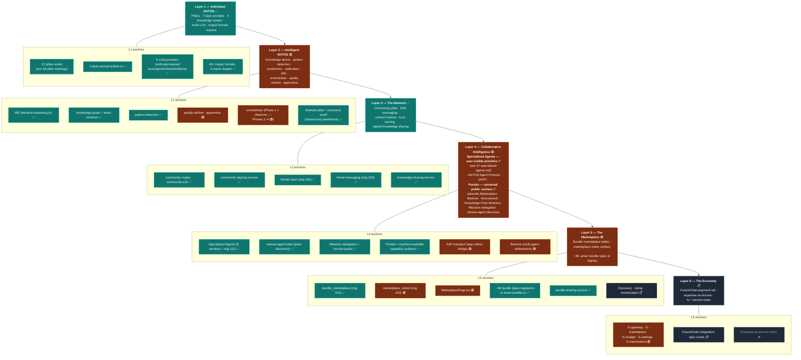

# 04-six-layer-vision — ANTON Six-Layer Vision (Strategic)

**Status of diagram:** Generated 2026-04-26 by Claude Code from commit `0fabf7f` (`openexpert@0.7.5`)
**Subsystem status legend:** ✅ Built · 🟢 Partial · 📋 Spec-only · ❌ Future
**Document type:** **Strategic reference, not a structural diagram.** Per `ANTON_Architecture_Schematics_Brief.md` Part C, G1.4, this is the only diagram allowed to show aspirational layers without a tight code citation per node. It maps each layer to *which already-built features serve it* and which are still ahead.
**Maintainer note:** Regenerate when a layer crosses a status threshold (e.g. Marketplace flips from 🟢 → ✅, Economy from ❌ → 📋).

The 6-layer vision is from `CLAUDE.md` "Knowledge Layers & Vision" — each layer independently valuable, each making the next more powerful.

## Diagram

## Reading the diagram

The vertical chain (L1 → L6) is the **value-amplification axis**: each layer is independently valuable, and each layer makes the next more powerful. The horizontal anchor groups show **which already-built features serve each layer** — so a strategic conversation about "where are we on Layer 4?" can be answered with a concrete inventory of services and migrations rather than a roadmap.

This is also the diagram to look at when adding a new feature: ask which layer it serves, and whether it makes the next layer more powerful (per CLAUDE.md guidance).

## Layer-by-layer summary

| Layer | Status | What's there now | What's still ahead |
|---|---|---|---|
| **L1 Individual ANTON** | ✅ | 12 pillars, 7-layer prompts, 4 knowledge modes, 6 LLM providers, exports, knowledge packs | — |
| **L2 Intelligent ANTON** | 🟢 | IRE, knowledge graph, atom extraction, pattern detection, Markets closed-loop. Quality ratchet + apprentice partial. Orchestrator Phase 1 only. | Orchestrator phases 2–4 (Proposal Manager → Supervised → Autonomous), full apprentice loop |
| **L3 The Network** | ✅ | E2E crypto, signing, friends + messaging, knowledge sharing | — |
| **L4 Collaborative Intelligence** | 🟢 | Specialized Agents, remote agent discovery, Missions delegation, Portals as capability surfaces | AAP contact-hash format verified end-to-end, Beehive deliberation surface, full ANTON-to-ANTON capability invocation |
| **L5 The Marketplace** | 🟢 | Bundle marketplace tables, visitor surface, 48 registered bundle types, sharing service | Discovery / rating / monetisation flows |
| **L6 The Economy** | 📋 | fc-* service stubs, FutureChain spec | FutureChain payment rail integration, expertise-as-income flows |

## Source references (loose, by design)

This diagram intentionally cites broadly rather than per-line — it's strategic, not structural. For tight citations see the structural diagrams (`01`, `02`, `03`).

- **L1:** `src/App.tsx`, `src/lib/constants.ts`, `server/services/prompt-builder.ts`, `server/services/unified-llm-client.ts`, `server/services/export-*.ts`.
- **L2:** `server/services/iterative-reasoning.ts`, `knowledge-graph.ts`, `atom-extractor.ts`, `pattern-detection.ts`, `quality-ratchet.ts`, `apprentice.ts`, `orchestrator-engine.ts`, `market-*.ts`.
- **L3:** `server/services/community-{crypto,e2e,signing-service}.ts`, `knowledge-sharing-service.ts`, migrations 077, 080, 099–104, 110, 164–165.
- **L4:** `server/services/agent-*.ts`, `remote-agent-client.ts`, `mission-delegation.ts`, `portals/`, `capability-descriptor/`, `aap-rollout-bridge.ts`, `beehive-*.ts`.
- **L5:** `server/db/migrations-pg/104_bundle_marketplace.sql`, `163_marketplace_visitor.sql`, `server/services/anton-bundler.ts`, `bundle-sharing-service.ts`, `src/pages/MarketplacePage.tsx`.
- **L6:** `server/services/fc-*.ts`, migrations 081, 082, 087.
- **CLAUDE.md** — "Knowledge Layers & Vision" section is the canonical six-layer narrative.

## Open questions

- **Layer 2 Orchestrator phasing** — exact built/partial split per phase (Observer → Proposal → Supervised → Autonomous) needs the G3.2 deep-dive before the L2 status can be promoted from 🟢 to ✅.
- **Layer 4 AAP** — until contact-hash format and full handshake are confirmed in code, AAP stays 🟢 (transport bridge exists; protocol semantics unverified).
- **Layer 5 Marketplace** — the *surface* exists but the *economy mechanics* (discovery, rating, monetisation) do not. Status is intentionally split per anchor.

## Related diagrams

- `01-system-context` — outer-world view that L3, L4, L5, L6 all touch.
- `02-container-diagram` — services that anchor each layer.
- `03-pillar-topology` — L1 user-facing surfaces.
- `f-50-markets-pillar` (Group 5) — L2 proof case.
- `f-51-talent-discovery` (Group 5) — L4 example.
- `30-aap-protocol` (Group 4) — L4 transport detail.
