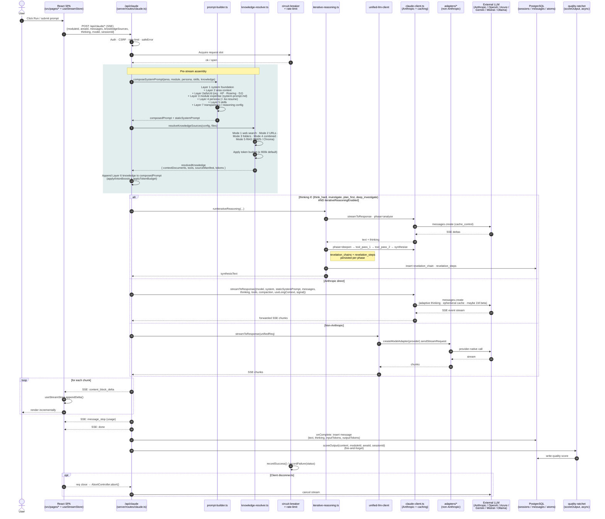

# 10-module-execution-sequence — Single Module Execution

**Status of diagram:** Generated 2026-04-26 by Claude Code from commit `0fabf7f` (`openexpert@0.7.5`)
**Subsystem status legend:** ✅ Built · 🟢 Partial · 📋 Spec-only · ❌ Future
**Maintainer note:** Regenerate when the request lifecycle changes — new pre-stream phase (compaction, IRE, quality ratchet), new persistence target, new abort/timeout logic, or a new provider-routing branch.

The canonical request lifecycle: a user clicks **Run** on a module and receives streamed output. Most module runs go through this exact path; specialised runs (Workflows, Missions, Agents) wrap or extend it.

## Diagram

## Legend

- **Pre-stream assembly box (teal)** — every request, regardless of provider, runs the full prompt + knowledge resolution pipeline before any model call. The labels Layer 1 / 3 / 5 / 7 are conceptual; the code labels only Layer 2 (with sub-layers a/b/c/d), Layer 4a, and Layer 6 explicitly. See diagram `11-seven-layer-prompt-builder` for the layer detail.
- **Three branches** — IRE (deep thinking branch), Anthropic direct (the default path; preserves prompt caching), Non-Anthropic (via the adapter factory).
- **`onComplete` callback** — same callback contract across all three branches; the route owns persistence after the stream finishes.
- **Quality scoring** — fire-and-forget; never blocks the response. Output goes into the quality_ratchet trail.

## Source-of-truth references

- `server/routes/claude.ts:5` — imports `streamToResponse`, `isApiKeyConfigured`, `callSync`, `getClient` from `claude-client`.
- `server/routes/claude.ts:11` — imports `buildOrgContextLayer`, `buildResumeContextLayer`, `buildKnowledgePackLayer`, `buildAtomLayer` from `prompt-builder`.
- `server/routes/claude.ts:993` — main Anthropic streaming call.
- `server/routes/claude.ts:990–1000` — IRE branch (`useIRE` + `runIterativeReasoning`).
- `server/routes/claude.ts:920–950` — request timeout + abort wiring (`thinkingTimeouts`, `AbortController`, `req.on('close')`).
- `server/routes/claude.ts:1496` — second `streamToResponse` (alternate route handler).
- `server/services/prompt-builder.ts:259` — `buildOrgContextLayer` (Layer 2a).
- `server/services/prompt-builder.ts:299` — `buildResumeContextLayer` (Layer 4a).
- `server/services/prompt-builder.ts:340` — `buildKnowledgePackLayer` (Layer 2b).
- `server/services/prompt-builder.ts:382` — `buildAtomLayer`.
- `server/services/prompt-builder.ts:554, 558` — Layer 2c / 2d (Roaring · Dow Jones).
- `server/services/prompt-builder.ts:562, 582` — Layer 6 hardware HKP.
- `server/services/prompt-builder.ts:2` — imports `applyAntonBoosts`, `applyTokenBudget` from `atom-boost`.
- `server/services/knowledge-resolver.ts:6–12` — 5-mode comment block.
- `server/services/knowledge-resolver.ts:34–36` — `MAX_CONTEXT_TOKENS = 900_000` default.
- `server/services/knowledge-resolver.ts:77–94` — `resolveKnowledgeSources` signature + return shape.
- `server/services/knowledge-resolver.ts:108–120` — Mode 1 web-search tool injection.
- `server/services/unified-llm-client.ts:141–300` — `streamToResponse` (provider dispatch + SSE).
- `server/services/unified-llm-client.ts:148–164` — Anthropic short-circuit (preserves caching).
- `server/services/iterative-reasoning.ts` — IRE phase loop.
- `server/services/quality-ratchet.ts` — `scoreOutput` (fire-and-forget).
- `server/services/circuit-breaker.ts` — request-slot acquisition.
- `server/db/schema.sql` — `sessions`, `messages` tables; `revelation_chains`, `revelation_steps` from migrations.

## Open questions

- **Quality-ratchet schema** — fire-and-forget call writes to a quality table; the exact target is partial in the audit and will be confirmed in `26-cross-workflow-intelligence`.
- **Compaction trigger thresholds** — `buildCompactionConfig(selectedModel, 'interactive')` returns model-specific thresholds; not detailed here but covered in `13-multi-llm-routing`.
- **Workflow / Mission / Agent execution** — these wrap the same `streamToResponse` path with their own orchestration. Separate diagrams: `24-workflow-engine` covers Workflows; Missions and Agents inherit this lifecycle and aren't drawn separately.

## Related diagrams

- `11-seven-layer-prompt-builder` — pre-stream assembly detail.
- `12-knowledge-source-resolver` — knowledge-resolver decision tree.
- `13-multi-llm-routing` — provider selection + caching + fallback.
- `22-iterative-reasoning-engine` — what happens inside the IRE branch.
- `23-reasoning-trails` — what gets persisted for the audit trail.
