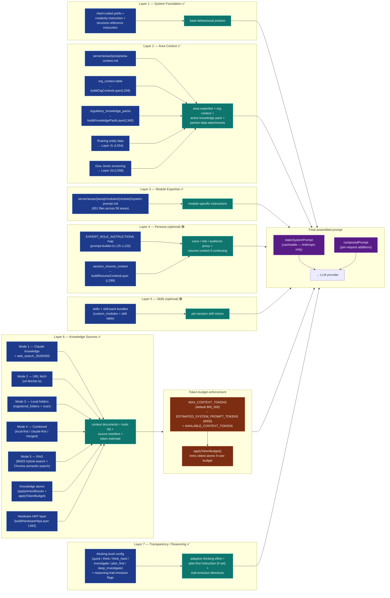

# 11-seven-layer-prompt-builder — Seven-Layer Prompt Builder

**Status of diagram:** Generated 2026-04-26 by Claude Code from commit `0fabf7f` (`openexpert@0.7.5`)
**Subsystem status legend:** ✅ Built · 🟢 Partial · 📋 Spec-only · ❌ Future
**Maintainer note:** Regenerate when a new layer is added (e.g. organisation-wide policy layer), when a layer source moves files, or when token budgeting changes.

The 7-layer prompt assembly is the heart of every ANTON request. The conceptual layer numbers come from `CLAUDE.md` and the brief; in code, only Layer 2 (with sub-layers a/b/c/d), Layer 4a, and Layer 6 are explicitly labeled — the others compose by convention. This diagram makes the layer structure explicit and grounds each layer in its source files.

## Diagram



## Layer-by-layer notes

| Layer | Optional? | Source files | Code anchor |
|---|---|---|---|
| 1 — System Foundation | required | hard-coded prefix in `prompt-builder.ts`; `CREATIVITY_INSTRUCTIONS` map (L8–L15); `getStructureReferenceInstruction` (L530) | composed inline at top of system prompt |
| 2 — Area Context | required if area selected | `server/areas/{area}/area-context.md` | composed inline |
| 2a — Org Context | optional | `org_context` table | `buildOrgContextLayer` (L259) |
| 2b — Knowledge Pack | optional | `regulatory_knowledge_packs` table | `buildKnowledgePackLayer` (L340) |
| 2c — Roaring | optional | `roaring-connector.ts` | comment marker (L554) |
| 2d — Dow Jones | optional | `dowjones-connector.ts` | comment marker (L558) |
| 3 — Module Expertise | required if module selected | `server/areas/{area}/modules/{module}/system-prompt.md` (651 files) | composed inline |
| 4 — Persona | optional | `EXPERT_ROLE_INSTRUCTIONS` map | `getExpertRoleInstruction` (L155) |
| 4a — Resume Context | optional | `session_resume_context` table | `buildResumeContextLayer` (L299) |
| 5 — Skills | optional | `custom_modules` + community skills | composed via skill-manager |
| 6 — Knowledge Sources | required (defaults) | `knowledge-resolver.ts` | `resolveKnowledgeSources` (L77) |
| 6 — Atoms boost | required when atoms exist | `atom-boost.ts` | `applyAntonBoosts` + `applyTokenBudget` |
| 6 — Hardware HKP | optional | `hkp-service.ts` | `buildHardwareHkpLayer` (L582) |
| 7 — Transparency | required | thinking-level config + `PLAN_FIRST_INSTRUCTION` (L17) | composed inline |

## Static vs dynamic prompt split

`staticSystemPrompt` carries the layers that don't change per-message (system foundation, area context, module expertise, persona); `composedPrompt` carries the per-request layers (knowledge, resume context, transparency directives).

For Anthropic models that support prompt caching (Opus 4.7, Sonnet 4.6), `staticSystemPrompt` is the *only* block tagged `cache_control: { type: 'ephemeral' }`. The reusable foundation hits the cache, the dynamic layers don't. This is why the split exists.

## Token-budget enforcement

```
AVAILABLE_CONTEXT_TOKENS = MAX_CONTEXT_TOKENS - ESTIMATED_SYSTEM_PROMPT_TOKENS
                        = 900_000          - 8_000
                        = 892_000
```

Layer 6 outputs are size-checked against `effectiveBudget`; `applyTokenBudget()` in `atom-boost.ts` trims oldest atoms first. Callers can override the default budget via `options.contextBudget` (e.g. set to `~800_000` when using the 1M-context beta on Sonnet 4.5).

## Source-of-truth references

- `server/services/prompt-builder.ts:1–2` — imports `applyAntonBoosts`, `applyTokenBudget` from `atom-boost`.
- `server/services/prompt-builder.ts:8–15` — `CREATIVITY_INSTRUCTIONS` (Layer 1 component).
- `server/services/prompt-builder.ts:17–23` — `PLAN_FIRST_INSTRUCTION` (Layer 7 component).
- `server/services/prompt-builder.ts:25–145` — `EXPERT_ROLE_INSTRUCTIONS` map (Layer 4 source).
- `server/services/prompt-builder.ts:147` — `getCreativityInstruction`.
- `server/services/prompt-builder.ts:151` — `getPlanningInstruction`.
- `server/services/prompt-builder.ts:155` — `getExpertRoleInstruction`.
- `server/services/prompt-builder.ts:167` — `getMultiPerspectiveInstruction`.
- `server/services/prompt-builder.ts:171` — `getMetaCognitiveInstruction`.
- `server/services/prompt-builder.ts:259` — `buildOrgContextLayer` (Layer 2a).
- `server/services/prompt-builder.ts:299` — `buildResumeContextLayer` (Layer 4a).
- `server/services/prompt-builder.ts:340` — `buildKnowledgePackLayer` (Layer 2b).
- `server/services/prompt-builder.ts:382` — `buildAtomLayer`.
- `server/services/prompt-builder.ts:530` — `getStructureReferenceInstruction`.
- `server/services/prompt-builder.ts:554, 558` — Layer 2c / 2d markers.
- `server/services/prompt-builder.ts:562, 582` — Layer 6 hardware HKP.
- `server/services/knowledge-resolver.ts:34–36` — token-budget constants.
- `server/areas/` — area-context.md + system-prompt.md per area/module (651 files).
- `_audit-notes.md` §3, §7 — area/module count, layer status.

## Open questions

- **Layer 1 / Layer 3 / Layer 5 / Layer 7 explicit naming** — these aren't named with a `// Layer N:` comment in `prompt-builder.ts`; they compose by convention. A future tidy-up would label them explicitly to match the spec.
- **Skills layer wiring** — Layer 5 status is 🟢 because the skill-pack mixin path is referenced but not consolidated in one helper. Confirmable via grep on `skill-manager.ts`.
- **Hardware HKP** — Layer 6 sub-component is path-aware; activates only when the user is in the Hardware Build (Tier-5 Coding) workspace.

## Related diagrams

- `10-module-execution-sequence` — where this layer assembly is invoked.
- `12-knowledge-source-resolver` — Layer 6 detail.
- `13-multi-llm-routing` — how the static / dynamic split interacts with caching.
