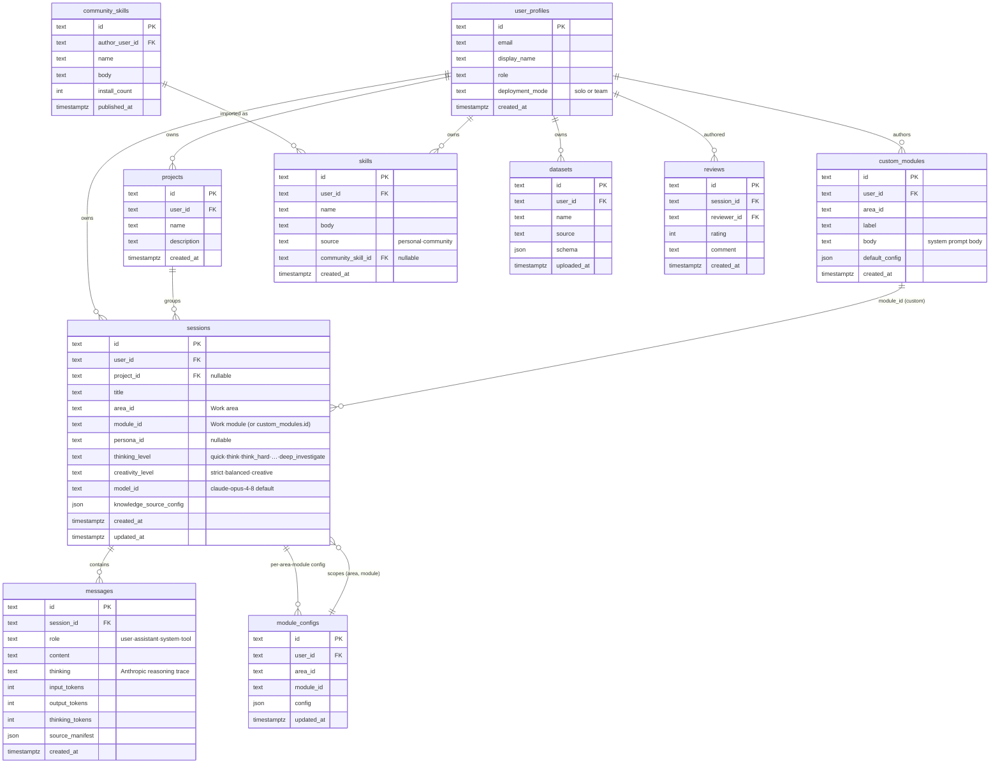

# 20a-database-areas — Schema: Areas / Modules / Work Sessions

**Status of diagram:** Generated 2026-04-26 by Claude Code from commit `0fabf7f` (`openexpert@0.7.5`)
**Subsystem status legend:** ✅ Built · 🟢 Partial · 📋 Spec-only · ❌ Future
**Maintainer note:** Regenerate when a column is added to `sessions` / `messages` / `module_configs` (the work-pillar core), or when a new pillar adds its own `*_sessions` table (e.g. talent / beehive already have).

The universal core that backs every Work-pillar interaction. `sessions` and `messages` are the most-touched tables in the codebase — every module run writes to them.

## Diagram

## Table cheatsheet

| Table | Cardinality (typical) | Notes |
|---|---|---|
| `user_profiles` | small (1 in solo, ~100s in team) | `deployment_mode` distinguishes solo/team paths |
| `sessions` | very large (every conversation) | indexed on `(user_id, updated_at DESC)` |
| `messages` | very large (every turn) | child of session; carries token usage and `source_manifest` |
| `module_configs` | medium | one per (user, area, module) — defaults editor surface |
| `projects` | small | optional grouping; many sessions can be projectless |
| `skills` / `community_skills` | small/medium | mixin layer for prompts |
| `custom_modules` | small | user-built modules (Build Your Own) |
| `reviews` | small | session-level user feedback (thumbs / rating) |
| `datasets` | medium | uploaded datasets, schema-tracked |

## Source-of-truth references

- `server/db/schema.sql:3–11` — `sessions` table.
- `server/db/schema.sql:13–23` — `messages` table.
- `server/db/schema.sql:25–31` — `registered_folders` (covered in 20b).
- `server/db/schema.sql:33–48` — `module_configs`.
- `server/db/schema.sql:50–58` — `projects`.
- `server/db/schema.sql:60–70` — `skills`.
- `server/db/schema.sql:72–84` — `reviews`.
- `server/db/schema.sql:86–98` — `user_profiles`.
- `server/db/schema.sql:100–114` — `custom_modules`.
- `server/db/schema.sql:116–127` — `community_skills`.
- `server/db/schema.sql:157–190` — `datasets`.
- Migrations after 048 alter several of these (e.g. token-usage columns, source_manifest JSON, persona_id, thinking_level) — see `_audit-notes.md` §5.

## Related diagrams

- `20b-database-knowledge.md` — `registered_folders` + atoms.
- `20d-database-reasoning-trails.md` — what's persisted alongside messages.
- `10-module-execution-sequence` — the writer of these tables.
