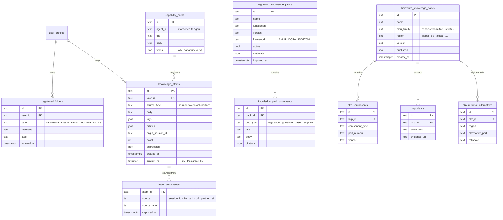

# 20b-database-knowledge — Schema: Knowledge

**Status of diagram:** Generated 2026-04-26 by Claude Code from commit `0fabf7f` (`openexpert@0.7.5`)
**Subsystem status legend:** ✅ Built · 🟢 Partial · 📋 Spec-only · ❌ Future
**Maintainer note:** Regenerate when a new knowledge-pack type is added, when atom schemas change, or when pgvector is adopted.

The persistence backing the 4-mode (now 5-mode) Knowledge Source Resolver and ANTON's atom-based learning surface.

## Diagram

## Notes

- **Atoms** are the unit of learned context. Created on every session via `atom-extractor.ts`, boosted/decayed via `atom-boost.ts`, retrieved via `hybrid-search.ts` (BM25 + entity expansion).
- **Regulatory knowledge packs** are bundled under `data/knowledge-packs/` (`.anton` archives) and ingested into `regulatory_knowledge_packs` + `knowledge_pack_documents` on import.
- **HKP** (Hardware Knowledge Pack) is the Hardware Build (Tier-5 Coding) parallel of regulatory packs — components, claims, regional alternatives.
- **Capability cards** carry the AAP capability descriptors that travel with Specialized Agents and Portals.
- **No pgvector**: semantic search is offloaded to Chroma (`server/services/chroma-client.ts`) + Ollama embeddings (`embedding-pipeline.ts`).

## Source-of-truth references

- `server/db/schema.sql:25–31` — `registered_folders`.
- `server/db/migrations-pg/039_knowledge_atoms_fts_pg.sql` — atom FTS.
- `server/db/migrations-pg/098_atom_provenance.sql` — provenance.
- `server/db/migrations-pg/078_knowledge_sharing.sql` — sharing flows.
- `server/db/migrations-pg/133_hardware_build_foundation.sql` — `hardware_knowledge_packs`, `hkp_components`, `hkp_claims`.
- `server/db/migrations-pg/135_esp32_wroom_32e_hkp_seed.sql`, `141_esp32_regional_sourcing_more.sql` — `hkp_regional_alternatives`.
- `server/services/atom-extractor.ts` — atom writer.
- `server/services/atom-boost.ts` — boost / decay / token-budget.
- `server/services/hybrid-search.ts` — atom retrieval.
- `server/services/hkp-service.ts` — HKP service.
- `server/services/knowledge-pack-service.ts` — pack import / activation.

## Related diagrams

- `12-knowledge-source-resolver` — runtime usage of these tables.
- `20e-database-memory-patterns.md` — the learning loop on top of atoms.
- `25-coding-area.md` — Hardware Build (Tier 5) usage of HKPs.
