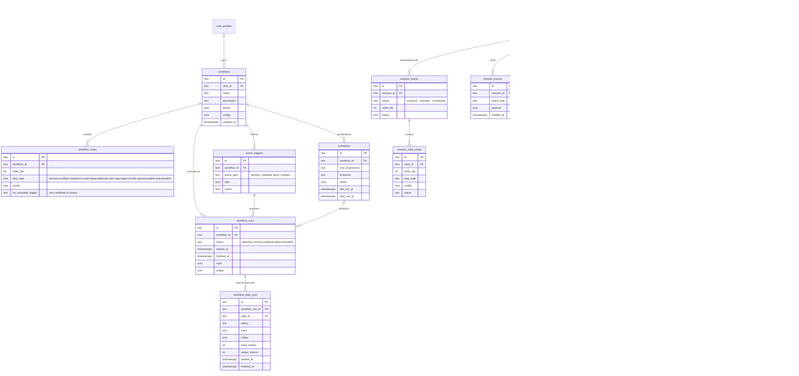

# 20c-database-workflows — Schema: Workflows / Triggers / Schedules / Missions

**Status of diagram:** Generated 2026-04-26 by Claude Code from commit `0fabf7f` (`openexpert@0.7.5`)
**Subsystem status legend:** ✅ Built · 🟢 Partial · 📋 Spec-only · ❌ Future
**Maintainer note:** Regenerate when a new step type, trigger type, or mission track is added.

The persistence layer for the Workflow Engine, the trigger / schedule system, and the Missions multi-step automation engine. They share infrastructure but model different domains.

## Diagram

## Notes

- **Workflow Engine** ✅ — `server/services/workflow-executor.ts` walks `workflow_steps` ordered by `order_idx`. `event-workflow-processor.ts` listens for `event_triggers`. `schedules` is polled by a cron-style scheduler (`schedules.ts`).
- **Step types** — confirmed in code: prompt-run, condition, transform, script, sleep, webhook, user-input, approval, file-upload, parallel, loop, dynamic + onComplete chaining. Brief calls for 12; the catalogue above lists the confirmed set. Marked 🟢 in audit because no single declarative table enumerates the names.
- **Missions** ✅ — separate engine on top of similar primitives. Has its own credential vault (`mission_credentials` references `credential-vault.ts` encrypted store), its own delivery surface (`mission_deliveries` → inbox / email / push / webhook), and its own gating (`mission_checkpoints`).
- The Missions tables intentionally don't reuse `workflow_steps` because mission tracks are domain-specific (research / outreach / monitoring) and need richer state than generic steps.

## Source-of-truth references

- `server/services/workflow-executor.ts` — step dispatcher.
- `server/services/event-workflow-processor.ts` — trigger consumer.
- `server/services/event-emitter.ts` — emitter.
- `server/routes/triggers.ts` + `server/routes/workflows.ts` + `server/routes/schedules.ts` — REST surface.
- `server/db/migrations-pg/115_missions_foundation.sql` — `missions`.
- `server/db/migrations-pg/116_missions_action_layer.sql` — action layer.
- `server/db/migrations-pg/117_missions_tracks_events.sql` — `mission_tracks`, `mission_events`.
- `server/db/migrations-pg/118_missions_delivery.sql` — `mission_deliveries`.
- `server/db/migrations-pg/119_missions_financial.sql` — financial gating.
- `server/db/migrations-pg/120_missions_delegation.sql` — delegation links.
- `server/db/migrations-pg/121_missions_review_fixes.sql`, `122_missions_grow_bridge.sql` — fixes + Grow integration.
- `server/services/missions/seed-templates.ts` — `tmpl_amlr_readiness_v1`.
- `server/services/credential-vault.ts` — encrypted vault for `mission_credentials`.

## Related diagrams

- `24-workflow-engine` — engine architecture (services + step types).
- `25-coding-area` — Hardware Build uses workflow primitives.
- `33-portals-pathfinder` — capability invocations call into workflows.
