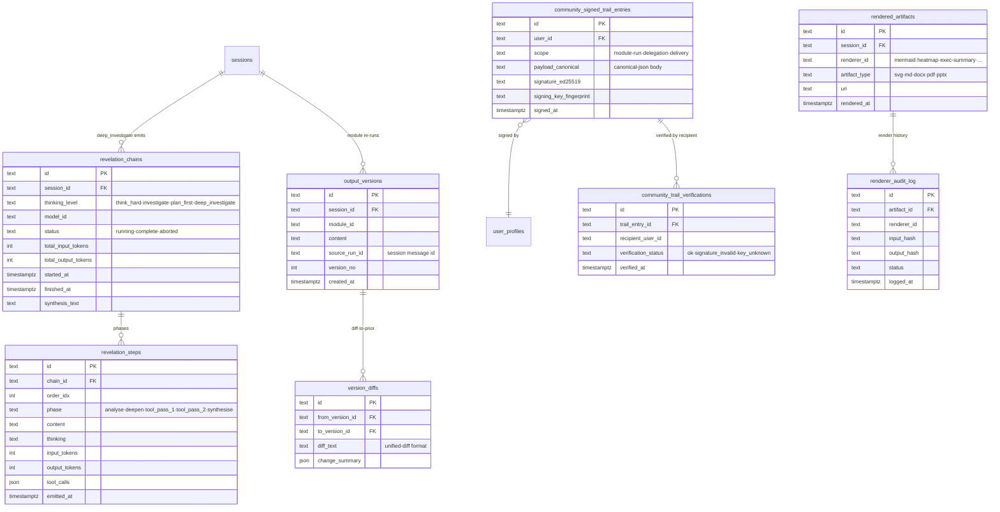

# 20d-database-reasoning-trails — Schema: Reasoning Trails

**Status of diagram:** Generated 2026-04-26 by Claude Code from commit `0fabf7f` (`openexpert@0.7.5`)
**Subsystem status legend:** ✅ Built · 🟢 Partial · 📋 Spec-only · ❌ Future
**Maintainer note:** Regenerate when a new emission point is added (e.g. a new orchestrator phase emits its own trail), when signed-trail formats change, or when a new trail-export bundle type ships.

The audit substrate. Every reasoning step that ANTON takes — IRE revelations, orchestrator decisions, signed deliveries — leaves a row here.

## Diagram

## Notes

- **Revelation chains** are the IRE primary trail. One chain per `deep_investigate` (or escalated `think_hard+`) run; multiple `revelation_steps` capture each phase.
- **Output versions + diffs** are the iteration trail — every re-run with refinements is a new `output_versions` row; `version_diffs` makes the change auditable.
- **Signed trail entries** are the AAP-side audit primitive. When a Specialized Agent or Mission delivers an output to another ANTON instance, the canonical body is signed Ed25519 and recorded with key fingerprint. Recipients log `community_trail_verifications` rows after checking.
- **Rendered artifacts + renderer audit log** are the Output Transformation System (Phase 1) trail — every renderer pass logs input/output content hashes for reproducibility.

## Source-of-truth references

- `server/services/iterative-reasoning.ts` — emits `revelation_chains` + `revelation_steps`.
- `server/db/migrations-pg/080_signed_trails_and_compliance.sql` — `community_signed_trail_entries`.
- `server/services/community-signing-service.ts` — Ed25519 signing.
- `server/db/migrations-pg/123_output_transformation.sql` — `rendered_artifacts`, `renderer_audit_log`.
- `server/db/migrations-pg/124_output_transformation_review_fixes.sql` — review fixes.
- `server/services/renderer-registry.ts` (+ `renderer-registry.builtin.ts`) — renderer dispatch that writes to these tables.
- Output-version migration (probably bundled into 040–060 range; not separately confirmed in this audit) — version + diff tables. 🟢 Partial confirmation.

## Open questions

- **Output-versions migration number** — this audit didn't pinpoint the exact migration; the tables exist but their migration of origin needs confirmation when deeply diffing schema.
- **Reasoning Trail viewer surface** — there's no top-level `ReasoningTrailViewer.tsx` page; trails are surfaced via the IRE drawer in the companion app and per-session reasoning panel in the SPA. A consolidated audit-trail view would benefit regulatory users (Evidence Pack covers part of this).

## Related diagrams

- `22-iterative-reasoning-engine` — emitter of revelation chains.
- `23-reasoning-trails` — the broader audit-system architecture.
- `30-aap-protocol` — signed trails travel via AAP.
- `f-51-talent-discovery` — talent_audit_trail, a related but pillar-specific trail table.
