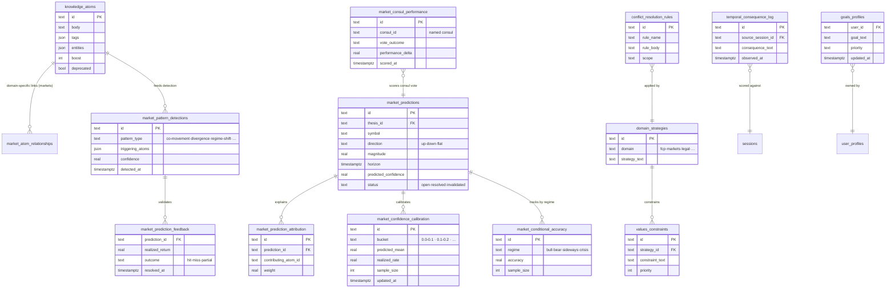

# 20e-database-memory-patterns — Schema: Memory & Patterns

**Status of diagram:** Generated 2026-04-26 by Claude Code from commit `0fabf7f` (`openexpert@0.7.5`)
**Subsystem status legend:** ✅ Built · 🟢 Partial · 📋 Spec-only · ❌ Future
**Maintainer note:** Regenerate when a new pattern type is added, when the apprentice signal model changes, or when temporal-reasoning tables shift.

The persistence behind ANTON's "intelligent" layer (Layer 2 of the six-layer vision). Atoms accumulate context, patterns surface across atoms, calibration tracks how well predictions hold up.

## Diagram

## Notes

- The Markets pillar is the *canonical* example of the memory + pattern + calibration loop in action — it has its own dedicated tables (here) plus 40+ more covered in the Markets future-state diagram.
- **Apprentice signal** (per CLAUDE.md L2 vision) is generated from pattern detections + prediction feedback; the table layout is per-pattern rather than a unified `apprentice_signals` table — `🟢` until that consolidation lands.
- **Conflict resolution rules** drive `conflict_resolution_service.ts` (resolves contradictions across atoms / strategies / packs).
- **Temporal consequence log** (migration 071) lets ANTON reason about second-order effects of past decisions over time.

## Source-of-truth references

- `server/db/migrations-pg/039_knowledge_atoms_fts_pg.sql` — atoms FTS.
- `server/db/migrations-pg/051_markets_patterns_indexes.sql` — `market_pattern_detections`.
- `server/db/migrations-pg/052_markets_learning.sql` — calibration + accuracy.
- `server/db/migrations-pg/053_markets_why_chains.sql`, `054_markets_why_chains_v2.sql` — why-chains (covered in Markets future-state).
- `server/db/migrations-pg/066_market_closed_loop.sql` — closed-loop feedback.
- `server/db/migrations-pg/071_temporal_reasoning.sql` — `temporal_consequence_log`.
- `server/db/migrations-pg/072_strategic_portfolios.sql` — `domain_strategies`, `values_constraints`.
- `server/db/migrations-pg/075_temporal_conflict_resolution.sql` — `conflict_resolution_rules`.
- `server/db/migrations-pg/154_markets_pattern_feedback.sql`, `156_markets_prediction_verification_tracking.sql` — feedback + verification.
- `server/services/atom-extractor.ts`, `atom-boost.ts` — atom writers.
- `server/services/pattern-detection.ts` — pattern detector.
- `server/services/quality-ratchet.ts`, `apprentice.ts` — quality + apprentice surfaces.
- `server/services/knowledge-graph.ts` — graph writer (atoms + relationships).

## Related diagrams

- `26-cross-workflow-intelligence` — funnel diagram explaining how these tables feed each other.
- `f-50-markets-pillar` — the full Markets-specific memory diagram.
- `20b-database-knowledge.md` — atoms / provenance.
