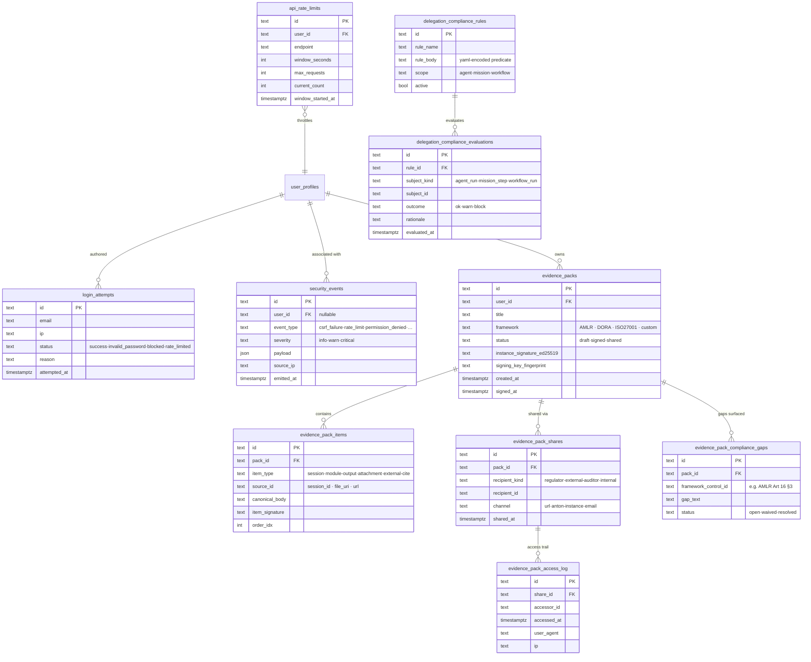

# 20f-database-compliance — Schema: Compliance / Audit / Evidence

**Status of diagram:** Generated 2026-04-26 by Claude Code from commit `0fabf7f` (`openexpert@0.7.5`)
**Subsystem status legend:** ✅ Built · 🟢 Partial · 📋 Spec-only · ❌ Future
**Maintainer note:** Regenerate when a new compliance rule type is added, when Evidence Pack item types expand, or when delegation-compliance evaluation criteria change.

The persistence behind ANTON's compliance-as-code surface, the Evidence Pack module, and the universal security/audit log.

## Diagram

## Notes

- **Evidence Pack** ✅ — instance-level Ed25519 signing of canonical bodies. Per memory: 4 frameworks shipped (AMLR / DORA / ISO27001 / custom); org-level signing + 3 minor frameworks deferred. Items can be sessions, module outputs, attachments, or external citations.
- **Compliance gaps** are surfaced by deterministic checks (e.g. AMLR Article 16 mandatory components) and rendered in the pack viewer with status flags.
- **Delegation compliance** is the safety net for Specialized Agents and Missions: rules are YAML predicates evaluated per agent run / mission step / workflow run.
- **Security events + login attempts** are the universal audit substrate; `auditLogger.ts` writes here on every middleware-detected anomaly.
- **API rate limits** ✅ — token-bucket per (user, endpoint).

## Source-of-truth references

- `server/db/schema.sql:129–139` — `login_attempts`.
- `server/db/schema.sql:141–155` — `security_events`.
- `server/db/migrations-pg/152_evidence_packs.sql` — Evidence Pack core.
- `server/db/migrations-pg/153_evidence_pack_compliance_gaps.sql` — gaps.
- `server/db/migrations-pg/079_task_delegation.sql` + `080_signed_trails_and_compliance.sql` — delegation foundation + signed trails.
- `server/services/auditLogger.ts` — emitter.
- `server/services/delegation-compliance-service.ts` — rule evaluation.
- `server/services/compliance-rules.ts` — rule registry.
- `server/middleware/{auth,csrf,rate-limit}.ts` — emitters that write `security_events`.
- `EVIDENCE_PACK_SPEC.md` — spec for the Evidence Pack module.

## Open questions

- **Org-level Evidence Pack signing** — deferred per memory; would add an `org_signature` column or a parallel `evidence_pack_org_signatures` table.
- **Compliance-rule format** — YAML-encoded today; if Compliance-as-Code matures further, may move to a dedicated DSL with its own AST table.

## Related diagrams

- `23-reasoning-trails` — broader audit-system architecture.
- `33-portals-pathfinder` — Portals can include Evidence Pack capability cards.
- `f-51-talent-discovery` — talent-specific compliance trails (Annex III, Pay Transparency).
