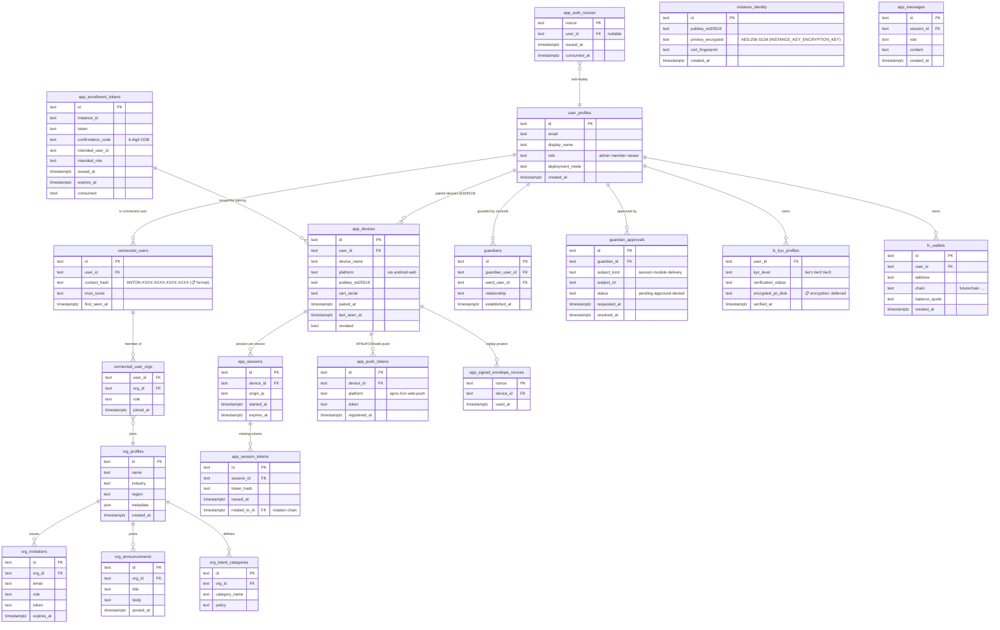

# 20g-database-rbac-identity — Schema: RBAC / Identity / Auth

**Status of diagram:** Generated 2026-04-26 by Claude Code from commit `0fabf7f` (`openexpert@0.7.5`)
**Subsystem status legend:** ✅ Built · 🟢 Partial · 📋 Spec-only · ❌ Future
**Maintainer note:** Regenerate when a new identity surface ships (e.g. SSO), when team-mode RBAC roles change, or when the KYC schema evolves.

The persistence behind multi-tenant identity, the Companion App pairing ritual, the FutureChain wallet KYC, and team-mode user/org structures.

## Diagram

## Notes

- **Two identity surfaces** — `user_profiles` is the universal identity (Work / School / Life / Markets / etc.); `connected_users` is the Network-layer surface used by Community + AAP, carrying the contact hash and trust score.
- **Companion App pairing** ✅ — `instance_identity` holds the instance Ed25519 keypair (privkey AES-GCM encrypted via `INSTANCE_KEY_ENCRYPTION_KEY`). Pairing flow writes `app_enrollment_tokens` → consumed → `app_devices` (with phone Ed25519 pubkey) → `app_sessions` + `app_session_tokens`.
- **Guardian flow** ✅ — School pillar requires `guardians` link before student-account write paths; `guardian_approvals` gates writes that need consent.
- **KYC encryption** 📋 — per memory `project_vision_gaps.md`, encrypted-PII blob handling for `fc_kyc_profiles` is deferred.
- **Contact hash format** — `ANTON-XXXX-XXXX-XXXX-XXXX` is in the spec/memory; not directly grep-confirmed in code yet (📋 for that exact format string).

## Source-of-truth references

- `server/db/schema.sql:86–98` — `user_profiles`.
- `server/db/migrations-pg/077_community_network_foundation.sql` — `connected_users` foundation.
- `server/db/migrations-pg/084_kyc_enhanced.sql` — KYC table.
- `server/db/migrations-pg/085_contact_payment_fields.sql`, `086_identity_payment_and_visibility.sql` — payment + visibility.
- `server/db/migrations-pg/094_app_gateway.sql` — `app_devices`, `app_sessions`, `app_messages`, `app_session_tokens`, `app_enrollment_tokens`.
- `server/db/migrations-pg/130_app_companion_security.sql` — `app_push_tokens`, `app_checkpoints`, `app_signed_envelope_nonces`, `instance_identity`.
- `server/db/migrations-pg/131_app_companion_security_review_fixes.sql` — review fixes.
- `server/db/migrations-pg/110_p2p_replay_protection.sql` — `p2p_message_nonces`.
- `server/services/app-enrollment-service.ts` — pairing ritual + privkey encryption.
- `server/services/identity.ts` (and `src/app/services/identity.ts`) — Ed25519 surface.
- `server/middleware/auth.ts` — JWT (team mode) + session auth (solo mode).

## Related diagrams

- `30-aap-protocol` — uses contact_hash + Ed25519 keys.
- `31-companion-app-gateway` — pairing flow + signed envelopes.
- `f-54-school-mode` — guardian + ward flow.
