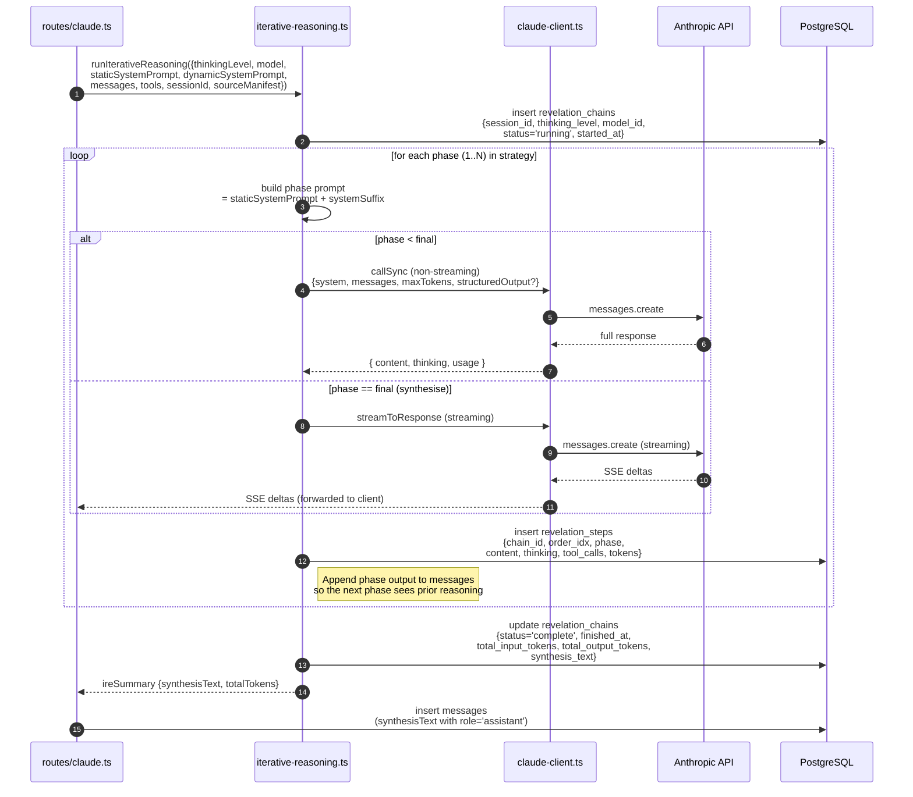

# 22-iterative-reasoning-engine — Iterative Reasoning Engine (IRE)

**Status of diagram:** Generated 2026-04-26 by Claude Code from commit `0fabf7f` (`openexpert@0.7.5`)
**Subsystem status legend:** ✅ Built · 🟢 Partial · 📋 Spec-only · ❌ Future
**Maintainer note:** Regenerate when a new IRE strategy is added or when phase prompts change materially.

The IRE is ANTON's deep-reasoning loop. It doesn't iterate to "convergence" in the classic sense — it walks a **fixed strategy** of named phases, each with its own system-prompt suffix and token budget, persisting every step. The brief mentions a "25-iteration depth ceiling"; in code the ceiling is **per-strategy phase count** (2/4/4/6) plus per-phase token budgets, not a generic iteration cap.

## Diagram — strategy + phase architecture

```mermaid
flowchart LR
  classDef strat fill:#0F766E,stroke:#5EEAD4,color:#F0FDFA
  classDef phase fill:#1E3A8A,stroke:#93C5FD,color:#EFF6FF
  classDef out fill:#581C87,stroke:#D8B4FE,color:#FAF5FF

  Caller["routes/claude.ts<br/>useIRE = thinking ∈<br/>{think_hard, investigate,<br/>plan_first, deep_investigate}<br/>+ iterativeReasoningEnabled<br/>+ provider == anthropic"]:::out

  Caller --> Strategy{thinkingLevel}

  Strategy -- think_hard --> S1["Strategy think_hard ✅<br/>2 phases"]:::strat
  Strategy -- investigate --> S2["Strategy investigate ✅<br/>4 phases"]:::strat
  Strategy -- plan_first --> S3["Strategy plan_first ✅<br/>4 phases"]:::strat
  Strategy -- deep_investigate --> S4["Strategy deep_investigate ✅<br/>6 phases (most expensive)"]:::strat

  S1 --> P11[1. analyse]:::phase
  P11 --> P12[2. synthesise<br/>STREAMS to user]:::phase

  S2 --> P21[1. analyse]:::phase
  P21 --> P22[2. reflect<br/>+ confidence + revision_needed]:::phase
  P22 --> P23[3. deepen]:::phase
  P23 --> P24[4. synthesise<br/>STREAMS to user]:::phase

  S3 --> P31[1. analyse]:::phase
  P31 --> P32[2. plan]:::phase
  P32 --> P33[3. deepen]:::phase
  P33 --> P34[4. synthesise<br/>STREAMS to user]:::phase

  S4 --> P41[1. analyse]:::phase
  P41 --> P42[2. reflect]:::phase
  P42 --> P43[3. deepen]:::phase
  P43 --> P44[4. explore]:::phase
  P44 --> P45[5. validate]:::phase
  P45 --> P46[6. synthesise<br/>STREAMS to user]:::phase

  P12 --> Persist
  P24 --> Persist
  P34 --> Persist
  P46 --> Persist

  Persist["Per-phase write:<br/>revelation_steps row<br/>(content, thinking,<br/>input_tokens, output_tokens,<br/>tool_calls, order_idx)"]:::out
  Persist --> Final["Update revelation_chains:<br/>status, total_tokens,<br/>synthesis_text"]:::out
```

## Diagram — single revelation cycle (sequence)

## Strategy-by-strategy phase table

| Strategy | Phases | First phase prompt nub | Final phase | Total LLM calls |
|---|---|---|---|---|
| `think_hard` | analyse → synthesise | "Produce a structured, thorough analysis. Be explicit about your reasoning. Do NOT synthesise yet." | synthesise (streamed) | 2 |
| `investigate` | analyse → reflect → deepen → synthesise | "Produce a deep, multi-angle analysis." | synthesise (streamed) | 4 |
| `plan_first` | analyse → plan → deepen → synthesise | "Analyse the problem prior to producing an explicit plan." | synthesise (streamed) | 4 |
| `deep_investigate` | analyse → reflect → deepen → explore → validate → synthesise | "Exhaustive, multi-angle analysis…" | synthesise (streamed) | 6 |

## Phase output contract (from L193)

The reflection / validate phases are structured-output: they return `{ revision_needed: boolean, next_action: string, confidence: number }` so subsequent phases can branch.

## Token-budget per phase

Each phase entry in the strategy table carries a `maxTokens`. Intermediate phases get "meaningful room" (e.g. 4–8k); final synthesise phases get the model ceiling (Opus 4.7 = ~32k output) so the user-facing answer isn't truncated.

## Source-of-truth references

- `server/services/iterative-reasoning.ts:3–14` — strategy summary comment.
- `server/services/iterative-reasoning.ts:29–34` — phase shape (`name`, `systemSuffix`, `streaming`, `maxTokens`).
- `server/services/iterative-reasoning.ts:37–55` — `think_hard` strategy (2 phases).
- `server/services/iterative-reasoning.ts:57–91` — `investigate` (4 phases).
- `server/services/iterative-reasoning.ts:93–125` — `plan_first` (4 phases).
- `server/services/iterative-reasoning.ts:128–179` — `deep_investigate` (6 phases).
- `server/services/iterative-reasoning.ts:193–195` — structured-output schema for reflection (`revision_needed`, `next_action`).
- `server/routes/claude.ts:976–1000` — IRE branch decision (`useIRE = …`).
- `server/db/schema.sql` + later migrations — `revelation_chains`, `revelation_steps` tables (see `20d-database-reasoning-trails.md`).
- `_audit-notes.md` §3 — IRE status row.

## Open questions

- **"25-iteration ceiling"** — the brief mentions a 25-iteration cap; the actual cap is **phase count × per-phase tool calls + token budget**. There is no `MAX_ITERATIONS = 25` constant. Either the spec needs updating, or a unified iteration counter should be introduced for protection against runaway tool loops.
- **Tool passes** — the spec mentions `tool_pass_1`, `tool_pass_2` phases for `deep_investigate`; the code's deep_investigate has `analyse → reflect → deepen → explore → validate → synthesise`. The "tool passes" are not separate phase names — tools are usable in any phase via the `tools` parameter. (Updated diagram naming reflects code, not spec.)
- **Streaming during intermediate phases** — only the final synthesise phase streams. Intermediate phases use `callSync`. If we wanted to surface intermediate reasoning live, this would need redesign.
- **Strategy choice for non-Anthropic** — IRE is currently `provider === 'anthropic'` only (per `routes/claude.ts`). Other providers fall through to the direct-stream path.

## Related diagrams

- `10-module-execution-sequence` — IRE branch in the request lifecycle.
- `20d-database-reasoning-trails.md` — revelation_chains + revelation_steps tables.
- `23-reasoning-trails` — broader audit-system architecture.
- `13-multi-llm-routing` — why IRE is Anthropic-only.
