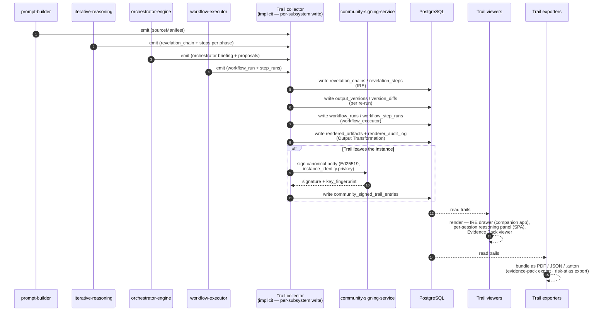

# 23-reasoning-trails — Reasoning Trails (Audit System)

**Status of diagram:** Generated 2026-04-26 by Claude Code from commit `0fabf7f` (`openexpert@0.7.5`); refreshed 2026-04-26 PM after C.2 (consolidated viewer).
**Subsystem status legend:** ✅ Built · 🟢 Partial · 📋 Spec-only · ❌ Future
**Maintainer note:** Regenerate when a new emission point is wired (e.g. a new orchestrator phase emits trails) or when export/sharing flows change.

**C.2 closure:** A consolidated viewer is now live at `/audit-trail` (frontend `AuditTrailPage.tsx`), backed by `routes/audit-trail.ts` → `trails-aggregator-service.ts`. The aggregator returns a unified `TrailEntry` shape across IRE / Workflow / Signed-delivery / Evidence-pack / Renderer-artifact kinds, with filters (kind, session, user, date range, free-text, signature status) and pagination. Subsystem status promoted from 🟢 → ✅ for the viewer surface.

The reasoning-trail system is ANTON's defensible "show your work" surface. Every reasoning step from every subsystem can be captured, signed, persisted, browsed, and exported. It's the substrate that makes ANTON usable in regulated environments.

## Diagram

## Trail kinds

| Trail kind | Source | DB table(s) | Surface |
|---|---|---|---|
| **Source manifest** | `prompt-builder` + `knowledge-resolver` | `messages.source_manifest` (json) | per-message badge in SPA / companion-app |
| **IRE revelations** | `iterative-reasoning` | `revelation_chains` + `revelation_steps` | IRE drawer (companion app), reasoning panel |
| **Output versions** | re-run iteration | `output_versions` + `version_diffs` | version-history page |
| **Workflow runs** | `workflow-executor` | `workflow_runs` + `workflow_step_runs` | WorkflowMonitor surface |
| **Orchestrator briefings** | `orchestrator-engine` | (within orchestrator service state) | OrchestrationDashboard |
| **Renderer trails** | `renderer-registry` | `rendered_artifacts` + `renderer_audit_log` | Output Transformation panel |
| **Signed delivery trails** | AAP / Specialized Agents / Missions | `community_signed_trail_entries` + `community_trail_verifications` | recipient verification, Evidence Pack |
| **Atlas integrity findings** | `atlas-integrity-rules.ts` | (atlas_events) | Risk Atlas workspace |
| **Talent audit trail** | `talent-*` | `talent_audit_trail` | Talent workspace |
| **Mission events** | mission engine | `mission_events` | Mission inbox |

## Emission discipline (canonical pattern)

Each subsystem emits its own trail; there is **no central trail collector service** today. The "Trail collector" box in the diagram is conceptual — each emitter writes directly. This keeps emission paths simple but means observability is per-subsystem.

A future consolidation would introduce `trail-emitter.ts` with a uniform `emit(kind, payload, signing?)` API.

## Export pipeline

| Export | Library / format | Trail kinds bundled | Status |
|---|---|---|---|
| Evidence Pack (PDF + JSONL + HTML) | `pdfkit` + custom JSONL writer + HTML template | source manifests + IRE summaries + output versions + signed delivery trails | ✅ |
| Risk Atlas board pack | `docx` + `pdfkit` | atlas integrity findings + cross-domain bundles + Stage 7 appetite | ✅ |
| Mission delivery (signed `.anton`) | `anton-bundler` + `community-signing-service` | mission events + signed trail entries | ✅ |
| Workflow run report | (basic markdown) | workflow_runs + step_runs | 🟢 |
| Orchestrator briefing PDF | `pdfkit` (briefing → PDF) | orchestrator proposals | 🟢 |

## UI surfaces

| Surface | What it shows | File |
|---|---|---|
| Per-message reasoning panel | source manifest + thinking trace | `src/components/SourceManifestBadge.tsx`, `ReasoningPanel.tsx` (under modules/) |
| IRE drawer (companion app) | revelation chain phase-by-phase | `src/app/components/ReasoningDrawer.tsx` |
| Evidence Pack viewer | bundled trail items + signatures | `src/pages/portals/EvidencePackViewerPage.tsx` |
| Risk Atlas workspace | integrity rules + Stage trails | `src/pages/risk-atlas/RiskAtlasWorkspacePage.tsx` |
| WorkflowMonitor | per-step outcome + token usage | embedded in workflow pages |
| OrchestrationDashboard | platform stats + briefing history | `src/pages/OrchestrationDashboard.tsx` |

## Source-of-truth references

- `server/services/trails-aggregator-service.ts` — **consolidated read API** (post-C.2); unified `TrailEntry` shape across kinds.
- `server/routes/audit-trail.ts` — REST surface mounted at `/api/audit-trail` in `server/index.ts`.
- `src/pages/AuditTrailPage.tsx` — viewer UI at `/audit-trail` (filters, pagination, detail drawer, payload inspect).
- `src/App.tsx` — `/audit-trail` route registration (alongside the existing `/audit` compliance log).
- `server/services/iterative-reasoning.ts` — emits revelation chains + steps.
- `server/services/orchestrator-engine.ts` — emits briefing + proposals.
- `server/services/workflow-executor.ts` — emits workflow_runs + step_runs.
- `server/services/renderer-registry.ts` (+ `renderer-registry.builtin.ts`) — emits rendered_artifacts + renderer_audit_log.
- `server/services/community-signing-service.ts` — Ed25519 canonical-body signer.
- `server/services/auditLogger.ts` — security_events emitter.
- `server/db/migrations-pg/080_signed_trails_and_compliance.sql` — signed-trail tables.
- `server/db/migrations-pg/123_output_transformation.sql`, `124_…` — renderer audit.
- `server/db/migrations-pg/152_evidence_packs.sql`, `153_…` — Evidence Pack pipeline.
- `EVIDENCE_PACK_SPEC.md` — bundling spec.
- `_audit-notes.md` §3 — Reasoning Trails status (🟢 because no consolidated viewer).

## Open questions

- **Unified trail collector** — should we consolidate? Pros: one place to apply policy, easier to add a privacy redactor. Cons: more coupling.
- **Trail privacy** — there's no `trail_redaction` step today. Sensitive content (PII, credentials) is the writer's responsibility.
- **Trail retention** — no automatic pruning; trails accumulate. A retention policy table would help.
- **Companion-app trail surfacing** — only the IRE drawer surfaces trails on mobile; workflow / orchestrator trails aren't accessible from the companion app.

## Related diagrams

- `20d-database-reasoning-trails.md` — schema underlying these trails.
- `22-iterative-reasoning-engine` — IRE emission detail.
- `21-orchestrator-trust-phases` — Orchestrator emission detail.
- `24-workflow-engine` — Workflow emission detail.
- `32-anton-bundle-format` — `.anton` bundling for trail export.
