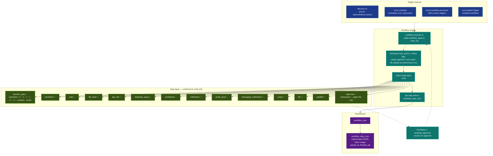
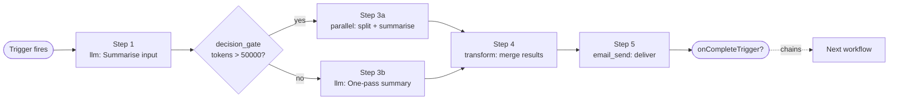

# 24-workflow-engine — Workflow Engine

**Status of diagram:** Generated 2026-04-26 by Claude Code from commit `0fabf7f` (`openexpert@0.7.5`); refreshed 2026-04-26 PM after C.4 (registry promotion).
**Subsystem status legend:** ✅ Built · 🟢 Partial · 📋 Spec-only · ❌ Future
**Maintainer note:** Regenerate when a new step type is added to `server/services/workflow-step-registry.ts`. The step-type table below is derived from that file — paraphrasing forbidden, copy the registry verbatim.

The Workflow Engine is the multi-step automation primitive underneath ANTON. Missions wrap it with credentials + delivery; Coding Area uses it for builds; pillars use it for recurring jobs. As of C.4 (Improvement Brief 2026-04-26), the **canonical step-type catalogue lives in `workflow-step-registry.ts`** — `workflow-executor.ts` imports `HEADLESS_STEP_IDS` / `INTERACTIVE_STEP_IDS` / `isRegisteredStepType` from there. New step types are added by registering, not by editing the executor switch.

## Diagram — engine architecture

## Diagram — generic workflow example

## Step-type catalogue (derived from `workflow-step-registry.ts`)

The registry is the single source of truth. **22 step types** are registered (17 headless + 4 interactive + 1 gate). Each registry entry carries `id, label, description, kind, defaultTimeoutMs, defaultRetries, configSchemaId?, notes?`.

### Headless (17) — runnable without UI

| # | ID | Label | Default timeout | Retries |
|---|---|---|---|---|
| 1 | `decision_gate` | Decision gate | 1s | 0 |
| 2 | `conditional` | Conditional | 1s | 0 |
| 3 | `transform` | Transform | 5s | 0 |
| 4 | `wait` | Wait | 600s | 0 |
| 5 | `parallel` | Parallel | 600s | 0 |
| 6 | `api_call` | API call | 30s | 1 |
| 7 | `database_query` | Database query | 30s | 0 |
| 8 | `file_read` | File read | 10s | 0 |
| 9 | `data_import` | Data import | 120s | 1 |
| 10 | `data_export` | Data export | 120s | 1 |
| 11 | `data_transform` | Data transform | 120s | 0 |
| 12 | `data_merge` | Data merge | 60s | 0 |
| 13 | `notification` | In-app notification | 10s | 1 |
| 14 | `email_send` | Email | 30s | 2 |
| 15 | `messaging_notification` | Messaging notification (push) | 15s | 2 |
| 16 | `script` | Script (sandboxed) | 60s | 0 |
| 17 | `llm` | LLM prompt (via unified-llm-client) | 300s | 1 |

### Gate (1) — pauses for external resolution

| # | ID | Label | Default timeout | Notes |
|---|---|---|---|---|
| 18 | `approval` | Approval gate | 7 days | run status flips to `awaiting_approval` |

### Interactive (4) — require frontend

| # | ID | Label |
|---|---|---|
| 19 | `claude` | Claude session step |
| 20 | `input` | User input |
| 21 | `export` | Export action |
| 22 | `checkpoint` | Checkpoint |

### Spec deltas (closed by registry promotion)

- The original whitepaper claimed **12 step types**. The registry confirms **22**. Spec is wrong; registry is authoritative.
- The original audit (26 April morning) counted **14 + 2 interactive**. That count missed `data_import / data_export / data_transform / data_merge` (4 headless) and one interactive (`checkpoint`). Updated.
- New step types added by editing `workflow-step-registry.ts` and implementing the dispatch case — no executor-level allowlist editing required.

## Triggers

| Trigger | Source | Fires when |
|---|---|---|
| **Manual** | `routes/workflows.ts` `POST /run` | user clicks Run |
| **Cron** | `schedules.cron_expression` polled by scheduler | next_run_at ≤ now |
| **Event** | `event-workflow-processor.ts` listens to `event_triggers` | event matches `(event_type, filter)` |
| **Chain** | `onCompleteTrigger` field on the previous step's last step | predecessor completes |

## Pause / resume

The `approval` step (and any interactive step) sets `workflow_runs.status = 'awaiting_approval'`. A resume webhook (or UI action) flips it back to `running` and the engine re-enters at the next step.

## Token + cost accounting

Each `llm` step records `input_tokens` + `output_tokens` on `workflow_step_runs`. The WorkflowMonitor surface aggregates per-run cost.

## Source-of-truth references

- `server/services/workflow-step-registry.ts` — **canonical step-type catalogue** (single source of truth, post-C.4).
- `server/services/workflow-executor.ts:23–27` — imports the registry sets (`HEADLESS_STEP_IDS`, `INTERACTIVE_STEP_IDS`, `isRegisteredStepType`).
- `server/services/workflow-executor.ts:96–100` — `INTERACTIVE_STEP_TYPES` filter + early `approval` handling.
- `server/services/workflow-executor.ts:220` — failure path.
- `server/services/workflow-executor.ts:243` — main `switch (step.type)`.
- `server/services/workflow-executor.ts:244–267` — `decision_gate` operators.
- `server/services/workflow-executor.ts:271, 281, 289, 351, 414, 487, 490, 498, 505, 560, 608, 642, 671` — per-step type cases.
- `server/services/workflow-executor.ts:676` — default branch (`unsupported_step_type`).
- `server/services/event-workflow-processor.ts` — event-trigger consumer.
- `server/services/event-emitter.ts` — emitter.
- `server/routes/workflows.ts`, `routes/triggers.ts`, `routes/schedules.ts` — REST surface.
- `20c-database-workflows.md` — schema for `workflows`, `workflow_steps`, `workflow_runs`, `workflow_step_runs`, `event_triggers`, `schedules`.

## Open questions

- **Spec-vs-code "12 step types"** — code has 14 confirmed + 2 interactive filtered. Update the spec or the docs to match.
- **Step retry policy** — no per-step retry confirmed; failures bubble up to `failed`. Should add `retries` + `retry_backoff` to `workflow_steps`.
- **Cancellation** — `workflow_runs.status` supports `cancelled` but the cancellation signal path (e.g. user clicks Cancel mid-run) wasn't traced.
- **Parallel step concurrency limit** — `parallel` runs children with no explicit max-concurrency; large parallel branches could overwhelm the LLM rate-limiter.

## Related diagrams

- `20c-database-workflows.md` — schema.
- `10-module-execution-sequence` — the `llm` step internally uses this lifecycle.
- `23-reasoning-trails` — workflow_step_runs are part of the audit trail.
