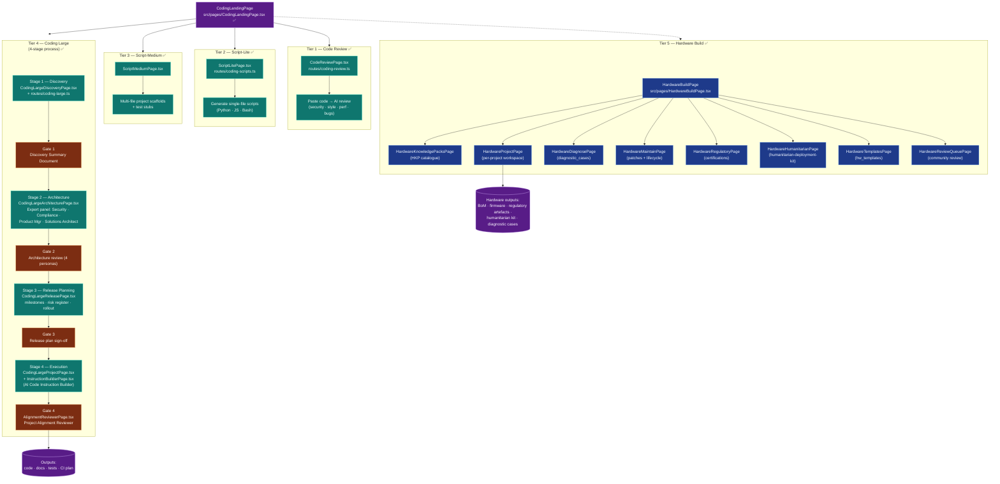

# 25-coding-area — Coding Area (4-Tier + Hardware Build Tier 5)

**Status of diagram:** Generated 2026-04-26 by Claude Code from commit `0fabf7f` (`openexpert@0.7.5`)
**Subsystem status legend:** ✅ Built · 🟢 Partial · 📋 Spec-only · ❌ Future
**Maintainer note:** Regenerate when a new tier ships, when expert-panel personas change, or when the AI Code Instruction Builder gains new tools.

The Coding Area is ANTON's AI-led software development surface. Four tiers cover the spectrum from "tweak a script" to "design a release programme"; Tier 5 (Hardware Build) extends the model into firmware + electronics + humanitarian deployments.

## Diagram

## Tier table

| Tier | Pages (under `src/pages/`) | Routes | Status |
|---|---|---|---|
| 1 — Code Review | `CodeReviewPage.tsx` | `routes/coding-review.ts` | ✅ |
| 2 — Script-Lite | `ScriptLitePage.tsx` | `routes/coding-scripts.ts` | ✅ |
| 3 — Script-Medium | `ScriptMediumPage.tsx` | `routes/coding-scripts.ts` | ✅ |
| 4 — Coding Large (4 stages) | `CodingLargeDiscovery/Architecture/Release/Project + InstructionBuilder + AlignmentReviewer` | `routes/coding-large.ts` + `routes/coding.ts` | ✅ |
| 5 — Hardware Build | 9 pages (see HW subgraph) | `routes/hardware.ts` | ✅ (foundation laid 2026-04-18 per memory) |

## Tier 4 expert personas (Stage 2 review panel)

Per `CODING_AREA_SPEC.md` (referenced from CLAUDE.md): the architecture review at Gate 2 takes the proposed architecture through four personas in series:

| Persona | Lens |
|---|---|
| **Security Analyst** | threat model, OWASP top 10, secret handling, supply-chain |
| **Compliance Officer** | data-protection (GDPR), regulated-domain hooks, retention |
| **Product Manager** | scope discipline, release-blocking gaps, user value |
| **Solutions Architect** | tradeoffs, alternatives, technical debt, scalability |

Each persona reads the Discovery Summary + draft architecture, returns a structured critique. The user reviews critiques and updates the architecture before passing Gate 3.

## Tier 4 artefact lifecycle

1. **Discovery Summary Document** — Stage 1 produces a structured doc capturing problem, constraints, success criteria, glossary, stakeholders.
2. **Architecture proposal** — Stage 2 expands Discovery into the system design.
3. **Release plan** — Stage 3 turns architecture into milestones + risk register + rollout strategy.
4. **AI Code Instruction Builder** — Stage 4's tool: takes the spec and produces *prompts for Claude Code* (or any AI assistant) to implement the work in chunks.
5. **Project Alignment Reviewer** — Gate 4: confirms the produced code traces back to the Discovery Summary (no scope drift).

## Tier 5 — Hardware Build foundations

Per memory `project_hardware_build_v4.md` (2026-04-18 foundation laid; long-running 60–80 week build):

- **HKP** (Hardware Knowledge Pack) — pack of components + claims + regional alternatives. Tables: `hardware_knowledge_packs`, `hkp_components`, `hkp_claims`, `hkp_regional_alternatives`.
- **Hardware Projects** — per-project workspace with phases (`hardware_projects`, `hardware_project_phases`).
- **Diagnostic Cases** — symptom → diagnosis chain (`diagnostic_cases`, `diagnostic_case_outcomes`, `diagnostic_case_cross_references`). Seeded with ESP32 cases.
- **Maintenance** — fleet + patch + lifecycle (`hw_fleet_devices`, `hw_patch_plans`, `hw_patch_stages`, `hw_patch_rollouts`, `lifecycle_events`, `lifecycle_event_project_impacts`).
- **Regulatory** — certifications + signoffs (`hw_regulatory_artefacts`, `hw_regulatory_signoffs`).
- **Quality** — automated test runs (`hw_quality_runs`, `hw_quality_results`, `hw_quality_scores`).
- **Templates** — hardware-template + instantiation (`hw_templates`, `hw_template_instantiations`).
- **Capacity Transfer** — knowledge transfer artefacts + signoffs (`hw_capacity_transfer_artefacts`, `hw_capacity_transfer_signoffs`).
- **Humanitarian** — humanitarian deployment kits (`hw_humanitarian_deployments`).
- **Community Review Queue** — for HKP / templates / projects pending review (`hw_community_review_queue`).

## Source-of-truth references

- `server/routes/coding.ts` — top-level coding routes.
- `server/routes/coding-large.ts` — Tier 4 routes.
- `server/routes/coding-review.ts` — Tier 1.
- `server/routes/coding-scripts.ts` — Tier 2 + 3.
- `server/routes/hardware.ts` — Tier 5.
- `src/pages/CodingLandingPage.tsx`, `CodeReviewPage.tsx`, `ScriptLitePage.tsx`, `ScriptMediumPage.tsx`, `CodingLargeDiscoveryPage.tsx`, `CodingLargeArchitecturePage.tsx`, `CodingLargeReleasePage.tsx`, `CodingLargeProjectPage.tsx`, `InstructionBuilderPage.tsx`, `AlignmentReviewerPage.tsx`.
- `src/pages/HardwareBuildPage.tsx`, `HardwareKnowledgePacksPage.tsx`, `HardwareProjectPage.tsx`, `HardwareDiagnosePage.tsx`, `HardwareMaintainPage.tsx`, `HardwareRegulatoryPage.tsx`, `HardwareHumanitarianPage.tsx`, `HardwareTemplatesPage.tsx`, `HardwareReviewQueuePage.tsx`.
- `server/db/migrations-pg/133_hardware_build_foundation.sql` … `144_hardware_hardening.sql` — Tier 5 schema (12 migrations).
- `CODING_AREA_SPEC.md` — referenced from CLAUDE.md (not directly verified in this audit).
- `docs/HARDWARE_BUILD_ROADMAP.md` — Tier 5 roadmap.
- `_audit-notes.md` §3 — Coding Area status.

## Open questions

- **Expert-panel persona-prompt files** — are the four Stage-2 personas backed by `system-prompt.md` files under `server/areas/coding/`? Not directly grep-confirmed in this audit.
- **AI Code Instruction Builder output format** — does it produce `.anton instruction-builder-project` bundles? `anton-bundler.ts` registers that bundle type, suggesting yes.
- **Tier 4 ↔ Tier 5 hand-off** — when Tier 4 design touches embedded firmware, does Tier 5 take over? No explicit hand-off route confirmed.

## Related diagrams

- `20b-database-knowledge.md` — HKP schema.
- `26-cross-workflow-intelligence` — Coding Area outputs feed quality ratchet + apprentice signals.
- `32-anton-bundle-format` — coding-blueprint, instruction-builder-project, hardware-project bundles.
