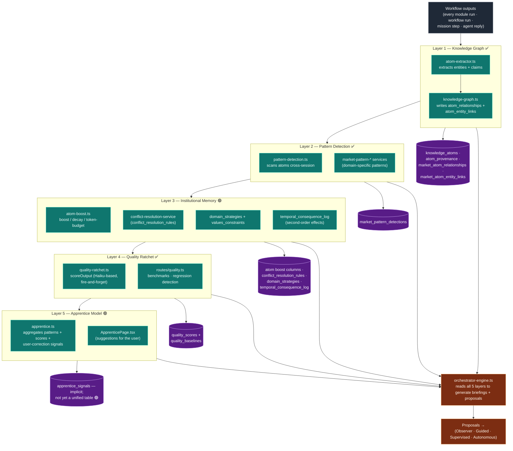

# 26-cross-workflow-intelligence — Cross-Workflow Intelligence (5-Layer Funnel)

**Status of diagram:** Generated 2026-04-26 by Claude Code from commit `0fabf7f` (`openexpert@0.7.5`); refreshed 2026-04-26 PM after E.1 (funnel orchestrator).
**Subsystem status legend:** ✅ Built · 🟢 Partial · 📋 Spec-only · ❌ Future
**Maintainer note:** Regenerate when a layer ships, when the apprentice signal model changes, or when quality-ratchet thresholds tune.

**E.1 closure (refined post-second-take):** `server/services/cross-workflow-intelligence.ts` is the funnel orchestrator with isolated try/catch per stage. After the second-take review caught contract mismatches, the orchestrator now correctly:
- writes a synthetic `workflow_outputs` row before calling `atomExtractor.extractAtoms(outputId)` (Layer 1);
- consumes pattern-detection methods that return arrays directly (`x.length`, not `x.patternsDetected`);
- requires `userId` in `FunnelInput` and forwards it to `apprentice.recordSession()` (Layer 5).

Layer 2 (graph-update) is intentionally orchestrated by Layer 1's internal `detectRelationships()` — there is no separate `addEntitiesFromContent` entry-point in `knowledge-graph.ts`, and the funnel reflects that honestly rather than pretending. Subsystem status: **🟢 wired-but-unused**.

**2026-07-06 correction (code wins over docs):** the earlier claim that the funnel is invoked was wrong. `runCrossWorkflowFunnel` / `runCrossWorkflowFunnelInBackground` have **zero callers** anywhere in the codebase (verified by grep, 2026-07-06) — the funnel orchestrator is dead code that has never executed. What actually runs in `routes/claude.ts` `onComplete` are the individual stages, inlined separately: quality scoring (`claude.ts:895`) and apprentice promotion (`claude.ts:942`, via raw SQL, not the service). The unifying "5-layer funnel" described below is aspirational, not wired.

**2026-07-17 update:** `server/services/cross-workflow-intelligence.ts` was **deleted** — it was a zero-caller duplicate (with a raceier apprentice stage) of the inline `routes/claude.ts onComplete` path that actually runs. The individual stages remain wired inline; there is no orchestrating funnel file. This doc is retained as the record of the intended 5-layer design, not of a shipped orchestrator.

The 5-layer funnel from CLAUDE.md / brief: **Knowledge Graph → Pattern Detection → Institutional Memory → Quality Ratchet → Apprentice Model**. These services exist in code (per audit) but there is no single orchestrating "funnel" file — they're called by emitters across pillars, and aggregate state is read by the Orchestrator. Marked 🟢 because of the missing orchestration layer.

## Diagram

## Funnel reading

**Each layer narrows what the next sees.** Layer 1 captures *everything* from every interaction. Layer 2 surfaces *patterns*. Layer 3 *retains the patterns that matter* (boosts useful atoms, decays stale ones, resolves conflicts, attaches strategy/value constraints). Layer 4 *grades outputs* against learned standards. Layer 5 turns the survival-of-the-fittest signal into *concrete suggestions* for the user.

The Orchestrator is the consumer at the funnel's bottom: its briefings and proposals are the user-visible output of the funnel.

## Per-layer code anchors

| Layer | Service | Tables | Status |
|---|---|---|---|
| 1 — Knowledge Graph | `atom-extractor.ts`, `knowledge-graph.ts` | `knowledge_atoms`, `atom_provenance`, `market_atom_*` | ✅ |
| 2 — Pattern Detection | `pattern-detection.ts`, `market-pattern-*` | `market_pattern_detections` | ✅ |
| 3 — Institutional Memory | `atom-boost.ts`, `conflict-resolution-service`, `temporal_consequence_log` writer | `domain_strategies`, `values_constraints`, `conflict_resolution_rules`, `temporal_consequence_log` | 🟢 |
| 4 — Quality Ratchet | `quality-ratchet.ts` (Haiku scoreOutput, fire-and-forget) | quality + benchmarks tables | ✅ |
| 5 — Apprentice Model | `apprentice.ts`, `ApprenticePage.tsx` | implicit (no unified `apprentice_signals` table) | 🟢 |

## Why "🟢 Partial" for L3 and L5

- **L3 — Institutional Memory** — the *components* are present (boost, conflict, strategy, temporal) but there's no orchestrating service that ties them into a unified "remember this, decay that" decision per scope. Functionality works per-pillar (especially Markets); it's the cross-pillar consolidation that's partial.
- **L5 — Apprentice Model** — the *page* exists and the *signal sources* exist, but a single `apprentice_signals` table tying it all together would make this a ✅. Today it's reconstructed by aggregating across pattern + quality + Markets feedback.

## Source-of-truth references

- `server/services/atom-extractor.ts` — Layer 1 emitter.
- `server/services/knowledge-graph.ts` — Layer 1 graph writer.
- `server/services/pattern-detection.ts` — Layer 2.
- `server/services/atom-boost.ts` — Layer 3 (`applyAntonBoosts`, `applyTokenBudget`).
- `server/services/conflict-resolution-service.ts` (or implied) — Layer 3 conflict resolver.
- `server/db/migrations-pg/072_strategic_portfolios.sql` — `domain_strategies`, `values_constraints`.
- `server/db/migrations-pg/075_temporal_conflict_resolution.sql` — `conflict_resolution_rules`.
- `server/db/migrations-pg/071_temporal_reasoning.sql` — `temporal_consequence_log`.
- `server/services/quality-ratchet.ts` — Layer 4 (referenced from `routes/claude.ts:990+` as fire-and-forget after every run).
- `server/services/apprentice.ts` — Layer 5.
- `src/pages/ApprenticePage.tsx` — Layer 5 surface.
- `server/services/orchestrator-engine.ts` — funnel consumer.
- `_audit-notes.md` §3 — Cross-Workflow Intelligence row.

## Open questions

- **Funnel orchestration** — should there be a `cross-workflow-intelligence-orchestrator.ts` that owns the L1→L5 pipeline as one service? Pros: clear ownership; Cons: more coupling.
- **Apprentice unified table** — promote L5 to ✅ by introducing `apprentice_signals (id, scope, signal_kind, payload, weight, surfaced_at)`.
- **Quality ratchet baseline** — needs a `quality_baselines` table per (module, area) to support genuine regression detection (not just per-output scoring).

## Related diagrams

- `04-six-layer-vision` — Layer 2 of the vision is anchored here.
- `21-orchestrator-trust-phases` — the consumer.
- `20e-database-memory-patterns.md` — the schema underneath.
- `f-50-markets-pillar` — the Markets pillar is the cleanest end-to-end demonstration of the funnel.
