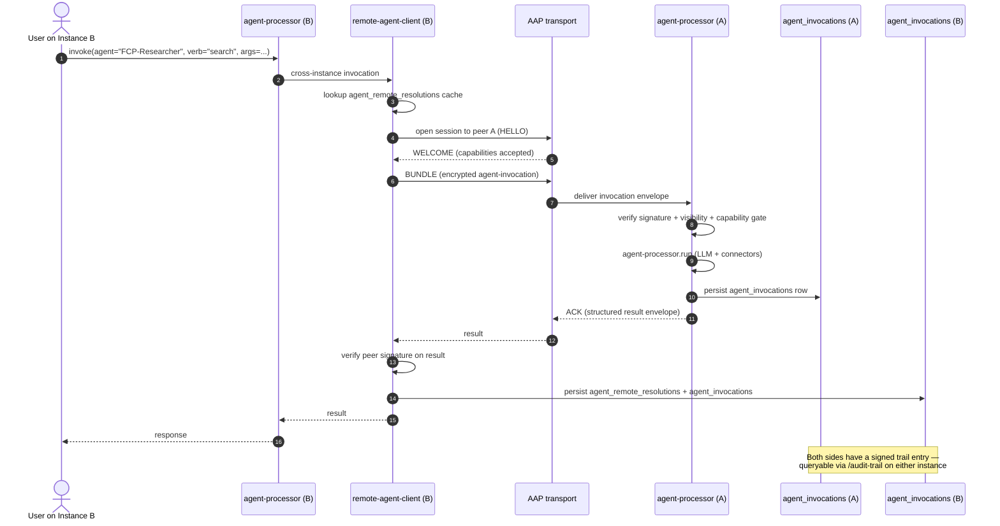

# 27-specialized-agents — Specialized Agents (Layer 4)

**Status of diagram:** Generated 2026-04-26 by Claude Code from commit `0fabf7f` (`openexpert@0.7.5`)
**Subsystem status legend:** ✅ Built · 🟢 Partial · 📋 Spec-only · ❌ Future
**Maintainer note:** Regenerate when a new agent service ships, when the connector type catalogue extends, when the visibility model changes, or when the Layer-4 framing evolves. Contributor docs are at [`/docs/agents/`](../agents/).

Specialized Agents are ANTON's user-visible Layer-4 primitive — long-lived, named, capability-bound personas that compose into Missions, are reachable across instances via AAP, and emit signed audit trails per invocation. Where Missions are templated business workflows, Agents are reusable cross-pillar primitives.

## Diagram — agent lifecycle

```mermaid
flowchart LR
  classDef build fill:#1E3A8A,stroke:#93C5FD,color:#EFF6FF
  classDef sign fill:#7C2D12,stroke:#FDBA74,color:#FFF7ED
  classDef invoke fill:#0F766E,stroke:#5EEAD4,color:#F0FDFA
  classDef trail fill:#581C87,stroke:#D8B4FE,color:#FAF5FF

  Build["Build via Hub UI<br/>or agent-builder.ts<br/>{name, system_prompt, default_model,<br/>capabilities[], connectors[], visibility}"]:::build

  Build --> Validate["agent-service.create()<br/>validate + persist agent_profiles"]:::build

  Validate --> Sign["Sign profile<br/>community-signing-service<br/>+ instance Ed25519 key"]:::sign

  Sign --> Register{visibility}
  Register -- private/team --> Local["Local registry only<br/>agent_profiles row"]:::sign
  Register -- public-aap --> RemoteReg["Publish via<br/>registry-protocol/operations/register<br/>→ peers can discover"]:::sign

  Local --> Invoke
  RemoteReg --> Invoke

  Invoke["Invocation request<br/>(local hub OR remote-agent-client)"]:::invoke
  Invoke --> Authz["agent-processor.authorize<br/>(visibility + capability gate)"]:::invoke
  Authz --> Process["agent-processor.run<br/>LLM via unified-llm-client<br/>+ tool routing"]:::invoke

  Process --> Connect{needs connector?}
  Connect -- yes --> Conn["agent-connector-executor<br/>fetch credential at call time<br/>execute external call"]:::invoke
  Connect -- no --> Result
  Conn --> Result["Structured response"]:::invoke

  Result --> TrailLocal["Append agent_invocations row<br/>(tokens, duration, outcome)"]:::trail
  Result -.-> TrailRemote["For remote calls:<br/>+ community_signed_trail_entries<br/>(both caller + peer)"]:::trail

  TrailRemote -. "via /audit-trail" .-> Auditor[("Auditor / regulator<br/>queries trail")]
  TrailLocal -. "via /audit-trail" .-> Auditor
```

## Diagram — remote-agent invocation (sequence)

## Service tree

| File | Responsibility | Status |
|---|---|---|
| `server/services/agent-service.ts` | CRUD for `agent_profiles` (`AgentProfile` interface at L8, factory at L27) | ✅ |
| `server/services/agent-processor.ts` | Conversation turn execution, tool routing (L13, type at L272) | ✅ |
| `server/services/agent-builder.ts` | UI + programmatic agent creation (L11) | ✅ |
| `server/services/agent-connector-executor.ts` | External-system bridge (`ConnectorConfig` L18, `ConnectorCallResult` L28, factory L38) | ✅ |
| `server/services/remote-agent-client.ts` | Cross-instance discovery + invocation (L23) | 🟢 (full crypto wiring per AAP follow-up) |

## Schema

Migration **111** (`111_specialized_agents.sql`) introduces:

- `agent_profiles` — id, name, system_prompt, default_model, visibility, owner_user_id, created_at
- `agent_capabilities` — agent_id → capability_id (12-verb taxonomy entries)
- `agent_connectors` — agent_id → connector_id (binding to credential vault entries)
- `agent_invocations` — full audit trail per call (caller, agent, verb, args_hash, tokens, duration, outcome)
- `agent_remote_resolutions` — cache of contact-hash → remote agent resolutions (TTL'd)

## How it relates to the rest of the platform

| Subsystem | Relationship |
|---|---|
| **Missions** | A Mission can call an Agent for a step (`agent-service.invoke`). An Agent can be the persona behind a long-running mission. See [`/docs/missions/README.md`](../missions/README.md). |
| **Workflows** | A `workflow_step_type='llm'` can route through an Agent instead of a generic prompt-builder call. |
| **AAP** | Remote-agent invocation rides on the wire-format v1 transport. See [`/docs/aap/wire-format-v1.md`](../aap/wire-format-v1.md). |
| **Portals** | A portal of `category='anton-portal'` exposes Agent capabilities as machine-readable endpoints. See [`33-portals-pathfinder.md`](33-portals-pathfinder.md). |
| **Beehive** (per Addendum 1 §E.6) | Multi-Agent deliberation across instances — the strongest expression of Layer 4. |
| **Trust phases** | Agent invocations consult `applyOrchestratorAction()` for tier-gated auto-execution. See [`21-orchestrator-trust-phases.md`](21-orchestrator-trust-phases.md). |
| **Audit trail** | Every invocation appears in `/audit-trail` (kind: `agent_invocation`). See [`23-reasoning-trails.md`](23-reasoning-trails.md). |

## Source-of-truth references

- `server/services/agent-service.ts:8` — `AgentProfile` interface
- `server/services/agent-service.ts:27` — `createAgentService` factory
- `server/services/agent-processor.ts:13` — `createAgentProcessor` factory
- `server/services/agent-builder.ts:11` — `createAgentBuilder` factory
- `server/services/agent-connector-executor.ts:18, 28, 38` — `ConnectorConfig`, `ConnectorCallResult`, factory
- `server/services/remote-agent-client.ts:23` — `createRemoteAgentClient` factory
- `server/routes/agents.ts` — REST surface
- `src/pages/agents/AgentHubPage.tsx` — UI
- `server/db/migrations-pg/111_specialized_agents.sql` — schema

## Open questions

- **Per-invocation pricing.** When Layer 6 (FutureChain) lands, `public-aap` agents will be able to charge per use. Schema for billing entries not yet designed.
- **Multi-agent deliberation primitive.** Beehive (Addendum 1 §E.6) will need a session-level abstraction over multiple `agent_remote_resolutions` calls — TBD whether to extend `agent_invocations` or introduce a `beehive_sessions` table.
- **Agent marketplace.** Agents will travel as `.anton skill-pack` bundles (#5). The bundle ↔ agent mapping is straightforward but needs an explicit category subdivision (`skill-pack:agent-profile`?).

## Related diagrams

- [`04-six-layer-vision.md`](04-six-layer-vision.md) — Layer 4 framing
- [`23-reasoning-trails.md`](23-reasoning-trails.md) — `/audit-trail` consolidated viewer
- [`30-aap-protocol.md`](30-aap-protocol.md) — wire-format that remote-agent calls ride on
- [`33-portals-pathfinder.md`](33-portals-pathfinder.md) — `anton-portal` category exposes agents as portal capabilities
- [`/docs/agents/`](../../docs/agents/) — contributor documentation
- [`/docs/marketing/specialized-agents.md`](../../docs/marketing/specialized-agents.md) — strategic positioning
