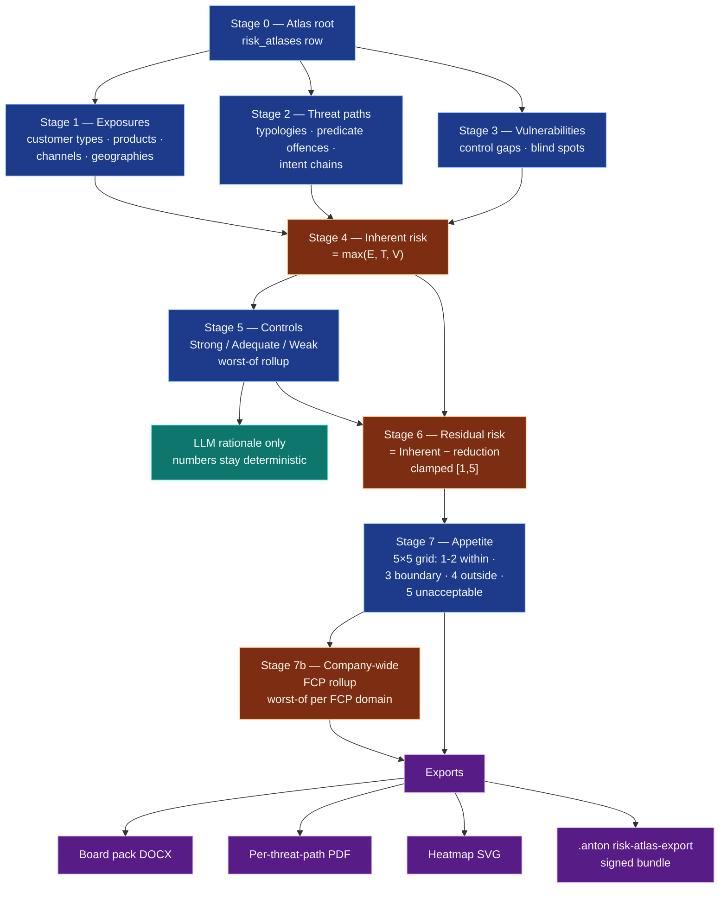

# 28-risk-atlas — Risk Atlas Pillar (Cross-Pillar Surface)

**Status of diagram:** Generated 2026-04-26 PM by Claude Code from commit `0fabf7f` (`openexpert@0.7.5`); shipped during Phase 2 maturity sprints.
**Subsystem status legend:** ✅ Built · 🟢 Partial · 📋 Spec-only · ❌ Future
**Maintainer note:** Regenerate when an industry-pack family is added, when the FCP-domain set extends, when an integrity rule lands, or when the export format catalogue grows.

Risk Atlas is ANTON's universal seven-stage threat-path engine. Generalises CASP / FCP business-wide-risk-assessment methodology for any business — bakery to bank. The architectural commitment: **deterministic engine + LLM-rationale**. Scores are reproducible across runs; the LLM writes prose, never numbers.

## Diagram — seven-stage flow

## The 6 integrity rules

`atlas-integrity-rules.ts` enforces deterministic invariants over Atlas state. Pure functions over a snapshot — no LLM, no DB writes outside the evaluation.

| Rule id | What it checks |
|---|---|
| ATLAS-INT-001 | Residual ≥ 4 with no appetite statement |
| ATLAS-INT-002 | Strong control without ≥5-character evidence string |
| ATLAS-INT-003 | Outside-appetite path missing remediation action / target date |
| ATLAS-INT-004 | Threat path with zero exposure-point links |
| ATLAS-INT-005 | Control referenced by vulnerabilities but not present in `atlas_controls` |
| ATLAS-INT-006 | Cross-domain path bundle (Stage 7b) with members from disjoint FCP scopes |

## Industry pack catalogue (33 packs)

| pack_kind | Examples | Purpose |
|---|---|---|
| `industry` | sme-general, fcp-bank, fcp-casp, fcp-payment-institution, sector-construction, sector-real-estate, sector-gambling, sector-art-dealer, … | Industry-specific overlay |
| `fcp-domain` | fcp-domain-amlcft, fcp-domain-sanctions, fcp-domain-fraud, fcp-domain-abc, fcp-domain-market-abuse, fcp-domain-tax-evasion-facilitation, fcp-domain-export-controls | FCP-domain-specific overlay |
| `overlay` | universal-fcp-core | Composes into multiple Atlases as a baseline |

Inheritance via `parent_pack_id` (cycle-protected). Loader does a two-pass insert (parents-first then parent-link) so file-system ordering doesn't break the FK chain (post-fix from 2026-04-26 PM).

## Mission integration

`tmpl_amlr_readiness_v1` is the canonical 10-task end-to-end programme for an AMLR-obliged entity. See [`/docs/missions/use-cases/amlr-readiness.md`](../missions/use-cases/amlr-readiness.md).

## Source-of-truth references

- `server/services/risk-atlas/atlas-residual-calculator.ts` — the deterministic core (25 unit tests)
- `server/services/risk-atlas/atlas-pack-loader.ts` — two-pass loader (post-fix)
- `server/services/risk-atlas/atlas-fcp-scope-service.ts` — Stage 7b rollup
- `server/services/risk-atlas/atlas-integrity-rules.ts` — 6 deterministic integrity rules
- `server/db/migrations-pg/125_risk_atlas_foundation.sql` … `129_risk_atlas_addendum_review_fixes.sql`
- `data/risk-atlas/packs/` — 33 industry/FCP-domain/overlay packs
- `tests/services/risk-atlas/` — atlas-residual-calculator + atlas-fcp-scope-rollup + atlas-integrity-rules + atlas-pack-loader tests

## Related diagrams

- [`/docs/architecture/04-six-layer-vision.md`](04-six-layer-vision.md) — Risk Atlas serves Layer 2
- [`/docs/architecture/24-workflow-engine.md`](24-workflow-engine.md) — workflows Atlas rides on
- [`/docs/risk-atlas/`](../../docs/risk-atlas/) — contributor documentation
- [`/docs/marketing/risk-atlas.md`](../../docs/marketing/risk-atlas.md) — strategic positioning
