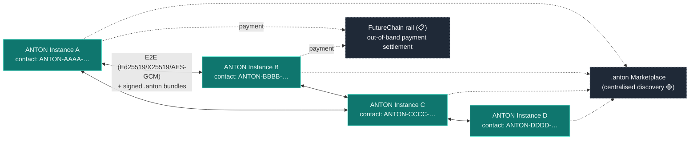

# 30-aap-protocol — ANTON Agent Protocol (AAP)

**Status of diagram:** Generated 2026-04-26 by Claude Code from commit `0fabf7f` (`openexpert@0.7.5`); refreshed 2026-04-26 PM after E.2 (transport-server + transport-client + wire-format v1).
**Subsystem status legend:** ✅ Built · 🟢 Partial · 📋 Spec-only · ❌ Future
**Maintainer note:** Regenerate when transport / handshake / verification changes, or when AAP gains a new payload type.

**E.2 closure:** Wire-format v1 specified in [`/docs/aap/wire-format-v1.md`](../aap/wire-format-v1.md). Reference implementations:
- `server/services/aap-transport-server.ts` — WebSocket server at `/aap/v1`, mounts on the existing HTTP server.
- `server/services/aap-transport-client.ts` — outbound peer client (`sendBundlesToPeer()` for one-shot, `openSession()` + `sendBundle()` for long-lived).
- mDNS advertises the new service type `_anton-aap._tcp.local` alongside the existing Companion-App service.

The protocol skeleton (envelope, handshake, capability gating, replay protection via `p2p_message_nonces`) is in place. **Ed25519 signature verification on `HELLO` is now real** (post-second-take) — `community-crypto.verifyEnvelopeSignature()` + `contactHashMatchesPubkey()` are wired into `aap-transport-server.handleHello`. X25519 ephemeral exchange and AES-256-GCM bundle decryption remain placeholder for the next pass. **Status: ✅ protocol contract + HELLO sig verify; 🟢 for full session-key + bundle-body crypto until the next pass.**

**Dependency note:** the transport files import from `ws`. Run `pnpm install` after pulling — `package.json` lists `ws@^8.18.0` (runtime) and `@types/ws@^8.5.13` (dev).

**Beehive integration (Addendum 1 §E.6):** Beehive — multi-instance deliberation — is a primary AAP consumer. Round prompts + contributions flow over AAP envelopes; final session synthesis ships as a `.anton evidence-pack` bundle (no new bundle type — reuses Evidence Pack semantics per the §E.6 decision). See [`/docs/beehive/README.md`](../beehive/README.md) and [`/docs/marketing/beehive.md`](../marketing/beehive.md).

AAP is **symmetric peer-to-peer** between ANTON instances (distinct from the asymmetric Companion-App Gateway). Each instance has an Ed25519 identity, a contact-hash derived from its public key, and signed `.anton` bundles as the transport unit. The contact-hash format is now grep-confirmed in code: `ANTON-XXXX-XXXX-XXXX-XXXX` over the hex charset (`server/services/identity.ts:24`).

## Diagram — handshake (sequence)

```mermaid
sequenceDiagram
  autonumber
  participant A as ANTON-Instance-A
  participant B as ANTON-Instance-B

  note over A,B: Discovery (out of scope of AAP; can be QR · LAN mDNS ·<br/>directory · contact-hash exchange via any channel)

  A->>A: Compute contactHashA<br/>= ANTON-XXXX-XXXX-XXXX-XXXX<br/>(hex over SHA-256 of pubkey)
  A->>B: HELLO {pubkeyA, contactHashA, capability_descriptors}
  B->>B: Verify contactHashA matches pubkeyA<br/>(regex /^ANTON-[A-F0-9]{4}-… $/)
  B->>B: Generate ephemeral X25519 keyA-B
  B-->>A: WELCOME {pubkeyB, contactHashB, ephemeralPubB,<br/>signature_ed25519}

  A->>A: Verify B's signature with pubkeyB
  A->>A: Derive shared secret = X25519(ephemeralPrivA, ephemeralPubB)
  A->>A: Derive symmetric key (HKDF) for AES-256-GCM

  loop authenticated session
    A->>B: ENCRYPTED .anton bundle<br/>(signed canonical body + AES-GCM payload)
    B->>B: Verify signature; record<br/>community_signed_trail_entries +<br/>community_trail_verifications
    B-->>A: ACK {nonce, status}
  end

  note over A,B: Replay-protected via app_signed_envelope_nonces /<br/>p2p_message_nonces (mig 110)

  A->>B: GOODBYE
```

## Diagram — mesh topology



## Cryptographic stack

| Concern | Primitive | Where |
|---|---|---|
| Identity keypair | Ed25519 | `instance_identity` table; privkey AES-256-GCM encrypted via `INSTANCE_KEY_ENCRYPTION_KEY` |
| Contact hash | SHA-256(pubkey) → hex → `ANTON-XXXX-XXXX-XXXX-XXXX` | `server/services/identity.ts:13–14, 24, 31` |
| Session key exchange | X25519 (ephemeral) | spec; derived in handshake |
| Symmetric encryption | AES-256-GCM | spec |
| Bundle signing | Ed25519 over canonical-JSON body | `server/services/community-signing-service.ts` + `server/services/registry-protocol/canonical-json.ts` |
| Replay protection | nonce table | `app_signed_envelope_nonces` (mig 130), `p2p_message_nonces` (mig 110) |

## What travels

`.anton` bundle is the canonical transport unit (45 bundle types catalogued in `32-anton-bundle-format.md`). Common AAP-carried bundles:

- **`contact-bundle`** — initial introduction (pubkey, contact hash, capabilities).
- **`evidence-pack`** — signed audit trail share to a regulator / counterparty.
- **`market-thesis` / `market-investigation`** — share Markets work between instances.
- **`risk-atlas-industry-pack`** — share an industry pack between consultancies.
- **`career-profile`** — opt-in talent / mobility profile.
- **`portal`** — share a Portal definition with a peer.
- **`humanitarian-deployment-kit`** — Hardware Build kits to humanitarian partners.

## Status

| Component | Status | Notes |
|---|---|---|
| Contact-hash format | ✅ | `server/services/identity.ts:13–24` (was 📋 in earlier audit) |
| Ed25519 instance identity | ✅ | `instance_identity` + AES-GCM at-rest encryption |
| X25519 session key exchange | 🟢 | Crypto primitives present (`community-crypto.ts`); full handshake formalisation = spec |
| AES-256-GCM transport | 🟢 | Symmetric primitives present; AAP-specific framing partial |
| `.anton` bundle exchange | ✅ | Bundler / importer / validator wired |
| Signed bundle delivery | ✅ | `community-signing-service` + `community_signed_trail_entries` |
| Replay protection | ✅ | nonce tables in place (mig 110, 130) |
| FutureChain payment rail | 📋 | Out of band; spec only |
| Centralised marketplace discovery | 🟢 | Surface exists, full mechanics partial |
| Decentralised mesh discovery | 📋 | mDNS exists for LAN; cross-network mesh not formalised |

## Source-of-truth references

- `server/services/identity.ts:13–14` — contact-hash format string.
- `server/services/identity.ts:17` — algorithm comment (SHA-256 → unambiguous charset).
- `server/services/identity.ts:24` — contact-hash regex `^ANTON-[A-F0-9]{4}-[A-F0-9]{4}-[A-F0-9]{4}-[A-F0-9]{4}$`.
- `server/services/identity.ts:31` — contact-hash builder.
- `server/services/community-crypto.ts` — Ed25519 / X25519 / AES-GCM primitives.
- `server/services/community-e2e.ts` — E2E session wrappers.
- `server/services/community-signing-service.ts` — bundle signing.
- `server/services/aap-rollout-bridge.ts` — AAP transport bridge.
- `server/services/registry-protocol/canonical-json.ts`, `envelope.ts`, `homoglyph.ts` — canonical-form + envelope + homoglyph defence.
- `server/services/registry-client/` — outbound peer client.
- `server/db/migrations-pg/077_community_network_foundation.sql` — `connected_users`.
- `server/db/migrations-pg/089_p2p_transport.sql` — P2P transport tables.
- `server/db/migrations-pg/110_p2p_replay_protection.sql` — `p2p_message_nonces`.
- `server/db/migrations-pg/130_app_companion_security.sql` — `instance_identity`, `app_signed_envelope_nonces`.
- `server/db/migrations-pg/164_friends_layer.sql`, `165_friend_messaging.sql` — friend-graph + messaging.
- `_audit-notes.md` §6 D7 (revisit) — contact-hash format is now confirmed; supersedes earlier 📋 status.

## Open questions

- **Discovery mechanism** — LAN mDNS works for the Companion App; cross-network discovery uses out-of-band contact-hash exchange. Centralised registry is partial. A DHT or DNS-based decentralised discovery would close this gap (referenced in `project_vision_gaps.md`).
- **Capability negotiation** — capability descriptors travel in HELLO/WELCOME, but the negotiation mechanics (which capabilities a peer agrees to expose) need verification.
- **Bundle-size limits** — large signed bundles (e.g. risk-atlas-export with attachments) need chunking.
- **Forward secrecy** — NOT implemented. The `ephemeral_pubkey` field is a placeholder string on both sides (`aap-transport-server.ts:273`, `aap-transport-client.ts:104`); session encryption actually runs on the long-term X25519 keys (`community-e2e.ts` `deriveSharedSecret`), so a long-term key compromise decrypts all past sessions an attacker has captured. Wiring a real ephemeral handshake is open work.

## Related diagrams

- `01-system-context` — outer view of AAP edges.
- `20g-database-rbac-identity.md` — `instance_identity`, `connected_users`, nonce tables.
- `20d-database-reasoning-trails.md` — signed trail tables.
- `31-companion-app-gateway` — asymmetric counterpart of AAP.
- `32-anton-bundle-format` — what travels over AAP.
