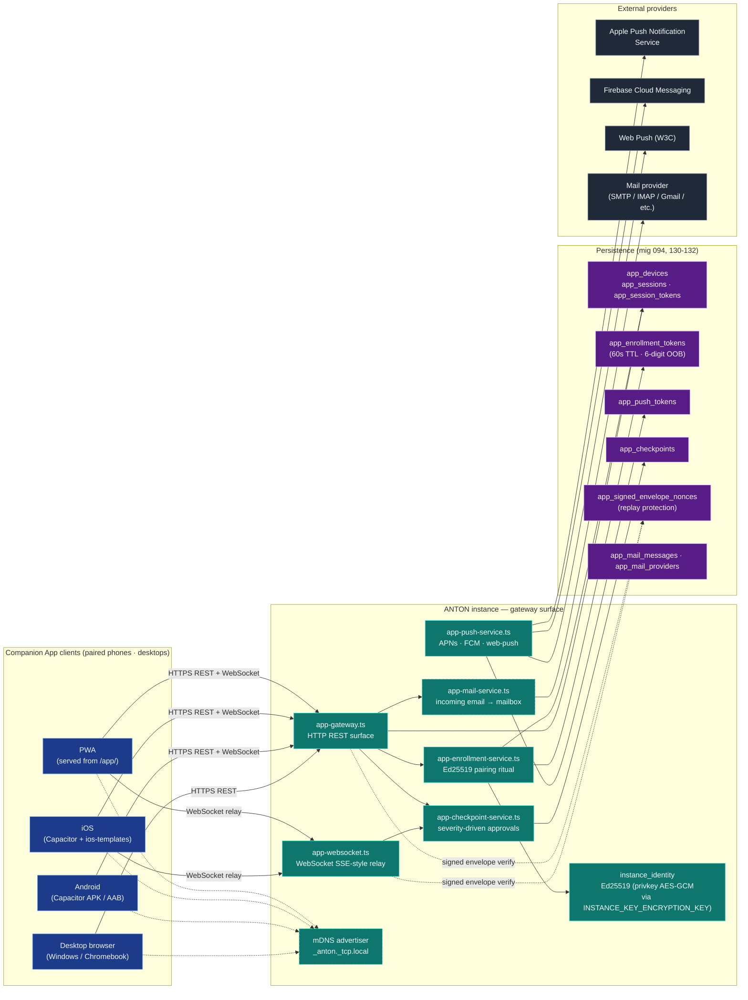

# 31-companion-app-gateway — Companion App Gateway

**Status of diagram:** Generated 2026-04-26 by Claude Code from commit `0fabf7f` (`openexpert@0.7.5`)
**Subsystem status legend:** ✅ Built · 🟢 Partial · 📋 Spec-only · ❌ Future
**Maintainer note:** Regenerate when a new pairing surface is added (e.g. SSO-pair), when push-payload contract changes, or when a new platform target ships (currently iOS/Android/PWA/desktop).

The Companion App Gateway is **asymmetric** — one ANTON instance + N paired phone/desktop clients. This is distinct from the symmetric AAP P2P (one ANTON ↔ one ANTON). It shares cryptographic primitives with AAP via `community-crypto` and `identity` but the relationship model is different.

## Diagram

## Pairing ritual (Ed25519, spec §5.2)

1. **Admin** opens "Connect a device" → instance issues a 60s-TTL **enrollment package**: `{ instance_pubkey, cert_fingerprint, endpoints, intended_user_id, intended_role, nonce, optional_6_digit_OOB_code }` and writes the row to `app_enrollment_tokens`.
2. **Phone** scans QR (or pastes code) → generates a fresh **Ed25519 keypair** (private key in Keychain / Keystore via `@aparajita/capacitor-secure-storage`).
3. **Phone** signs `${token}.${nonce}.${publicKey}` and POSTs to `/api/app/enrollment/complete` with the user-typed OOB code (if present).
4. **Server** verifies signature + OOB → issues **device certificate** + **session token** → writes to `app_devices` (with phone pubkey + cert fingerprint).
5. **Phone** biometric-locks the credentials.

## Multi-instance support

- `src/app/services/instances.ts` holds the paired-instance list per device (a phone can be paired to many ANTON instances).
- `InstanceTopBar.tsx` + `InstanceSwitcher.tsx` make the active instance unambiguous (Wallet-card style bottom sheet).
- `setActiveInstanceAsync()` is race-free; legacy single-session global key is bridged.

## Approvals (the enterprise wedge — spec §8.6)

- `app_checkpoints` table + `/api/app/checkpoints/*` REST.
- `ApprovalsScreen.tsx` is a **primary tab** with live badge.
- Severity-sorted inbox: `info → warn → critical`; biometric re-confirm on `critical / high` or `requires_biometric=true`.
- Responses are **signed envelopes** (Ed25519 sig + replay-protected nonce in `app_signed_envelope_nonces`).

## Push (spec §8.7)

- `app_push_tokens` table + APNs / FCM / web-push dispatcher.
- Payload is opaque: `{ event_id, severity, opaque_title, deep_link }` — never confidential content.
- Real dispatch enabled by `APP_GATEWAY_PUSH=true` env + provider keys.

## Voice (spec §8.4)

- `VoiceMode.tsx` full-screen overlay with hold-to-talk Telegram-style.
- On-device speech fallback if no network.
- Live captions, platform TTS via `tts.ts`.
- Immediate barge-in on tap.

## Capture (spec §8.5)

- `CapturePage.tsx` — camera / library / share-target.
- Resize to 2048px / 70% JPEG; POST to `/query-sync` with structured `capture` field (1MB soft cap server-side).

## Optional env vars

- `APP_GATEWAY_MDNS=true` — advertise `_anton._tcp.local`
- `APP_GATEWAY_LAN_BROWSE=true` — let authenticated apps browse LAN via `/api/app/discover/lan`
- `APP_GATEWAY_PUSH=true` — enable real APNs/FCM/web-push dispatch
- `APP_GATEWAY_PUBLIC_URL=https://anton.example.com` — WAN endpoint baked into enrollment QRs
- `INSTANCE_KEY_ENCRYPTION_KEY=<32-byte hex>` — required for at-rest privkey encryption

## Distribution

- **Android**: Google Play (standard), Managed Google Play, sideload APK, optional F-Droid.
- **iOS**: App Store, TestFlight, Custom Apps via Apple Business Manager, Unlisted Apps. (Templates supplied; binary not built in this repo.)
- **PWA**: served at `/app/` from the instance; installable.

## Source-of-truth references

- `server/services/app-enrollment-service.ts` — pairing ritual + device certs + signed-envelope verification + privkey encryption.
- `server/services/app-gateway.ts` — REST surface.
- `server/services/app-websocket.ts` — WebSocket relay.
- `server/services/app-push-service.ts` — APNs/FCM/web-push dispatch.
- `server/services/app-checkpoint-service.ts` — pending-approval CRUD + severity-driven biometric requirement.
- `server/services/app-mail-service.ts` — incoming mail.
- `server/services/mdns-advertiser.ts` — Bonjour `_anton._tcp` + legacy `_anton-gateway._tcp`.
- `src/app/services/identity.ts` — Ed25519 (via `@noble/ed25519`) + signed envelope + tier-aware secure storage.
- `src/app/services/instances.ts` — multi-instance store with race-free switcher.
- `src/app/services/checkpoints.ts` — Approvals client.
- `src/app/services/push.ts`, `biometric.ts`, `haptics.ts`, `tts.ts`, `capture.ts` — Capacitor wrappers.
- `src/app/pages/JoinPage.tsx` — pairing UI.
- `src/app/pages/ApprovalsScreen.tsx` — Approvals inbox.
- `src/app/pages/CapturePage.tsx` — capture surface.
- `src/app/components/InstanceSwitcher.tsx`, `InstanceTopBar.tsx`, `BottomSheet.tsx`, `QuickActionsFab.tsx`, `VoiceMode.tsx` — UI primitives.
- `tests/app/enrollment-link.test.ts`, `enrollment-service.test.ts` — 16 tests on URL parsing + signature contract.
- `ios-templates/` — `Info.plist`, `PrivacyInfo.xcprivacy`, `App.entitlements`, `Podfile`.
- `server/db/migrations-pg/094_app_gateway.sql`, `130_app_companion_security.sql`, `131_app_companion_security_review_fixes.sql`, `132_app_mail.sql`.
- `docs/COMPANION_APP_INSTALL.md` — install guide.

## Open questions

- **Web-push provider** — `web-push` library is referenced; VAPID keys are user-managed. The provider abstraction is solid.
- **WAN-only enrollment** — `APP_GATEWAY_PUBLIC_URL` allows WAN pairing; behind a NAT / firewall, the URL must be reachable. No built-in tunneling (e.g. Tailscale integration) yet.
- **Cross-instance message routing** — when a user is paired to multiple instances, push notifications use the active-instance preference; race conditions handled but worth verifying under switching load.

## Related diagrams

- `30-aap-protocol` — symmetric counterpart.
- `20g-database-rbac-identity.md` — `app_*` and `instance_identity` tables.
- `01-system-context` — outer view of Companion-App edges.
- `02-container-diagram` — gateway service tier.
