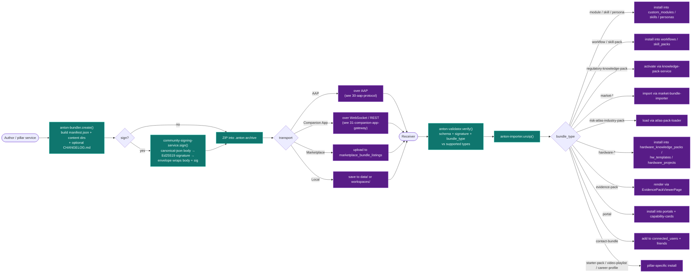

# 32-anton-bundle-format — `.anton` Bundle Format

**Status of diagram:** Generated 2026-04-26 by Claude Code from commit `0fabf7f` (`openexpert@0.7.5`); refreshed 2026-04-26 PM after D.3.
**Subsystem status legend:** ✅ Built · 🟢 Partial · 📋 Spec-only · ❌ Future
**Maintainer note:** Regenerate when a new bundle type is added to the union in `anton-bundler.ts`, when the manifest schema changes, or when the signing flow changes. **Per-type contributor docs live in `/docs/anton-format/`** (D.3 closure) — that's the canonical contributor-facing reference; this diagram is the structural view.

`.anton` is ANTON's universal package format — a ZIP with `manifest.json` + content directories per type. It's how pillars share work, how the marketplace lists items, and how AAP transports payloads. **45 bundle types** are confirmed in the code's `BundleType` union (whitepaper says 17 — code has expanded substantially).

## Diagram — lifecycle



## Manifest structure (per bundle)

```text
my-bundle.anton (ZIP)
├── manifest.json                # required
│   ├── format_version           # e.g. "1.0"
│   ├── bundle_type              # one of the 45 union types
│   ├── name
│   ├── description
│   ├── author { name, contactHash?, signing_key? }
│   ├── version                  # semver
│   ├── created_at
│   ├── contents_count
│   └── signature                # Ed25519 over canonical body (if signed)
├── system-prompt.md             # per-module/persona/workflow types
├── guided-inputs.json           # for module types
├── default-config.json          # for module types
├── CHANGELOG.md                 # optional
└── contents/
    ├── modules/                 # for skill-pack
    ├── workflows/               # for workflow / skill-pack
    ├── personas/
    ├── skills/
    ├── packs/                   # regulatory / risk-atlas
    ├── markets/                 # market-* types
    ├── hardware/                # hw types
    ├── portals/                 # portal type
    └── attachments/             # evidence pack
```

## The 45 bundle types (verbatim from `BundleType` union)

| # | Type | Family |
|---|---|---|
| 1 | `module` | Work pillar core |
| 2 | `skill` | Work pillar core |
| 3 | `persona` | Work pillar core |
| 4 | `workflow` | Work pillar core |
| 5 | `skill-pack` | Work pillar core |
| 6 | `coding-blueprint` | Coding |
| 7 | `coding-review-profile` | Coding |
| 8 | `script-lite-template` | Coding |
| 9 | `script-medium-template` | Coding |
| 10 | `instruction-builder-project` | Coding |
| 11 | `compliance-ruleset` | Governance |
| 12 | `radar-config` | Intelligence / Radar |
| 13 | `quality-baseline` | Quality ratchet |
| 14 | `brand-template` | Output / branding |
| 15 | `output-chain` | Output transformation |
| 16 | `review-panel` | Review engine |
| 17 | `project-template` | Project mgmt |
| 18 | `audience-profile` | Persona / audience |
| 19 | `lesson-plan` | School |
| 20 | `study-pack` | School |
| 21 | `assessment-bank` | School |
| 22 | `regulatory-knowledge-pack` | Knowledge |
| 23 | `market-index` | Markets |
| 24 | `market-thesis` | Markets |
| 25 | `market-intelligence-model` | Markets |
| 26 | `market-investigation` | Markets |
| 27 | `market-data-source-config` | Markets |
| 28 | `market-atom-collection` | Markets |
| 29 | `market-strategy-pack` | Markets |
| 30 | `contact-bundle` | Network / AAP |
| 31 | `risk-atlas-industry-pack` | Risk Atlas |
| 32 | `risk-atlas-fcp-domain-pack` | Risk Atlas |
| 33 | `risk-atlas-export` | Risk Atlas |
| 34 | `hardware-knowledge-pack` | Hardware |
| 35 | `hardware-template` | Hardware |
| 36 | `hardware-project` | Hardware |
| 37 | `humanitarian-deployment-kit` | Hardware |
| 38 | `diagnostic-case-bundle` | Hardware |
| 39 | `patch-bundle` | Hardware |
| 40 | `lifecycle-advisory-bundle` | Hardware |
| 41 | `portal` | Portals |
| 42 | `evidence-pack` | Compliance |
| 43 | `starter-pack` | Onboarding |
| 44 | `career-profile` | Talent |
| 45 | `video-playlist` | Visitor / video layer |

## Transport-vs-bundle matrix

| Bundle type | Transport (typical) | Notes |
|---|---|---|
| `contact-bundle` | AAP | initial peer introduction |
| `evidence-pack` | AAP / Marketplace / Local | signed + Evidence Pack viewer |
| `market-*` | Marketplace / AAP / Local | shared market work |
| `risk-atlas-*` | AAP / Local | industry packs travel between consultancies |
| `hardware-*` | AAP / Marketplace / Local | hardware projects + kits |
| `portal` | AAP / Marketplace | portal definitions |
| `regulatory-knowledge-pack` | Marketplace / AAP | published packs |
| `module / skill / persona / workflow / skill-pack` | Marketplace / AAP / Local | core building blocks |
| `lesson-plan / study-pack / assessment-bank` | School-internal / Marketplace | School pillar |
| `career-profile` | AAP (opt-in) / Local | Talent / mobility |
| `video-playlist` | Marketplace / Local | Visitor v0.8 video layer |
| `compliance-ruleset / quality-baseline / brand-template / audience-profile` | Local / Marketplace | reusable governance / brand assets |
| `coding-blueprint / instruction-builder-project / script-*-template / coding-review-profile` | Local / Marketplace | Coding tier outputs |
| `radar-config` | Marketplace / Local | Horizon Radar configs |
| `output-chain / review-panel / project-template / starter-pack` | Local / Marketplace | reusable templates |
| `humanitarian-deployment-kit / diagnostic-case-bundle / patch-bundle / lifecycle-advisory-bundle` | Marketplace / AAP | Hardware Build sub-bundles |

## Signing flow

1. Build canonical-JSON body via `registry-protocol/canonical-json.ts` (deterministic key order, no whitespace).
2. Sign with instance Ed25519 privkey via `community-signing-service.sign()`.
3. Wrap body + signature in `registry-protocol/envelope.ts` envelope.
4. Include in manifest's `signature` field.

Verification reverses the flow: open envelope → recompute canonical body → verify signature against author's pubkey (resolved via contact-hash → `connected_users`).

## Source-of-truth references

- `server/services/anton-bundler.ts:25–84` — `BundleType` union (45 types).
- `server/services/anton-bundler.ts:94–145` — bundle-type registry with labels + content dirs.
- `server/services/anton-importer.ts` — unzip + apply.
- `server/services/anton-validator.ts` — schema + signature verification.
- `server/services/bundle-sharing-service.ts` — share lifecycle.
- `server/services/market-bundle-importer.ts` — pillar-specific applier.
- `server/services/portals/portal-bundler.ts` — portal-bundle build.
- `server/services/community-signing-service.ts` — Ed25519 signing.
- `server/services/registry-protocol/canonical-json.ts` — deterministic JSON.
- `server/services/registry-protocol/envelope.ts` — envelope wrapping.
- `server/services/registry-protocol/homoglyph.ts` — homoglyph defence on bundle names.
- `server/db/migrations-pg/104_bundle_marketplace.sql` — `marketplace_bundle_listings`, `marketplace_user_library`, `marketplace_reviews`.
- `data/knowledge-packs/` — example regulatory-knowledge-pack bundles.
- `data/risk-atlas/packs/` — example risk-atlas industry packs.
- `_audit-notes.md` §6 D2 — bundle-count reconciliation note.

## Open questions

- **Whitepaper drift** — `WHITEPAPER_ANTON_FORMAT_INSERT.md` (referenced in brief Part B.3) wasn't located; needs reconciliation against the current 45 types.
- **Canonical-JSON spec** — used in code; should be documented externally for cross-implementation peers (any non-ANTON tool wanting to verify a bundle).
- **Bundle versioning** — `format_version` is in the manifest; migration story when format_version changes is not formalised.

## Related diagrams

- `30-aap-protocol` — bundles travel here.
- `33-portals-pathfinder` — `portal` bundle is the deliverable.
- `25-coding-area` — Coding tier bundles.
- `f-50-markets-pillar` — Markets bundles.
- `f-51-talent-discovery` — career-profile bundle.
