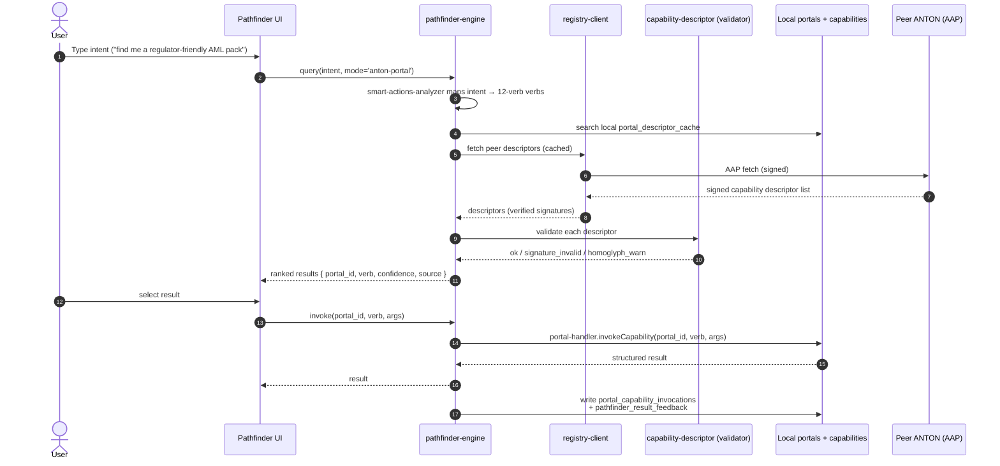

# 33-portals-pathfinder — Portals & Pathfinder

**Status of diagram:** Generated 2026-04-26 by Claude Code from commit `0fabf7f` (`openexpert@0.7.5`); refreshed 2026-04-26 PM after Addendum 1 §C.5 + §D.5.
**Subsystem status legend:** ✅ Built · 🟢 Partial · 📋 Spec-only · ❌ Future
**Maintainer note:** Regenerate when a new portal type / template ships, when a new capability verb is added (12-verb taxonomy), when registry-protocol changes, or when Pathfinder modes evolve. **Contributor docs are in [`/docs/portals/`](../portals/)** (post-D.5) — that's the canonical contributor-facing reference; this diagram is the structural view.

**C.5 closure:** the historical `/portals/mine` 500 (audit-notes §6 D7) is **resolved**. Root cause: Express was matching `/portals/:id` against the literal string "mine"; PostgreSQL rejected "mine" as a UUID. Fix: a dedicated `/portals/mine` alias registered BEFORE `/portals/:id`, sharing the `listOwnedPortals` handler. Regression test at `tests/routes/portals-mine.test.ts`.

**D.5 closure:** docs tree shipped at `/docs/portals/` (README, portal-types, registry-protocol, capability-descriptor, extending) plus marketing one-pager at `/docs/marketing/portals.md`. The "Portals as universal public surface that absorbs Marketplace, Recruitment, Beehive, Knowledge-Pack libraries" insight is now narrated.

Portals are ANTON's **unified public surface**: every Portal is simultaneously a human-readable site and a machine-readable AAP endpoint. Pathfinder is the **manifest-first discovery layer** that turns user intents into Portal/capability invocations. They form Layer 4 (Collaborative Intelligence) in the six-layer vision.

## Diagram — overall architecture

```mermaid
flowchart TD
  classDef ui fill:#1E3A8A,stroke:#93C5FD,color:#EFF6FF
  classDef svc fill:#0F766E,stroke:#5EEAD4,color:#F0FDFA
  classDef store fill:#581C87,stroke:#D8B4FE,color:#FAF5FF
  classDef ext fill:#1F2937,stroke:#9CA3AF,color:#F9FAFB
  classDef partial stroke-dasharray: 5 3

  subgraph Owner["Portal owner — admin surface"]
    direction TB
    PBuild["PortalBuilderPage<br/>8-phase walkthrough"]:::ui
    PMine["/portals/mine<br/>(open: 500 bug — see memory)"]:::ui
    PManage["/portals/:id/manage"]:::ui
    PInbox["PortalsInboxPage<br/>(visitor messages)"]:::ui
    PWalkLog["/portals/walkthroughs<br/>(walkthrough sessions log)"]:::ui
  end

  subgraph Visitor["Visitor — public surface"]
    direction TB
    PLanding["PortalsLandingPage<br/>(/portals)"]:::ui
    PDisco["PortalsDiscoveryPage<br/>(/portals/discovery)"]:::ui
    PVisit["PortalVisitorPage<br/>(/portals/p/:slug)"]:::ui
    PVisitHome["PortalVisitorHomePage"]:::ui
    PTplGallery["PortalsTemplateGalleryPage<br/>(7 starter templates)"]:::ui
    PCat["CategoryPage<br/>(category-associated portals)"]:::ui
  end

  subgraph PortalSvcs["Portal service tree (server/services/portals/)"]
    direction TB
    PBundler["portal-bundler.ts"]:::svc
    PDB["portal-database.ts"]:::svc
    PHandler["portal-handler.ts"]:::svc
    PLLM["portal-llm-suggest.ts<br/>+ portal-prompt-enrichment.ts"]:::svc
    PRender["portal-renderer.ts"]:::svc
    PSearch["portal-search.ts"]:::svc
    PWalk["portal-walkthrough.ts<br/>+ walkthrough-llm"]:::svc
    PStarter["starter-pack.ts"]:::svc
    PExt["external-url-verifier.ts<br/>(BYO-site mode)"]:::svc
    PLan["lan-discovery.ts"]:::svc
    PCapEdit["capabilities-editor.ts"]:::svc
  end

  subgraph CapDesc["capability-descriptor/<br/>(12-verb taxonomy)"]
    direction TB
    CDBuilder["builder.ts"]:::svc
    CDHash["hash.ts<br/>(content-addressable)"]:::svc
    CDSchema["schema.ts"]:::svc
    CDSigner["signer.ts<br/>(Ed25519)"]:::svc
    CDValidator["validator.ts"]:::svc
    CDVerbs["verbs/<br/>get · list · search · render ·<br/>submit · verify · attest ·<br/>resolve · invoke · subscribe ·<br/>publish · index"]:::svc
  end

  subgraph RegProto["registry-protocol/<br/>(transparency log)"]
    direction TB
    RPCanon["canonical-json.ts"]:::svc
    RPEnv["envelope.ts"]:::svc
    RPHomo["homoglyph.ts"]:::svc
    RPOps["operations/<br/>(register · update · revoke)"]:::svc
  end

  subgraph RegClient["registry-client/<br/>(outbound to peer registries)"]
    direction TB
    RCFetch["fetch + cache + verify"]:::svc
  end

  subgraph PathSvcs["Pathfinder service tree"]
    direction TB
    PFEng["pathfinder-engine.ts"]:::svc
    PFSmart["smart-actions-analyzer.ts"]:::svc
  end

  subgraph PathfinderUI["Pathfinder surface"]
    direction TB
    PFPage["src/pages/pathfinder/*"]:::ui
    PFAntonPortal["anton-portal mode<br/>(Portal capability invocation) 🟢"]:::ui
  end

  subgraph Storage["Persistence (mig 145–151, 158, 160, 161, 167)"]
    direction TB
    TPortals["portals · portal_pages ·<br/>portal_assets ·<br/>portal_structured_data"]:::store
    TWalk["portal_walkthrough_sessions ·<br/>portal_walkthrough_llm_calls"]:::store
    TCap["portal_capability_invocations ·<br/>capability_cards"]:::store
    TCache["portal_descriptor_cache ·<br/>portal_resolution_cache"]:::store
    TBookmark["portal_bookmarks ·<br/>portal_category_associations"]:::store
    TLan["portal_lan_neighbors"]:::store
    TPath["pathfinder_search_log ·<br/>pathfinder_result_feedback"]:::store
    TNonce["portal_signed_envelope_nonces"]:::store
  end

  Owner --> PortalSvcs
  Visitor --> PortalSvcs
  PortalSvcs --> CapDesc
  PortalSvcs --> RegProto
  PortalSvcs --> Storage
  CapDesc --> RegProto
  RegProto --> RegClient
  PathfinderUI --> PathSvcs
  PathSvcs --> CapDesc
  PathSvcs --> Storage
  PFAntonPortal -. invokes capability .-> PortalSvcs

  RegClient -. discover peer portals .-> PeerInstance["Peer ANTON instance<br/>(via AAP — see 30)"]:::ext
```

## Diagram — Pathfinder query → invocation (sequence)

## Capability verbs (12-verb taxonomy)

Per CLAUDE.md / spec, the capability descriptor uses a fixed 12-verb taxonomy:

| Verb | Purpose |
|---|---|
| `get` | Fetch a single resource |
| `list` | Enumerate resources |
| `search` | Free-text / structured search |
| `render` | Return human-renderable view |
| `submit` | Accept user input (form / payload) |
| `verify` | Verify a claim / signature / fact |
| `attest` | Produce a signed assertion |
| `resolve` | Resolve identifier → resource |
| `invoke` | Execute an action |
| `subscribe` | Push subscription |
| `publish` | Publish to a channel |
| `index` | Register for inclusion in indexes |

## Portal types / starter templates

7 starter templates per CLAUDE.md (verified via `starter-pack.ts` presence):
- Public expert portal (e.g. consultancy)
- Internal-team portal (org-private)
- Visitor-facing site (BYO-site / external surface mode)
- Capability gateway (machine-only)
- Evidence-pack share portal
- Marketplace listing portal
- Educational portal (school-affiliated)

(Exact template names live in `starter-pack.ts`; this list is the user-facing categorisation per the spec.)

## Portal lifecycle

1. **Build** — Owner uses `PortalBuilderPage` (8-phase walkthrough) → portal definition saved to `portals` + `portal_pages` + `portal_assets`.
2. **Publish** — `portal-bundler` packages as `.anton portal` bundle; instance signs; descriptor registered via `registry-protocol/operations/register`.
3. **Discover** — Visitors find via `PortalsLandingPage` / `PortalsDiscoveryPage`; peers find via `registry-client` fetch (AAP).
4. **Visit** — Browser hits `/portals/p/:slug` → `portal-renderer` produces HTML; or AAP peer hits descriptor URL → `portal-handler` invokes capability.
5. **Invoke** — Each `portal_capability_invocations` row is a recorded call; signed-envelope-nonced for replay-protection.
6. **Walkthrough** — `walkthrough-llm` runs guided sessions for builders; logged in `portal_walkthrough_sessions` + `portal_walkthrough_llm_calls`.
7. **Bookmark** — Visitors bookmark via `portal_bookmarks`.

## Source-of-truth references

- `server/services/portals/portal-bundler.ts`, `portal-database.ts`, `portal-handler.ts`, `portal-llm-suggest.ts`, `portal-prompt-enrichment.ts`, `portal-renderer.ts`, `portal-search.ts`, `portal-walkthrough.ts`, `walkthrough-llm.ts`, `starter-pack.ts`, `external-url-verifier.ts`, `lan-discovery.ts`, `capabilities-editor.ts`.
- `server/services/registry-protocol/canonical-json.ts`, `envelope.ts`, `homoglyph.ts`, `operations/`.
- `server/services/registry-client/`.
- `server/services/capability-descriptor/builder.ts`, `hash.ts`, `schema.ts`, `signer.ts`, `validator.ts`, `verbs/`.
- `server/services/pathfinder-engine.ts`, `smart-actions-analyzer.ts`.
- `server/routes/portals.ts`, `portal-bookmarks.ts`, `pathfinder.ts`.
- `src/pages/portals/PortalBuilderPage.tsx`, `PortalManagePage.tsx`, `PortalsDiscoveryPage.tsx`, `PortalsInboxPage.tsx`, `PortalsLandingPage.tsx`, `PortalsTemplateGalleryPage.tsx`, `PortalVisitorHomePage.tsx`, `PortalVisitorPage.tsx`.
- `src/pages/pathfinder/*`.
- `src/components/layout/Sidebar.tsx:354–375` — admin/visitor mode detection.
- `server/db/migrations-pg/145_portals_client.sql`, `146_portal_content.sql`, `147_portal_capability_invocations.sql`, `148_portal_walkthrough_sessions.sql`, `149_portal_performance_indexes.sql`, `150_portal_walkthrough_llm.sql`, `151_portal_lan_discovery.sql`, `158_portal_bookmarks.sql`, `160_portal_category_associations.sql`, `161_pathfinder_visitor.sql`, `167_portal_surface_mode.sql`.
- `ANTON_Portals_Spec.md` (root) — v0.2 spec.
- `_audit-notes.md` §3 — Portals + Pathfinder status.

## Open questions

- **`/portals/mine` 500** — open thread from prior session (memory `project_visitor_layer_v0_8.md`); should investigate and add a regression test before next release.
- **Pathfinder anton-portal mode** — partial wiring per audit; may be the highest-leverage Pathfinder polish.
- **Cross-instance descriptor cache** — `portal_descriptor_cache` exists but TTL + invalidation policy weren't traced.
- **BYO-site mode** — `external-url-verifier` confirms reachability; sandboxing of external surfaces (CSP, frame isolation) needs review.

## Related diagrams

- `04-six-layer-vision` — Portals + Pathfinder anchor Layer 4.
- `30-aap-protocol` — peer descriptor fetch.
- `32-anton-bundle-format` — `portal` bundle type.
- `f-51-talent-discovery` — Talent uses Portals as the public surface.
