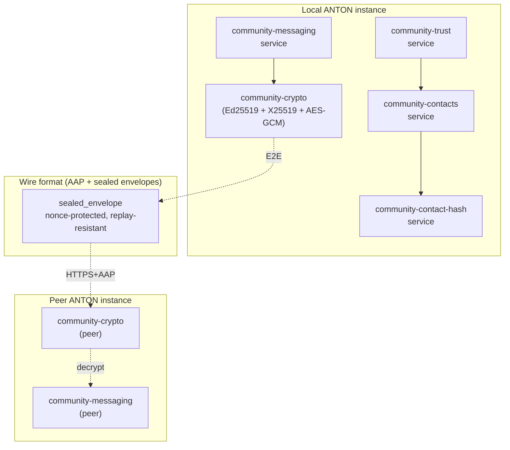

# 34 — Community Pillar Architecture

> **Pillar:** Community
> **Purpose:** ANTON-to-ANTON encrypted messaging, contact directory, trust scoring.
> **Sits on:** AAP transport (doc 30), registry-protocol (doc 33-portals-pathfinder),
> companion-app gateway (doc 31).

---

## Container view

## Data flow

1. **Contact addition** — User shares their `contact_hash` (deterministic
   hash of their pubkey). Peer adds to contact directory; trust score
   starts at 0.0.
2. **Outbound message** — `community-messaging` builds payload →
   `community-crypto.signEnvelope()` produces sealed envelope →
   POSTed via AAP transport to peer's gateway.
3. **Inbound message** — Peer's `community-crypto.verifyEnvelopeSignature()`
   validates Ed25519 sig + nonce-replay-protection → decrypts AES-GCM
   payload → hands to local `community-messaging` for storage.
4. **Trust update** — `community-trust` updates the contact's trust score
   based on bilateral interaction history (messages sent/received,
   message age distribution, mutual contact overlap).

## Tables (mig 084 + 085 + 086)

- `community_contacts` — pubkey + contact_hash + display_name + trust_score
- `community_messages` — message metadata (encrypted payload not stored verbatim)
- `community_threads` — conversation grouping
- `community_envelope_nonces` — replay-protection nonces (TTL-pruned)

## Cross-pillar integration

| Pillar    | Integration                                                                |
|-----------|----------------------------------------------------------------------------|
| Portals   | Discovers peer ANTON portals via the registry; can initiate Community pairing |
| Missions  | Outreach missions can use Community as a delivery channel                  |
| Agents    | Specialized agents on peer instances can be queried via Community pairing  |
| Companion app | Approval / push primitives can route via Community channels            |

## Security boundaries

- All payloads encrypted client-side; server stores ciphertext only
- Ed25519 signatures verified before payload decryption (verify-then-decrypt)
- Replay protection via per-message nonce + 24h window
- Contact-hash collision resistance: SHA-256(pubkey || domain-separator)

## Where it sits in the 6-layer vision

Community is **Layer 3 (Network)** — it's the connective tissue that
makes Layer 4 (Collaborative Intelligence) and Layer 6 (Economy)
possible. Without an end-to-end encrypted ANTON-to-ANTON channel, the
later layers have no transport.
