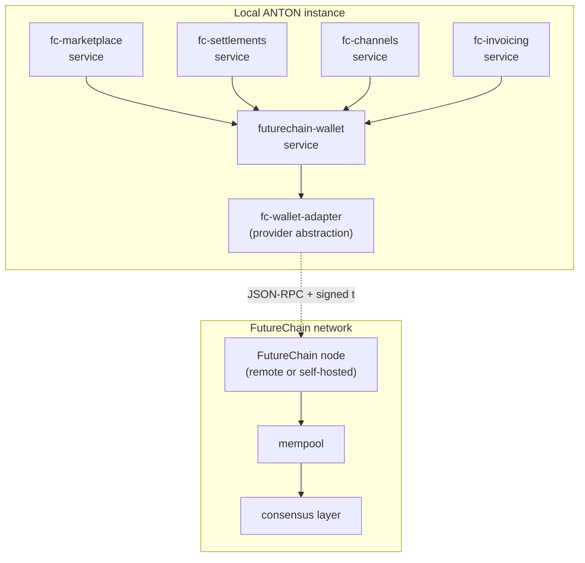

# 35 — Payments Pillar Architecture

> **Pillar:** Payments
> **Purpose:** FutureChain wallet + marketplace integration; expertise as
> income (Layer 6 of the vision).
> **Sits on:** AAP transport (doc 30), Community pillar (doc 34) for
> identity, registry-protocol (doc 33).

---

## Container view

## Data flow — receiving payment for an expert task

1. **Quote** — User invoices a peer for an expert module run. `fc-invoicing`
   creates an invoice with payment_request URI (FC chain ID + amount + memo).
2. **Payment posted** — Peer wallet broadcasts signed tx to FC node.
3. **Settlement detected** — Local `fc-settlements` polls FC node;
   matches incoming tx to the invoice memo; marks invoice paid.
4. **Channel update** — `fc-channels` updates the bilateral channel
   balance; reconciles against expected.
5. **Receipt** — User gets a notification in the companion app
   (Approvals / Inbox).

## Tables (mig 087 + 088 + 089)

- `fc_wallets` — wallet pubkey + encrypted privkey + balance cache
- `fc_invoices` — invoice header + payment_request + status
- `fc_settlements` — observed on-chain transactions
- `fc_channels` — bilateral payment channels
- `fc_marketplace_listings` — expertise / module / pack listings
- `fc_marketplace_purchases` — purchase records

## Cross-pillar integration

| Pillar       | Integration                                                          |
|--------------|----------------------------------------------------------------------|
| Community    | Identity provider — wallet pubkey ↔ community_contact pubkey         |
| Marketplace  | (Layer 5) — `.anton` bundles trade for FC; rev-share to authors      |
| Missions     | Mission runs can be paid for via FC; settlement triggers run start   |
| Agents       | Specialized agents can charge for queries on a per-call basis        |
| Companion app | Approvals (high-value tx require biometric re-confirm)              |

## Security boundaries

- Private keys stored encrypted (AES-256-GCM) using
  `INSTANCE_KEY_ENCRYPTION_KEY` — never logged, never transmitted
- Transaction signing happens server-side; client receives signed tx blob
- All FC node calls are over HTTPS; node URL pinned in instance config
- Companion-app wallet authority limited to "view-only" by default;
  outbound tx require biometric approval through the checkpoint flow

## Where it sits in the 6-layer vision

Payments is **Layer 6 (Economy)** — the final layer that turns expertise
into income. Depends on Community (Layer 3) for identity and Marketplace
(Layer 5) for what's being bought/sold. The FutureChain integration spec
exists; current implementation is wallet + marketplace surface; full
on-chain settlement is staged behind the FC node availability.
