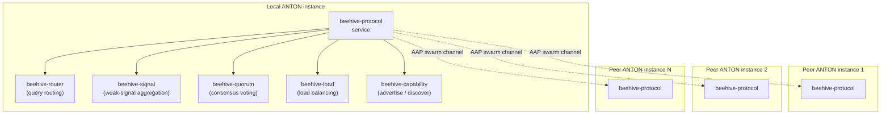

# 36 — Beehive Pillar Architecture

> **Pillar:** Beehive
> **Purpose:** Multi-instance protocol for ANTON instances to coordinate
> as a swarm — share signal, route queries, distribute load.
> **Sits on:** AAP transport (doc 30), Community pillar (doc 34) for
> identity, registry-protocol (doc 33).

---

## Container view



## Three core flows

### 1. Capability discovery

```
BeehiveCapability.advertise() → swarm broadcast
BeehiveCapability.discover(query) → multi-peer match → ranked candidate list
```

Each instance advertises its specialized agents, knowledge packs, and
domain modules. The discover flow ranks peers by capability match,
trust score (Community), and load (BeehiveLoad).

### 2. Query routing

```
local query → BeehiveRouter → (best peer match by capability + trust + load)
            → AAP request → peer execution → result back via AAP
```

Critical for Layer 4 (Collaborative Intelligence) — when local instance
doesn't have the needed expertise, BeehiveRouter finds a peer that does.

### 3. Quorum voting

```
high-stakes decision → BeehiveQuorum.requestVotes(peers, decision_payload)
                     → peers evaluate independently
                     → aggregate votes → quorum result + per-peer rationale
```

For decisions where a single instance's reasoning is insufficient
(safety calls, edge-case classifications) — uses N independent peer
evaluations to reduce single-point-of-reasoning failure.

## Tables (mig 113 + 114)

- `beehive_peers` — known peer instances + capabilities + trust + load
- `beehive_capabilities` — local capability advertisement registry
- `beehive_routing_log` — every routed query (audit + analytics)
- `beehive_signal_inbox` — incoming weak signals from peers
- `beehive_quorum_requests` — outstanding quorum requests + votes

## Cross-pillar integration

| Pillar    | Integration                                                              |
|-----------|--------------------------------------------------------------------------|
| Community | Identity + trust score per peer                                          |
| Agents    | Specialized agents advertised via BeehiveCapability                      |
| Pathfinder | Smart-action bar can route queries to swarm via BeehiveRouter           |
| Markets   | Cross-instance signal aggregation feeds back into market predictions     |
| Missions  | A mission step can require a BeehiveQuorum vote                          |

## Security boundaries

- All swarm messages signed with the instance Ed25519 key
- Peer trust scores rate-limit incoming traffic per peer
- Quorum requests deduplicated by request_id + peer_id; replay-protected
- Capability advertisements are public to authenticated peers only —
  not broadcast to the open internet

## Where it sits in the 6-layer vision

Beehive is the **operational backbone of Layer 4 (Collaborative
Intelligence)**. It's how individual ANTON instances become more than
the sum of their parts. The Specialized Agents (doc 27) provide the
"who can do what"; Beehive provides the "find them, route to them,
aggregate their results."
