# f-50-markets-pillar — Markets Pillar

**Status of diagram:** Generated 2026-04-26 by Claude Code from commit `0fabf7f` (`openexpert@0.7.5`); refreshed 2026-04-26 PM after E.4 (Consul Council surface).

**E.4 closure:** `ConsulCouncilPage.tsx` lives at `/markets/consul`; backed by `market-consul-service.ts` orchestrating 4 council members + a synthesis pass via the existing `market-consul-*.md` prompts. Each deliberation persists as a `revelation_chain` (reuses IRE persistence — no new trail format). Consul Council surface promoted from 📋 → ✅.
**Subsystem status legend:** ✅ Built · 🟢 Partial · 📋 Spec-only · ❌ Future
**Document type:** Future-state / pillar deep-dive. Markets is *built* (✅) but treated as a future-state diagram per the brief because of its forward-looking complexity (closed-loop learning, ANTON 100, consul council).
**Maintainer note:** Regenerate when ANTON 100 universe changes, when a new prediction-source is added, or when calibration approach shifts.

The Markets pillar is ANTON's **proof-of-self-learning intelligence** — the canonical Layer-2 example. Daily market feedback validates predictions and reasoning quality; closed-loop adjustments tune signal weights and consul performance.

> **Operational caveat (per memory `project_markets_effectiveness_pause.md`):** April 2026 closed-loop audit found 21% prediction accuracy, inverted calibration, and only one rebalance in history. Three pause flags installed: `MARKETS_THINKING_DISABLED`, `MARKETS_FETCH_DISABLED`, `RADAR_AUTOMATION_DISABLED`. Pillar code remains ✅ but production effectiveness is 🟢 pending fixes.

## Diagram

```mermaid
flowchart TD
  classDef ds fill:#1F2937,stroke:#9CA3AF,color:#F9FAFB
  classDef svc fill:#0F766E,stroke:#5EEAD4,color:#F0FDFA
  classDef store fill:#581C87,stroke:#D8B4FE,color:#FAF5FF
  classDef ui fill:#1E3A8A,stroke:#93C5FD,color:#EFF6FF
  classDef pause fill:#7C2D12,stroke:#FDBA74,color:#FFF7ED,stroke-dasharray: 5 3

  subgraph Sources["External data sources"]
    direction TB
    FMP["FMP (financial modelling prep)"]:::ds
    News["News + RSS feeds"]:::ds
    PartnerData["Roaring · Dow Jones"]:::ds
  end

  subgraph Ingest["Ingest pipeline (PAUSE FLAGS)"]
    direction TB
    Fetch["market-data services<br/>+ FMP fundamental analysis<br/>(MARKETS_FETCH_DISABLED 🟡)"]:::pause
    Atoms["market-atom-extractor<br/>(MARKETS_THINKING_DISABLED 🟡)"]:::pause
    Patterns["market-pattern-detection<br/>(MARKETS_THINKING_DISABLED 🟡)"]:::pause
  end

  subgraph Core["Core services (server/services/market-*)"]
    direction TB
    Indexes["market-index-* (ANTON 100)"]:::svc
    Theses["market-thesis-*"]:::svc
    WhyChains["market-why-chains"]:::svc
    Predict["market-prediction-*"]:::svc
    Calibrate["market-confidence-calibration<br/>+ market-conditional-accuracy"]:::svc
    Validate["market-cross-metric-validator<br/>+ market-validation"]:::svc
    Backtest["market-backtest"]:::svc
    Compute["market-computation<br/>(39 Python templates)"]:::svc
    NAV["market-nav-engine"]:::svc
    Event["market-event-trigger"]:::svc
    Orchestrate["market-workflow-orchestrator"]:::svc
    Consul["market-consul-performance"]:::svc
    RCI["market-rci"]:::svc
    Investigate["market-investigation"]:::svc
  end

  subgraph Storage["58 market_* tables (mig 049–067, 154–157)"]
    direction TB
    TIndex["market_indexes ·<br/>market_index_holdings ·<br/>market_index_rebalances ·<br/>market_index_nav_history (partitioned)"]:::store
    TThesis["market_theses · market_thesis_atoms ·<br/>market_narratives · market_why_chains ·<br/>market_why_chain_levels"]:::store
    TPattern["market_pattern_detections ·<br/>market_patterns_<half-year>"]:::store
    TPredict["market_predictions ·<br/>market_prediction_feedback ·<br/>market_prediction_attribution ·<br/>market_confidence_calibration ·<br/>market_conditional_accuracy"]:::store
    TConsul["market_consul_performance"]:::store
    TBacktest["market_backtests ·<br/>market_backtest_days ·<br/>market_backtest_predictions ·<br/>market_backtest_signal_weights ·<br/>market_backtest_theses"]:::store
    TAtoms["market_atoms (partitioned) ·<br/>market_atom_relationships ·<br/>market_atom_entity_links ·<br/>market_atom_sources · market_atom_tags"]:::store
    TEntity["market_entities · market_entity_aliases ·<br/>market_entity_relationships ·<br/>market_category_importance"]:::store
    TPrice["market_data_raw (partitioned) ·<br/>market_price_normalized ·<br/>market_historical_prices ·<br/>market_historical_fundamentals ·<br/>market_fundamental_scores"]:::store
    TFlow["market_event_calendar ·<br/>market_schedule_runs ·<br/>market_workflow_dead_letters ·<br/>market_computation_log"]:::store
    TLearn["market_meta_learning ·<br/>market_signal_weights ·<br/>market_signal_weight_adjustments ·<br/>market_symbol_weight_overrides ·<br/>market_correlation_map ·<br/>market_regime_history"]:::store
  end

  subgraph UI["Markets surfaces (23 pages)"]
    direction TB
    PIndex["MarketIndexesPage / Detail / Create"]:::ui
    PTheses["MarketThesesPage / Detail"]:::ui
    PWhy["MarketWhyChainsPage / Detail"]:::ui
    PPredict["MarketPredictionsPage"]:::ui
    PPattern["MarketPatternsPage"]:::ui
    PInvest["MarketInvestigationPage"]:::ui
    PRCI["MarketRCIPage"]:::ui
    PBack["MarketBacktestsPage"]:::ui
    PWorkflow["MarketWorkflowsPage"]:::ui
    PCalendar["MarketEventCalendarPage"]:::ui
    PCompute["MarketComputationPage"]:::ui
    PEntities["MarketEntitiesPage"]:::ui
    PWatch["MarketWatchlistPage"]:::ui
    PLearn["MarketLearningPage"]:::ui
    POnboard["MarketOnboardingPage"]:::ui
    PGoals["MarketGoalsProfilePage"]:::ui
    PMain["MarketsPage (landing)"]:::ui
  end

  Sources --> Fetch
  Fetch --> Atoms
  Fetch --> TPrice
  Atoms --> Patterns
  Atoms --> TAtoms
  Patterns --> TPattern
  Patterns --> Predict
  Predict --> TPredict
  Predict --> Validate
  Validate --> Calibrate
  Calibrate --> TPredict
  Calibrate --> TLearn
  Theses --> TThesis
  WhyChains --> TThesis
  Indexes --> TIndex
  NAV --> TIndex
  Backtest --> TBacktest
  Compute --> TFlow
  Event --> TFlow
  Orchestrate --> TFlow
  Consul --> TConsul
  RCI --> TPredict
  Investigate --> TAtoms

  UI --> Core
  Core --> Storage

  Predict -. closed loop .-> Calibrate
  Calibrate -. tune .-> Predict
```

## Closed-loop learning (the proof case)

1. **Atoms** ingested daily from FMP + news + partner data.
2. **Patterns** detected across atoms; **Theses** generated; **Why-Chains** trace causal claims.
3. **Predictions** issued with confidence + horizon.
4. **Daily NAV** + market-event triggers update `market_index_nav_history`.
5. **Prediction feedback** measures realized vs. predicted; writes `market_prediction_feedback`.
6. **Confidence calibration** updates per-bucket calibration in `market_confidence_calibration`.
7. **Conditional accuracy** updates per-regime accuracy in `market_conditional_accuracy`.
8. **Consul performance** scored per-vote in `market_consul_performance`.
9. **Signal weights** auto-adjusted via `market_signal_weight_adjustments`; symbol overrides recorded in `market_symbol_weight_overrides`.

## ANTON 100

`market_indexes` carries the ANTON 100 — a curated 100-symbol universe (mig `062_markets_anton100_indexes.sql`). Each index has holdings + rebalance history + NAV partitions.

## 39 Python computation templates

`server/computation-templates/markets/` houses Python templates (caching outputs in `data/computation-output/`). The templates execute deterministic numerical work (factor scores, correlation maps, regime detection) outside the LLM path. Template registry: `market-computation` service.

## Pause flags (April 2026)

| Flag | Effect |
|---|---|
| `MARKETS_THINKING_DISABLED=true` | Pauses every LLM-spending markets phase. Free phases (NAV, prices, prediction checkpoints, event triggers, MV refreshes) keep running. |
| `MARKETS_FETCH_DISABLED=true` | Pauses every external markets data fetch (FMP, news, RSS). |
| `RADAR_AUTOMATION_DISABLED=true` | Disables radar auto-scan + scheduled radar cron. Manual UI scans still work. |

These exist so the user can pause cost-bearing or risk-bearing flows while the closed-loop effectiveness audit findings (per memory) are addressed.

## Source-of-truth references

- `server/services/market-*.ts` (30 files) — service tier.
- `server/services/missions/seed-templates.ts` — Markets workflows seed.
- `server/db/migrations-pg/049_markets_pillar.sql` … `067_backtest_and_schedule.sql` — Markets foundation (19 migrations).
- `server/db/migrations-pg/068_expanded_universe.sql`, `069_fmp_news_sources.sql`, `070–076` — universe + sources + temporal reasoning.
- `server/db/migrations-pg/154_markets_pattern_feedback.sql` … `157_markets_symbol_weight_overrides.sql` — closed-loop additions.
- `server/computation-templates/markets/*` — 39 Python templates.
- `data/computation-output/` — cached outputs.
- `src/pages/markets/*` — 23 pages.
- `src/stores/useMarketsStore.ts` — frontend state.
- `CLAUDE.md` — Markets effectiveness narrative.
- `memory/project_markets_effectiveness_pause.md` — April 2026 audit.
- `memory/project_markets_vision.md`, `project_markets_pillar.md` — vision + progress.
- `_audit-notes.md` §3 — Markets row.

## Open questions

- **Closed-loop fix programme** — what's the order of operations to address: low accuracy → inverted calibration → missing rebalances → missing thesis lifecycle? Out of scope here.
- **Cost ceiling** — `MARKETS_THINKING_DISABLED` is a binary kill switch; a per-day budget would be more flexible.
- **Multi-tenant Markets** — today the pillar assumes single-org universe; scaling per-tenant universe is not addressed.

## Related diagrams

- `04-six-layer-vision` — Markets is the canonical Layer-2 proof.
- `26-cross-workflow-intelligence` — generic version of the funnel that Markets implements specifically.
- `20e-database-memory-patterns.md` — schema underpinning.
- `24-workflow-engine` — Markets workflows ride on this engine.
