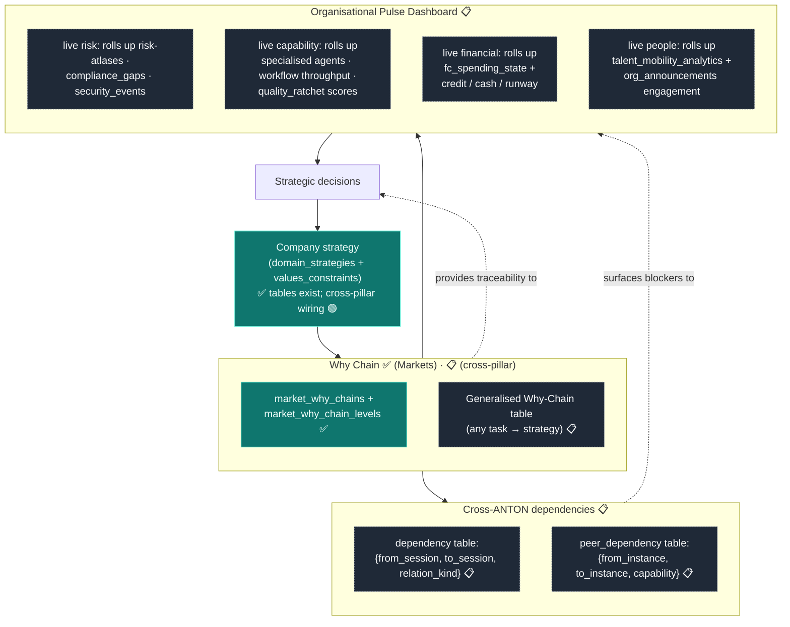

# f-52-connected-enterprise-planning — Connected Enterprise Planning

**Status of diagram:** Generated 2026-04-26 by Claude Code from commit `0fabf7f` (`openexpert@0.7.5`)
**Subsystem status legend:** ✅ Built · 🟢 Partial · 📋 Spec-only · ❌ Future
**Document type:** Future-state / strategic. Most components here are 📋 spec-only or ❌ future.
**Maintainer note:** Regenerate when Why-Chain enters cross-pillar use, when Org Pulse Dashboard ships, or when ANTON-to-ANTON dependency tracking gains its own subsystem.

The "connected enterprise" vision has three primitives: **cross-ANTON dependencies** (one ANTON's work informs another's), **Why Chain** (every task → company strategy), and **Organisational Pulse Dashboard** (real-time view of capability and risk across pillars). Today, only the Markets-specific Why-Chain (`market_why_chains`) exists; the cross-pillar generalisation is 📋.

## Diagram



## Why-Chain: present vs proposed

| Layer | Status | Where |
|---|---|---|
| Markets-specific Why-Chain | ✅ | `market_why_chains` + `market_why_chain_levels` (mig 053–054); `MarketWhyChainsPage.tsx` + `MarketWhyChainDetailPage.tsx` |
| Cross-pillar Why-Chain | 📋 | Spec only. Would need `why_chains` + `why_chain_levels` + a uniform cross-link from any work artefact (session / module-output / mission-step) to the chain |
| Strategy → tactic linkage | 🟢 | `domain_strategies` + `values_constraints` exist (mig 072) but cross-pillar consumption is partial |

## Cross-ANTON dependencies

Today: **none** at the table level. Today's path:
- A workflow may chain into another workflow via `onCompleteTrigger`.
- A Mission may delegate steps to other ANTON instances via AAP.
- An Agent may discover a remote agent via `remote-agent-client.ts`.

But there is **no canonical "dependency graph" that sees across pillars or instances**. Building one would be the spec-defined `dependencies` table:

```text
dependencies
  id PK
  from_kind (session|module-output|workflow-run|mission-step|agent-action)
  from_id
  to_kind (same enum)
  to_id (may include peer_instance_contact_hash)
  relation_kind (input|reference|approval|blocks|fulfilled-by)
  created_at
```

A cross-instance variant (`peer_dependencies`) would carry contact hashes for the peer side.

## Organisational Pulse Dashboard

📋 spec-only. Composed of four panes, each a roll-up of existing tables:

| Pane | Source tables (existing) | Status |
|---|---|---|
| **Risk** | `risk_atlases`, `atlas_residual_scores`, `atlas_appetite_statements`, `evidence_pack_compliance_gaps`, `security_events` | ✅ data exists, no rolled-up surface |
| **Capability** | `agent_profiles`, `workflow_runs` (rate / success), `quality_scores`, `talent_mobility_analytics` | ✅ data exists, no rolled-up surface |
| **Financial** | `fc_spending_state`, `fc_transactions`, `fc_budget_rules`, `fc_wallets` | 🟢 fc_* tables exist, surface partial |
| **People** | `talent_mobility_analytics`, `org_announcements`, `org_intent_categories`, `connected_user_orgs` | 🟢 |

A first cut would be `PulseDashboard.tsx` rolling up these tables read-only.

## Source-of-truth references

- `server/db/migrations-pg/053_markets_why_chains.sql`, `054_markets_why_chains_v2.sql` — Markets Why-Chain.
- `server/db/migrations-pg/072_strategic_portfolios.sql` — `domain_strategies`, `values_constraints`.
- `server/services/market-why-chains.ts` — Markets Why-Chain service.
- `src/pages/markets/MarketWhyChainsPage.tsx`, `MarketWhyChainDetailPage.tsx` — Markets surface.
- `server/db/migrations-pg/082_fc_marketplace_budget.sql`, `087_fc_gateway.sql` — financial tables.
- `server/services/risk-atlas/atlas-fcp-scope-service.ts` — Stage 7b company-wide rollup (this is the closest thing to a Pulse-style cross-pillar rollup, currently only for FCP).
- `CLAUDE.md` — Connected Enterprise Planning narrative.
- `memory/project_anton_vision_layers.md` — vision context.
- `_audit-notes.md` §3 — connected-enterprise readiness.

## Open questions

- **Build order** — Why-Chain generalisation first (gives traceability), then dependencies (gives blocker visibility), then Pulse (the consumer of both)?
- **Cross-instance dependencies and AAP** — when a Mission delegates a step to a peer, the dependency edge should travel with the AAP envelope so the peer can also see it.
- **Pulse refresh cadence** — live (real-time) vs nightly batch is a major architectural decision.

## Related diagrams

- `26-cross-workflow-intelligence` — funnel that feeds Pulse data.
- `21-orchestrator-trust-phases` — Orchestrator may surface Pulse-derived proposals.
- `20e-database-memory-patterns.md` — strategy + memory tables.
- `f-50-markets-pillar` — Markets Why-Chain reference implementation.
