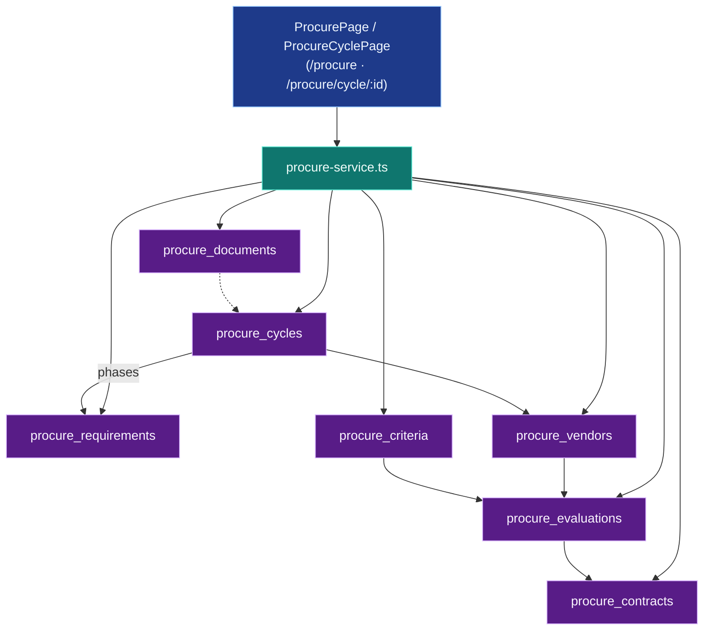
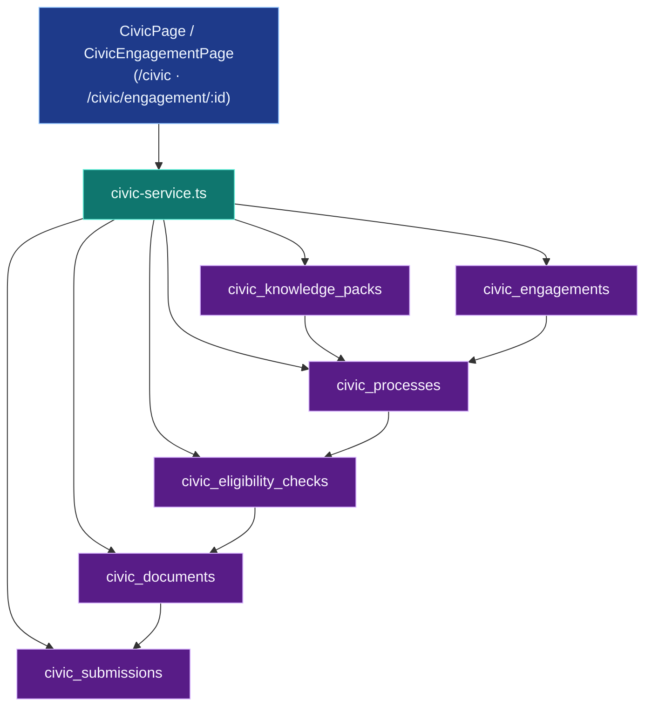
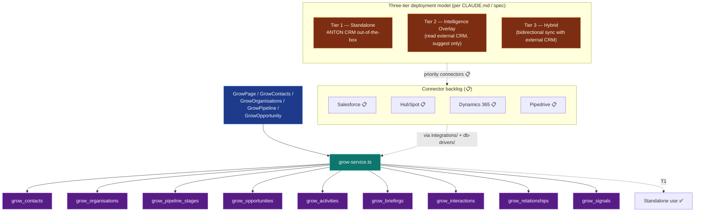

# f-53-future-pillars — Procure / Civic / Grow

**Status of diagram:** Generated 2026-04-26 by Claude Code from commit `0fabf7f` (`openexpert@0.7.5`); refreshed 2026-04-26 PM after E.5 (Salesforce + HubSpot adapters).

**E.5 closure (refined post-second-take):** `server/services/connectors/{crm-adapter,salesforce-adapter,hubspot-adapter}.ts` ship the read-side scaffolding for both CRMs. Common `CrmAdapter` interface ensures parity. The apply path uses the **real Grow column names** (`first_name`, `value`, `expected_close_date`, etc. — second-take review caught the original placeholder names) and the new `external_provider` / `external_id` / `owned_by_anton` / `last_modified_external` columns added in **migration 169** (`server/db/migrations-pg/169_grow_crm_external_columns.sql`). Composite unique indexes on `(external_provider, external_id)` back the upserts. **Salesforce + HubSpot promoted from 📋 → 🟢** for the read-side; bidirectional write-back remains 📋. Dynamics 365 + Pipedrive remain 📋.
**Subsystem status legend:** ✅ Built · 🟢 Partial · 📋 Spec-only · ❌ Future
**Document type:** Pillar deep-dive. Procure / Civic / Grow are **all built ✅** (per audit) but treated as a future-state diagram per the brief because their full enterprise-grade scope (especially Grow's three-tier model with external CRM connectors) is still maturing.
**Maintainer note:** Regenerate when Grow connectors ship (Salesforce / HubSpot / Dynamics 365 / Pipedrive), when Civic adds new processes, or when Procure adds new evaluation methods.

Three pillars, each domain-specific, each path-routed (not in `AppMode` toggle — see `_audit-notes.md` §6 D1).

## Diagram — Procure pillar

## Diagram — Civic pillar

## Diagram — Grow pillar (three-tier intelligence model)

## Persistence summary

| Pillar | Tables (count) | Key migrations |
|---|---|---|
| Procure | 7 (`procure_cycles`, `procure_requirements`, `procure_vendors`, `procure_criteria`, `procure_evaluations`, `procure_documents`, `procure_contracts`) | `091_procure_pillar.sql` |
| Civic | 6 (`civic_engagements`, `civic_processes`, `civic_eligibility_checks`, `civic_documents`, `civic_submissions`, `civic_knowledge_packs`) | `092_civic_pillar.sql` |
| Grow | 9 (`grow_contacts`, `grow_organisations`, `grow_pipeline_stages`, `grow_opportunities`, `grow_activities`, `grow_briefings`, `grow_interactions`, `grow_relationships`, `grow_signals`) | `093_grow_pillar.sql` |

## Mission integration (Grow)

`server/db/migrations-pg/122_missions_grow_bridge.sql` wires Missions to push activity into `grow_signals` + `grow_interactions`. Outreach missions create durable Grow trail.

## Source-of-truth references

- `server/services/procure-service.ts`, `civic-service.ts`, `grow-service.ts`.
- `server/routes/procure.ts`, `civic.ts`, `grow.ts`.
- `src/pages/procure/{ProcurePage,ProcureCyclePage}.tsx`.
- `src/pages/civic/{CivicPage,CivicEngagementPage}.tsx`.
- `src/pages/grow/{GrowPage,GrowContactsPage,GrowOrganisationsPage,GrowPipelinePage,GrowOpportunityPage}.tsx`.
- `src/components/layout/Sidebar.tsx:351–353` — path-based mode detection (these pillars use isProcureMode/isCivicMode/isGrowMode).
- `server/db/migrations-pg/091_procure_pillar.sql`, `092_civic_pillar.sql`, `093_grow_pillar.sql`, `122_missions_grow_bridge.sql`.
- `_audit-notes.md` §2, §6 D1 — pillar status + path-routing discrepancy.

## Open questions

- **Grow connectors** — which connector ships first (Salesforce vs HubSpot)? Each is non-trivial: `connection-manager.ts` + `db-drivers/` + per-vendor schema mapping.
- **Civic country packs** — `civic_knowledge_packs` is per-jurisdiction; rollout cadence (which countries) is a roadmap decision.
- **Procure compliance hooks** — link to `delegation_compliance_rules` for spend-threshold gates not investigated.
- **AppMode promotion** — should Procure / Civic / Grow be added to the `AppMode` toggle? Architectural decision for the team.

## Related diagrams

- `03-pillar-topology` — these are the path-routed pillars.
- `30-aap-protocol` — Civic-pack distribution between consenting peers.
- `20c-database-workflows.md` — Missions integration with Grow signals.
