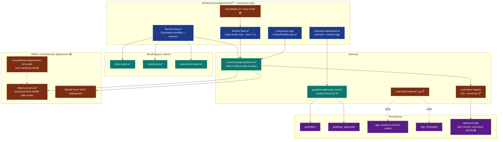

# f-54-school-mode — School Mode (Voice-First, Offline-Capable)

**Status of diagram:** Generated 2026-04-26 by Claude Code from commit `0fabf7f` (`openexpert@0.7.5`); refreshed 2026-04-26 PM after E.3 (Evidence Log + Curriculum Registry); School-pillar contributor docs at [`/docs/school/`](../../school/) (post-school-sprint, Phase 2).

**School pillar narrative:** [`/docs/marketing/school.md`](../../marketing/school.md) (one-pager) · [`/docs/school/README.md`](../../school/README.md) (contributor index) · [`/docs/school/safeguarding.md`](../../school/safeguarding.md) (the layered safety model) · [`/docs/school/extending.md`](../../school/extending.md). 34 student/teacher/guardian pages backed by `school-prompt-builder.ts` overlay + `school-evidence.ts` REST.

**E.3 closure:** `learning_evidence_log` and `curriculum_registry` tables added in migration 168 (5-country seed: SE/UK/US/IN/KE). Pages `LearningEvidencePage.tsx` (guardian-visible, teacher-editable) and `CurriculumRegistryPage.tsx` (admin) live at `/school/evidence` and `/school/curriculum`. REST surface in `routes/school-evidence.ts`. Both promoted from 📋 → ✅ for the surface; 25-country expansion remains a roadmap item.
**Subsystem status legend:** ✅ Built · 🟢 Partial · 📋 Spec-only · ❌ Future
**Document type:** Pillar deep-dive. School pillar is built (✅) but full voice-first T1 + curriculum registry + humanitarian deployment story is partial.
**Maintainer note:** Regenerate when curricula expand, when guardian flow changes, or when offline / Mistral / Ollama deployment story evolves.

ANTON's School pillar separates **Guardian / Teacher / Student** surfaces, embeds parental oversight + teacher-curated content, and is designed for voice-first interaction (Tier-1 readers) and offline humanitarian deployment via Mistral / Ollama.

## Diagram

## Three-role surface

| Role | Surface | Key behaviours |
|---|---|---|
| **Guardian** | `src/pages/school/Guardian*.tsx`, Companion app | Approvals via `guardian_approvals`; activity log; consent toggles |
| **Teacher** | `src/pages/school/Teacher*.tsx` | Push lesson-plan / study-pack / assessment-bank bundles; review student work |
| **Student** | `src/pages/school/Student*.tsx`, Companion app SchoolFeedScreen | Safe-mode chat (no web search by default), voice-first option, age-gated |

## Voice-first Tier 1

- Companion app `VoiceMode.tsx` (Telegram-style hold-to-talk).
- On-device speech fallback when offline.
- Live captions + platform TTS via `tts.ts`.
- For T1 readers: no text input required; entire flow voice-driven.

Status 🟢: voice infrastructure built; School-specific T1 mode not yet a separate UI variant.

## Curriculum registry

- 25+ country curricula targeted per CLAUDE.md.
- Files under `data/curricula/` (status 🟢: directory present, content depth varies by country).
- Mapped into `school-prompt-builder` so module suggestions match local syllabus.

## Learning Evidence Log

📋 spec-only as a unified surface. Today, evidence accumulates in `app_messages` + `app_sessions` (school-mode flag) + reviews; consolidating into a per-student timeline view is the open work. Would be the School-pillar equivalent of Evidence Pack.

## Offline / humanitarian deployment

For NGO / humanitarian / low-bandwidth deployments:
- **Ollama LLM** — `nomic-embed-text` + a small local generation model (Llama 3, Qwen) replace the cloud Anthropic call.
- **Mistral local** — alternative local provider via `mistralAdapter`.
- **`humanitarian-deployment-kit` bundle** (Hardware Build Tier 5) ships pre-configured ANTON + Ollama + curriculum packs to field hardware.

Status 🟢: all primitives present; documented humanitarian deployment runbook is the gap.

## Source-of-truth references

- `src/pages/school/*` — School surfaces.
- `server/services/school-prompt-builder.ts` — Safe-mode prompt overlay.
- `server/routes/school.ts` — REST surface.
- `src/app/pages/SchoolFeedScreen.tsx` — companion app feed.
- `src/app/components/VoiceMode.tsx` — voice-first.
- `data/curricula/` — curriculum JSON per country.
- `server/db/migrations-pg/094_app_gateway.sql` — `app_sessions` (used in school-mode).
- `server/services/anton-bundler.ts` — `lesson-plan`, `study-pack`, `assessment-bank` bundle types (lines 19–21 of the BundleType union).
- `server/services/adapters/ollamaAdapter.ts`, `mistralAdapter.ts` — offline providers.
- `_audit-notes.md` §2, §3 — School pillar status.

## Open questions

- **Guardian-approval friction** — how to present approval requests so guardians actually engage (push? digest? on-device?). Today: push is wired but UX cadence is undefined.
- **Curriculum freshness** — countries update curricula yearly; who maintains the JSON?
- **Offline LLM quality floor** — small local models hallucinate more; what's the safe-mode floor that prevents harmful output without internet fact-check?
- **Evidence Log → portfolio** — should the Learning Evidence Log produce an exportable portfolio bundle for transcript / college applications?

## Related diagrams

- `03-pillar-topology` — School in the pillar tree.
- `20g-database-rbac-identity.md` — guardian + ward tables.
- `31-companion-app-gateway` — VoiceMode + push.
- `25-coding-area` — humanitarian-deployment-kit (Hardware Build).
- `32-anton-bundle-format` — lesson-plan / study-pack / assessment-bank.
